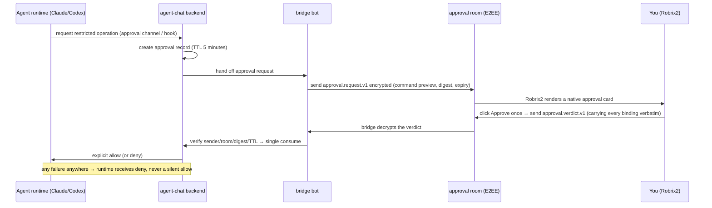

# Owner Approval: Humans Make the Call on High-Risk Operations

> **Scope**: This chapter covers the core gate of HAgency's security model — the one-shot authorization card in the encrypted approval room: what it looks like, how the protocol binds it, and how failures converge. Prerequisite: Chapter 5.2; see Chapter 6 for the full mechanism.

In an agent-chat **managed runtime**, sandbox escapes and commands marked ask by policy enter owner approval. Current explicit examples include Claude `Bash(gh *)` / `Bash(git push *)` Ask rules and Codex `PermissionRequest` under `workspace-write`. Do not interpret this as “every network operation in every runtime/version is always gated.”

The full journey of one approval:

## What the Approval Card Looks Like

The bridge creates or reuses an E2EE `Approval: <agent>` room per **`(agent, owner MXID)`**. One owner may reuse it across projects; different owners get separate rooms. It is not ready until the owner accepts the invitation.

The card contains:

- **Tool and command preview**: e.g. `Bash: cargo test --lib`, plus the Agent's stated purpose ("May I run the full Rust library test suite on the pinned v4 room-aliases artifact to complete the final review?");
- **Expiry**: 5 minutes by default; once expired the card is marked **Expired** and its buttons are disabled;
- **Two buttons**: a pending card offers `Approve once` and `Deny`. The current screenshot captured an expired card; it proves Expired rendering and raw-event fallback, not the pending/success interaction. The release book should add pending and terminal-state captures.

Protocol-level highlights (matching the raw events visible in the screenshot):

- The request binds agent, runtime, project, project room, owner, approval room, request IDs, tool and description, and up to 8KB of input preview. `input_digest` hashes this canonical server record; it is not a promise to hash unlimited raw stdin;
- Robrix2 preserves all binding fields in the verdict. It refreshes bridge devices and rotates the outbound Megolm session to reduce device-rotation UTD failures. Device query, Olm/OTK, or room-key delivery can still fail; the path then remains fail-closed;
- **Text replies are not approval.** The card says so explicitly: "Text replies are not approval" — only a structured verdict counts, closing off the social-engineering path of "just say OK in chat and it goes through".

## Fail-Closed: Every Anomaly Is a Denial

Every link is fail-closed: no unique owner, owner not joined, expiry, duplicate consumption, sender/room/digest mismatch, or channel failure all deny. Useful audit reasons include `owner_binding_missing`, `owner_binding_ambiguous`, `owner_invite_pending`, `expired`, and `not_pending`.

Meanwhile, agent-chat verifies on the server side that the verdict's **actual Matrix sender** (`event.sender`) is the bound owner account and that the room is the bound approval room. Even if someone forges a card or a verdict, it cannot get past the server. **The buttons in Robrix2 are only a UI convenience; the authorization decision always happens on the agent-chat server** — this is where Chapter 3's principle "Robrix2 is not a source of authorization" lands.

## What Does the Project Room See?

Approval details (including command content) appear only in the encrypted approval room. In the project board room, other members see just one redacted status line: *"Agent wf_codex is waiting for approval from its owner."* — the team knows where the process is blocked, but sees none of the sensitive detail. In multi-party rooms, this boundary ensures transparency never comes at the cost of leakage.

Generic `!ctl` / `!agentctl` commands are rejected in project and approval rooms, even for administrators. An empty approver set denies rather than falling back to all admins.

## Claude and Codex Enter Through Different Adapters

| Runtime | Managed policy | Common misleading symptom |
|---------|----------------|---------------------------|
| Claude Code | `--permission-mode auto`; protected Bash Ask rules enter the channel | a manually reopened or incompatible session may stop at its own TUI prompt while the backend has no pending approval |
| Codex | `workspace-write` + `on-request` PermissionRequest hook | first launch requires local `TRUST`; changed hook hash must be trusted again; hook timeout follows approval TTL plus buffer |

Restart with `bin/agentchat down <name>` / `up <name>`, not by launching the CLI manually inside tmux. Detach from tmux without stopping it with `Ctrl-b`, then `d`.
