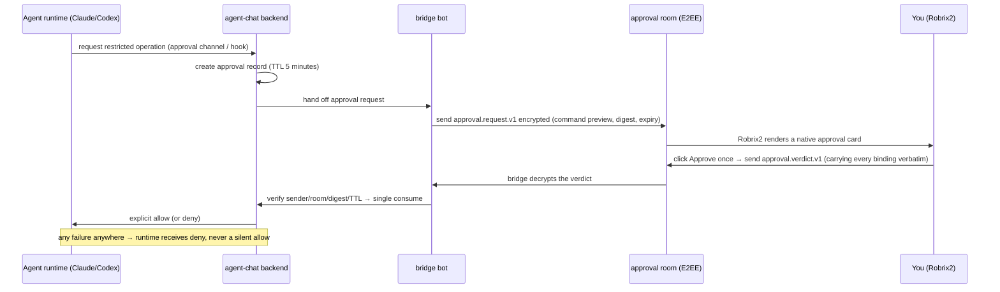
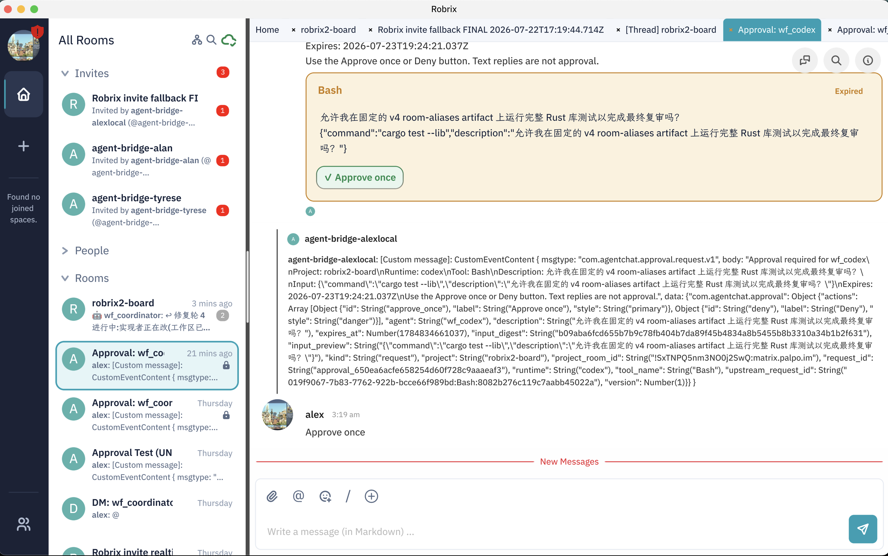

# Owner Approval: Humans Make the Call on High-Risk Operations

> **Scope**: This chapter covers the core gate of HAgency's security model — the one-shot authorization card in the encrypted approval room: what it looks like, how the protocol binds it, and how failures converge. Prerequisite: Chapter 5.2; see Chapter 6 for the full mechanism.

An Agent is free to read and write project code inside its own sandbox, but **operations that cross the sandbox** — external writes like `gh issue create` / `gh pr create`, network access, touching files outside the sandbox — must be approved by its owner (that is, you).

The full journey of one approval:

## What the Approval Card Looks Like

Every Agent has a dedicated **`Approval: <agent>` end-to-end encrypted room** whose only members are you, the bridge bot, and that Agent. When the Agent's runtime requests a restricted operation, a native approval card appears in the room:

The card contains:

- **Tool and command preview**: e.g. `Bash: cargo test --lib`, plus the Agent's stated purpose ("May I run the full Rust library test suite on the pinned v4 room-aliases artifact to complete the final review?");
- **Expiry**: 5 minutes by default; once expired the card is marked **Expired** and its buttons are disabled;
- **Two buttons**: `Approve once` (allow this one execution only) and `Deny`.

Protocol-level highlights (matching the raw events visible in the screenshot):

- The request event `com.agentchat.approval.request.v1` carries the full set of bindings: agent, project, request_id, `input_digest`, expires_at, and so on. `input_digest` is a SHA-256 over the **canonicalized content of the entire request** (agent, project, tool name, command input preview, …) — the input preview takes the first 8KB, enough to cover real-world commands;
- When you click a button, Robrix2 emits `com.agentchat.approval.verdict.v1`, **preserving every binding field verbatim**; before sending, it refreshes the bridge's device keys and rotates the outbound room key so the bridge is guaranteed to be able to decrypt;
- **Text replies are not approval.** The card says so explicitly: "Text replies are not approval" — only a structured verdict counts, closing off the social-engineering path of "just say OK in chat and it goes through".

## Fail-Closed: Every Anomaly Is a Denial

Every link in the approval chain follows **fail-closed**: request expired → deny; duplicate consumption → deny; field mismatch (digest, room, sender identity) → deny; the approval channel itself breaks → the Agent receives an explicit deny rather than hanging forever.

Meanwhile, agent-chat verifies on the server side that the verdict's **actual Matrix sender** (`event.sender`) is the bound owner account and that the room is the bound approval room. Even if someone forges a card or a verdict, it cannot get past the server. **The buttons in Robrix2 are only a UI convenience; the authorization decision always happens on the agent-chat server** — this is where Chapter 3's principle "Robrix2 is not a source of authorization" lands.

## What Does the Project Room See?

Approval details (including command content) appear only in the encrypted approval room. In the project board room, other members see just one redacted status line: *"Agent wf_codex is waiting for approval from its owner."* — the team knows where the process is blocked, but sees none of the sensitive detail. In multi-party rooms, this boundary ensures transparency never comes at the cost of leakage.
