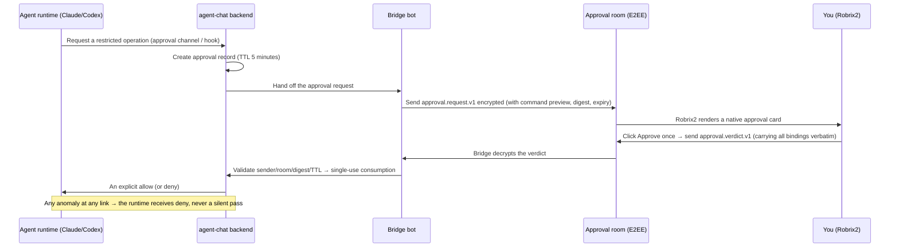
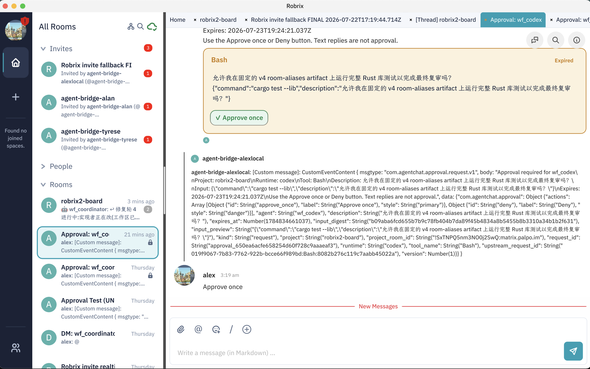

# Owner Approval: Humans Make the Call on High-Risk Operations

> **Scope**: This chapter covers the core gate of HAgency's security model — the single-use authorization card in the encrypted approval room: what it looks like, how the protocol binds it, and how failures converge. Prerequisite: Chapter 5.2; for the full mechanism landscape see Chapter 8.

In a runtime **launched managed** by agent-chat, operations outside the sandbox and commands marked ask by policy enter owner approval. The typical paths explicitly covered today are Claude's `Bash(gh *)` / `Bash(git push *)` Ask rules, and the `PermissionRequest` triggered under Codex's `workspace-write` sandbox. Do not read "any network access will be approved" as an unconditional fact across all runtimes/versions.

The full journey of one approval:

```mermaid
sequenceDiagram
    participant RT as Agent runtime (Claude/Codex)
    participant BE as agent-chat backend
    participant BR as Bridge bot
    participant AP as Approval room (E2EE)
    participant H as You (Robrix2)

    RT->>BE: Request a restricted operation (approval channel / hook)
    BE->>BE: Create approval record (TTL 5 minutes)
    BE->>BR: Hand off the approval request
    BR->>AP: Send approval.request.v1 encrypted (with command preview, digest, expiry)
    AP->>H: Robrix2 renders a native approval card
    H->>AP: Click Approve once → send approval.verdict.v1 (carrying all bindings verbatim)
    AP->>BR: Bridge decrypts the verdict
    BR->>BE: Validate sender/room/digest/TTL → single-use consumption
    BE->>RT: An explicit allow (or deny)
    Note over BE,RT: Any anomaly at any link → the runtime receives deny, never a silent pass
```

## What the Approval Card Looks Like

The bridge creates or reuses an `Approval: <agent>` end-to-end encrypted room keyed by **`(agent, owner MXID)`**, whose only members are that owner, the bridge bot, and that agent. The same owner reuses it across projects; different owners get different rooms. While the owner has not yet accepted the invite, the approval channel is not ready.

The card contains:

- **Tool and command preview**: e.g. `Bash: cargo test --lib`, plus the agent's stated purpose ("May I run the full Rust library tests on the pinned v4 room-aliases artifact to complete the final review?");
- **Expiry time**: 5 minutes by default; once expired the card is marked **Expired** and its buttons are disabled;
- **Two buttons**: a pending card offers `Approve once` (allow exactly this one time) and `Deny`. The screenshot currently in this book captures an expired scene — it proves the Expired state and raw-event rendering, but does not by itself prove the pending/success interactions; the release version should add three state screenshots: pending, approved/denied.

Protocol-level essentials (matching the raw events visible in the screenshot):

- The request event `com.agentchat.approval.request.v1` carries canonical fields including agent, runtime, project, project room, owner, approval room, request_id, upstream request, tool name, description, and an input preview of at most 8KB; `input_digest` is a SHA-256 over those canonical fields excluding `request_id` (which is bound separately by verdict validation). It binds the canonical record stored on the server — it is not a promise over unbounded raw stdin;
- On button click, Robrix2 emits `com.agentchat.approval.verdict.v1` preserving all binding fields; before sending, it refreshes the bridge's device list and rotates the outbound Megolm session to reduce unable-to-decrypt caused by bridge device rotation. Device queries, Olm/OTK, or room-key delivery can still fail — in which case it does not send or waits for keys, ultimately remaining fail-closed;
- **A text reply is not an approval.** The card explicitly says "Text replies are not approval" — only a structured verdict counts, closing off the social-engineering path of "just say OK in chat and it goes through."

## Fail-Closed: Every Anomaly Is a Denial

Every link in the approval chain follows **failure means denial**: no unique owner binding, owner not yet joined to the approval room, expired request, duplicate consumption, sender/room/digest mismatch, or approval-channel failure — all are denied. Common rejection codes include `owner_binding_missing`, `owner_binding_ambiguous`, `owner_invite_pending`, `expired`, `not_pending`, and field mismatches; when diagnosing, read the backend audit and the bridge logs rather than guessing at button semantics.

Additionally, agent-chat validates server-side that the verdict's **real Matrix sender** (`event.sender`) is the bound owner account and that the room is the bound approval room. Even if someone forges a card or a verdict, it will not pass the server-side check. **The button in Robrix2 is only a UI convenience; the authorization decision always happens on the agent-chat server side** — this is where Chapter 3's principle "Robrix2 is not a source of authorization" lands.

## What Do People See in the Project Room?

Approval details (including command content) appear only in the encrypted approval room. In the project board room, other members see a single redacted status: *"Agent wf_codex is waiting for approval from its owner."* — the team knows where the process is stuck, but sees no sensitive details. In multi-person shared rooms, this boundary ensures that "transparency" does not come at the cost of leakage.

The generic `!ctl` / `!agentctl` commands are explicitly forbidden in both the project room and the approval room — even an administrator cannot use them to bypass owner approval. When the approver set is empty, the server rejects; it does not fall back to "any admin may approve."

## Claude and Codex Enter Through Different Doors

| Runtime | Managed policy | Easily misread symptoms |
|---------|---------|---------------|
| Claude Code | `--permission-mode auto`; protected Bash Ask rules enter the agent-chat channel | A hand-restarted Claude or incompatible local rules can leave the TUI stuck at its own selection box while the backend has no pending request at all |
| Codex | `workspace-write` + the `on-request` PermissionRequest hook | Requires typing `TRUST` in a local TTY on first launch; must be reconfirmed after the hook command/hash changes; the hook timeout is coupled to the approval TTL |

Use `bin/agentchat down <name>` / `up <name>` to restart a managed instance; do not exit inside tmux and manually run Claude/Codex yourself. To leave the tmux screen while keeping the process alive, press `Ctrl-b`, then `d`.
