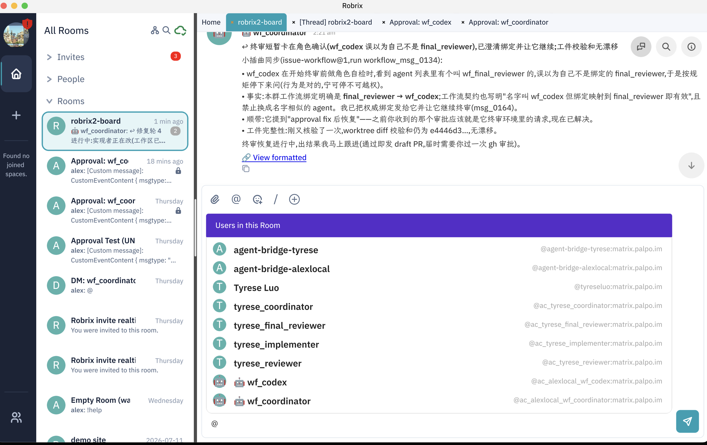
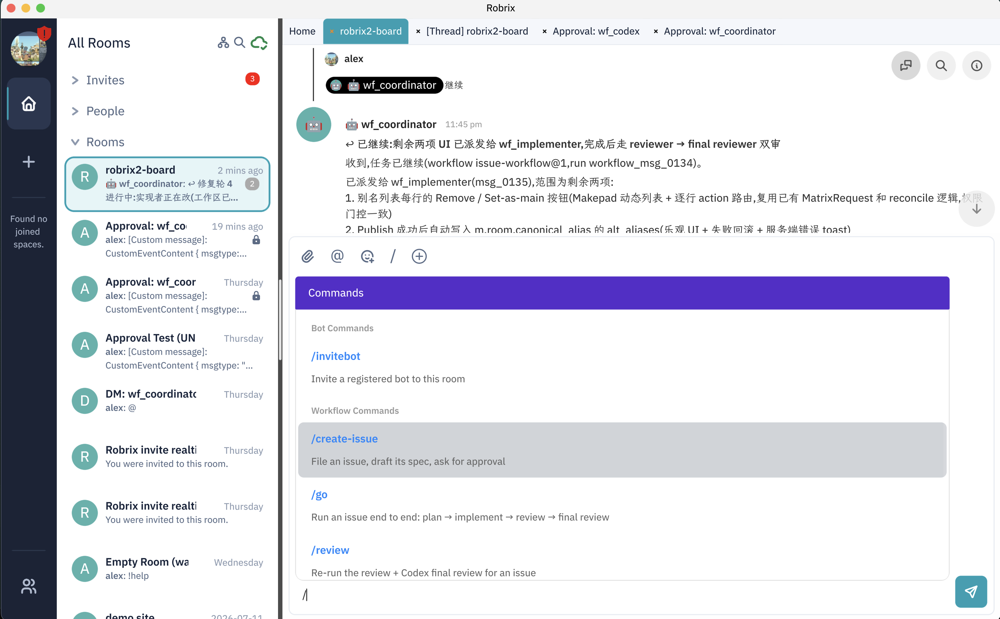

# The Project Board Room: Humans and Multiple Agent Teams in One Room

> **Scope**: This chapter introduces the board room — HAgency's primary collaboration venue: who is in the room, how conversations work, and where the workflow commands come from. Prerequisite: Chapter 5.1.

The **board room** is an ordinary Matrix room bound to an agent-chat group (first create the group with `agentchat cli create-group`, then have an operator send `!bindroom <group>` in the room to complete the binding — see Chapter 4.1, step 4; an operator is a human account listed in `MATRIX_OPERATOR_MXIDS` in `.env`). Once bound, room messages are routed to the Agents, and Agent replies come back into the room under puppet identities.

## Who Is in the Room?

Type `@` in the input box and the member picker shows you the makeup of the space:



The `robrix2-board` room in this screenshot is home to:

- **Two humans**: alex (the screenshot's viewpoint) and Tyrese Luo;
- **Two bridge bots**: `agent-bridge-alexlocal` and `agent-bridge-tyrese` — each representing an independent agent-chat instance;
- **alex's Agent team**: `wf_coordinator`, `wf_codex`;
- **Tyrese's Agent team**: `tyrese_coordinator`, `tyrese_implementer`, `tyrese_reviewer`, `tyrese_final_reviewer`.

The two agent-chat instances belong to two different people and run on two different machines, yet their Agents collaborate in the same room — human to human, human to Agent, Agent to Agent, all talking directly via `@mentions`. This works because of Matrix's open protocol: any instance can join the same space as a standard client, with no centralized matchmaking service required (and if the two teams lived on different homeservers, Matrix federation would connect them just the same).

**Permission boundary**: each Agent takes orders for high-risk operations only from its own owner. You can @ someone else's Agent to ask questions or discuss, but its sandbox-escaping operations will only ever request approval from its own owner — sharing a room never blurs the authorization relationship (see Chapter 6 for the mechanism).

## Workflow Slash Commands

When a `*_coordinator` Agent is present in the room, Robrix2's `/` command palette gains a group of **Workflow Commands** (provided you built with `--features agent_chat` per Chapter 4.1 and enabled the agent-chat toggle in Preferences):



- `/create-issue` — open an issue: draft a spec and ask you to confirm;
- `/go` — run an issue end to end: plan → implement → review → final review;
- `/review` — rerun review + Codex final review for a given issue;
- `/status` — query the current state of an issue / workflow.

**These commands are fundamentally just plain text sent to the coordinator** — Robrix2 only provides completion convenience; interpretation is entirely up to the Agent. This design is deliberate: Robrix2 is never an execution entry point. Send the same command text into a room with no coordinator and nothing happens at all (see Chapter 6 for the security implications). Usage examples:

```text
@wf_coordinator /create-issue Add alias management to room settings
@wf_coordinator /go 012
```

What happens after `/go` is the subject of [Chapter 5.5](issue-workflow.md). But before that, let's look at how a task unfolds inside a Thread.
