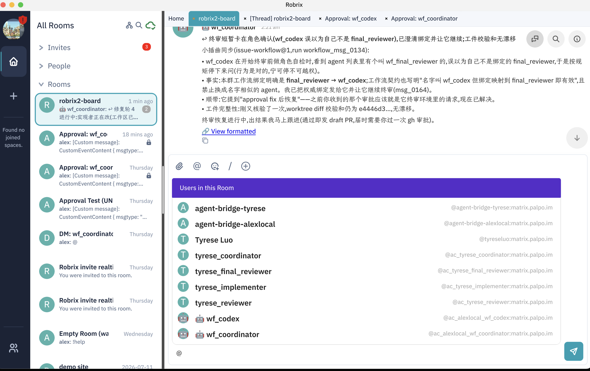
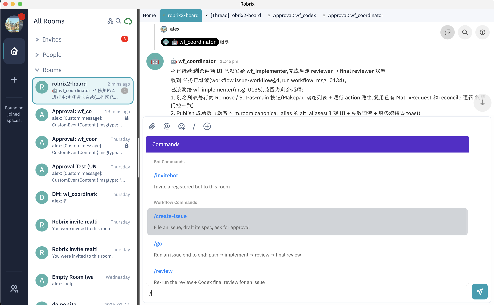

# The Project Board Room: Humans and Multiple Agent Teams in One Room

> **Scope**: This chapter introduces the board room — HAgency's primary collaboration venue: who is in the room, how conversations work, and where the workflow commands come from. Prerequisite: Chapter 5.1.

The **board room** is a **non-encrypted** Matrix room bound to an agent-chat group. `!bindroom` establishes room→group; a human then personally invites each Agent to establish room+agent→owner. Once both bindings are in place, messages explicitly routed to an Agent enter the backend, and the Agent's public replies return to the room under its puppet identity.

## Who Is in the Room?

Type `@` in the input box and the member picker shows you what this space is made of:



The `robrix2-board` room in this screenshot houses, all at once:

- **Two humans**: alex (the screenshot's viewpoint) and Tyrese Luo;
- **Two bridge bots**: `agent-bridge-alexlocal` and `agent-bridge-tyrese` — each representing an independent agent-chat instance;
- **alex's Agent team**: `wf_coordinator`, `wf_codex`;
- **Tyrese's Agent team**: `tyrese_coordinator`, `tyrese_implementer`, `tyrese_reviewer`, `tyrese_final_reviewer`.

The two agent-chat instances belong to two people and run on two machines, yet their Agents can speak publicly in the same room. **Human→Agent** routing uses `@<specific Agent>`; Agent→Agent dispatch within the same backend uses MCP/backend messages. The current bridge ignores `@ac_*` senders to prevent loops, so cross-instance Agents @-mentioning each other in Matrix must not be described as a reliable execution channel; cross-team messages should currently be relayed by a human, or read only as public status.

**Permission boundary**: you can @ someone else's Agent for discussion, but whether that Agent accepts the task is decided by the other instance's policy, and protected operations only go to its own owner. Each backend can only schedule its own Agents, project paths, tokens, and model pool; it cannot use the shared room to acquire permissions on a teammate's machine.

## @ Is Execution Routing, Not Just a Ping

The default is `MATRIX_DEFAULT_WAKE=off`. In a shared room, a top-level message without an explicit @ may be recorded by the bridge, but it wakes no Agent. Rich replies may currently infer the target from the puppet being replied to; if your team requires "an explicit @ every time", do not treat that inference as a security boundary — verify the running version's behavior separately during acceptance.

To avoid answer-grabbing and request amplification, the board room is used under these rules:

| Input | Expectation |
|------|------|
| Top-level message, no @ | Wakes no Agent |
| `@wf_coordinator ...` | Wakes only the corresponding Agent |
| @ two Agents at once | Both targets each receive the task |
| An Agent speaks publicly in the room | For humans to read; does not automatically become a task for another instance's Agent |

## Workflow Slash Commands

When a `*_coordinator` Agent is present in the room, Robrix2's `/` command palette appends a set of **Workflow Commands** (provided you built with `--features agent_chat` and enabled the agent-chat toggle in Preferences, per Chapter 4.1):



- `/create-issue` — open an issue: draft a spec and ask for your confirmation;
- `/go` — run an issue end to end: plan → implement → review → final review;
- `/review` — re-run review + Codex final review for an issue;
- `/status` — query the current state of an issue / workflow.

**These commands are essentially plain text sent to the coordinator.** Robrix2 only provides completion; only a coordinator with a compatible workflow skill installed will interpret them. Without the skill, with the Agent offline, or without an @, the commands do not automatically create a backend workflow run.

```text
@wf_coordinator /create-issue add alias management to room settings
@wf_coordinator /go 012
```

What happens after you send `/go` is the subject of [Chapter 5.5](issue-workflow.md). But before that, let's look at how a task unfolds inside a Thread.
