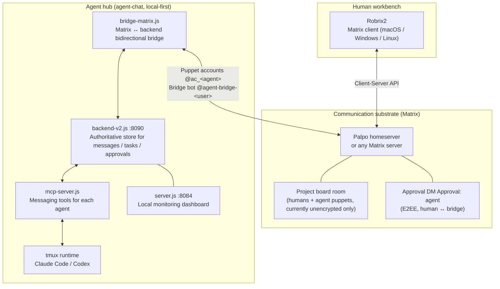

# Philosophy and Overall Architecture

> **Scope**: This chapter lays out HAgency's four design principles and its three-layer architecture — every mechanism in the chapters that follow has a place on this map. Prerequisites: the Preface. If you are evaluating whether this system deserves your trust, start reading here.

## Humans Are Participants, Not Spectators

A typical "multi-agent development system" works like this: you submit a requirement, a swarm of agents churns away inside a black box, and eventually a result gets tossed back at you. The human is shut out of the process — you can't see what happened between the agents, you can't course-correct midway, and you certainly can't gate dangerous operations.

HAgency's design principles are the exact opposite:

1. **Shared space**: Humans and agents can talk in the same Matrix room. Only dispatches, reports, and conclusions explicitly posted to the group become room records; backend DMs, private task state, and approval details are not automatically public.
2. **Humans decide**: Directional decisions ("commit a checkpoint first, or keep writing?" "send a draft PR directly?") are escalated by the agents and made by you.
3. **Humans authorize**: An agent's dangerous operations (`gh` write operations, sandbox-escaping commands) trigger **Owner approval** — a card delivered to an encrypted DM that lets the agent proceed only after you click "Approve once". Approvals are single-use, time-limited, and fail-closed.
4. **Humans can intervene**: You can `@` any agent at any moment to interject, change the plan, or even take over the task — because everything happens in a chat room right in front of you.

Of these four, authorization is **enforced** when the runtime is managed and the owner binding is valid. Shared space and intervention use Matrix transport and membership. Directional escalation and proactive reporting are currently workflow conventions. These are different assurance levels.

## Three-Layer Architecture

A few key design choices, each with its own "why":

**Agents appear on Matrix as puppet accounts.** Each agent maps to an `@ac_<name>:<server>` account with a display name; an avatar is guaranteed only when automatic avatars are enabled or one is configured. This reuses Matrix mentions, threads, and room permissions rather than inventing a second chat protocol.

**robrix→agent delivery is pure Matrix.** You mention `@wf_coordinator` in the room → Palpo → the bridge receives the event → converts it into an agent-chat notification → nudges Claude Code / Codex in tmux; the agent's reply travels back along the same path under its puppet identity. There is no private side channel anywhere in between, which means **any Matrix client can join the collaboration** — Robrix2 is simply the one with the best experience.

**Authoritative state lives at explicit server-side boundaries, not in Robrix2.** Several bindings that look similar are distinct:

| Relationship | Authority | Purpose |
|------|---------|------|
| operator/admin ACL | agent-chat environment | who may run management commands |
| `room → group` | Matrix bridge state | which backend group receives a project room |
| `(room, agent) → owner MXID` | bridge provenance from the Agent invite | who may approve that Agent in that room |
| approval request/consume | backend approval store | TTL, digest, one-shot verdict |
| `group → project/workflow` | Project Board binding data | read-only projection; no supported write UI/API yet |

Robrix2 displays and initiates events, but never grants approval authority or infers owners from display names.

**Approvals go through a dedicated encrypted DM.** The bridge creates or reuses an `Approval: <agent>` room per `(agent, owner MXID)`, usually after owner provenance exists, and it is not ready until the owner joins. Only a redacted waiting status appears in the project room.

**Project rooms and approval rooms have different encryption boundaries.** Agent group outbound messages currently bypass the E2EE crypto client, so thread continuity supports **unencrypted project rooms only**. Approval rooms use a separate E2EE path. Do not enable encryption on the board room in the current version.
