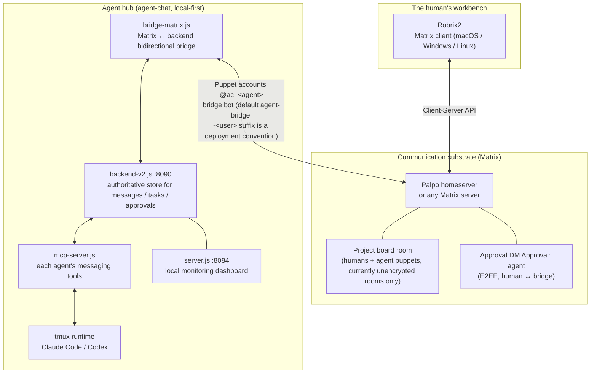

# Philosophy and Overall Architecture

> **Scope**: This chapter lays out HAgency's four design principles and its three-layer architecture — every mechanism in the chapters that follow has a place on this map. Prerequisite: the Preface. Readers evaluating whether this system deserves trust should start here.

## The Human Is a Subject, Not a Spectator

A typical "multi-agent development system" usually looks like this: you submit a requirement, a swarm of agents runs it inside a black box, and finally a result is thrown back at you. The human is excluded from the process — you cannot see what happened between the agents, you cannot correct course midway, and you certainly cannot gate high-risk operations.

HAgency's design principles are the exact opposite:

1. **Same space**: humans and agents can talk in the same Matrix room. Only dispatches, reports, and conclusions explicitly published to the group become part of the room record; backend-internal DMs, unpublished task state, and approval details are not automatically made public.
2. **Humans decide**: directional decisions ("commit a checkpoint first, or keep writing?" "send a draft PR right away?") are proactively escalated by the agent and decided by the human.
3. **Humans authorize**: an agent's high-risk operations (`gh` write operations, sandbox-escaping commands) trigger **Owner approval** — a card delivered to an encrypted DM that only proceeds when you click "Approve once". Approvals are single-use, time-limited, and fail-closed.
4. **Intervenable**: you can `@` an agent at any time to interject, change the plan, or even take over the task — because everything happens in a chat room right in front of you.

Of these four, "humans authorize" is **enforced** by the approval protocol, given a managed runtime and a valid owner binding (Chapters 5.4 and 8); "same space" and "intervenable" are provided by Matrix transport and room membership; "humans decide" and proactive reporting are currently mostly workflow conventions. The strength of these guarantees differs and must not be conflated.

## Three-Layer Architecture

```mermaid
flowchart TB
    subgraph human["The human's workbench"]
        R["Robrix2<br/>Matrix client (macOS / Windows / Linux)"]
    end

    subgraph matrix["Communication substrate (Matrix)"]
        P["Palpo homeserver<br/>or any Matrix server"]
        room["Project board room<br/>(humans + agent puppets, currently unencrypted rooms only)"]
        appr["Approval DM Approval: agent<br/>(E2EE, human ↔ bridge)"]
        P --- room
        P --- appr
    end

    subgraph ac["Agent hub (agent-chat, local-first)"]
        BR["bridge-matrix.js<br/>Matrix ↔ backend bidirectional bridge"]
        BE["backend-v2.js :8090<br/>authoritative store for messages / tasks / approvals"]
        MCP["mcp-server.js<br/>each agent's messaging tools"]
        TMUX["tmux runtime<br/>Claude Code / Codex"]
        DASH["server.js :8084<br/>local monitoring dashboard"]
        BR <--> BE
        BE <--> MCP
        MCP <--> TMUX
        BE --- DASH
    end

    R <-->|Client-Server API| P
    BR <-->|"Puppet accounts @ac_&lt;agent&gt;<br/>bridge bot (default agent-bridge,<br/>-&lt;user&gt; suffix is a deployment convention)"| P
```

A few key design choices, and the "why" behind each:

**Agents appear on Matrix as "puppet accounts."** Each agent maps to an `@ac_<name>:<server>` account with a display name set; an avatar is only guaranteed if auto-avatars are explicitly enabled or configured manually. To a human, it is still an ordinary room member. The payoff is reusing Matrix's @mentions, Threads, and room permissions rather than inventing a second chat protocol for agents.

**robrix→agent delivery is pure Matrix.** You say `@wf_coordinator` in a room → Palpo → the bridge receives the event → converts it into an agent-chat notification → nudges the Claude Code / Codex session in tmux; the agent's reply travels back along the same path under its puppet identity. There is no private side channel anywhere in between, which means **any Matrix client can participate in the collaboration** — Robrix2 is simply the one with the best experience.

**Authoritative state is distributed across explicit server-side boundaries, never in Robrix2.** Several easily confused "bindings" are in fact distinct things:

| Relationship | Authoritative source | Purpose |
|------|---------|------|
| operator / admin ACL | agent-chat environment variables | Who may run admin commands such as `!bindroom` |
| `room → group` | Matrix bridge persistent state | Which backend group a project room is wired to |
| `(room, agent) → owner MXID` | Established by the bridge from the agent's invite event | Who may approve this agent's requests in that room |
| approval request / consume | backend approval store | TTL, digest, single-use consumption, and the final verdict |
| `group → project/workflow` | Project Board binding data | Read-only project projection; currently no formal write UI/API |

**Robrix2 is only a client for display and initiating actions — never a source of authorization.** It does not determine owners from display names, and it holds no approval permissions that could override server-side judgment.

**Approvals travel through a separate encrypted DM.** The bridge creates or reuses an `Approval: <agent>` E2EE room keyed by `(agent, owner MXID)`, whose members are the owner, the bridge bot, and that agent. It is usually created on demand after the owner binding is established, and is not ready until the owner accepts the invite. Approval details appear only there; other people in the project room see only a redacted waiting status.

**The project room and the approval room currently sit on different encryption boundaries.** An agent's outbound path into group rooms does not currently go through the E2EE crypto client, so Thread continuity is supported only in **unencrypted project rooms**. The approval room uses a separate E2EE path. Do not enable room encryption when creating a board room; if your project content cannot live in a plaintext / federatable room, the current version is not suitable for pasting full code and commands into the board room.
