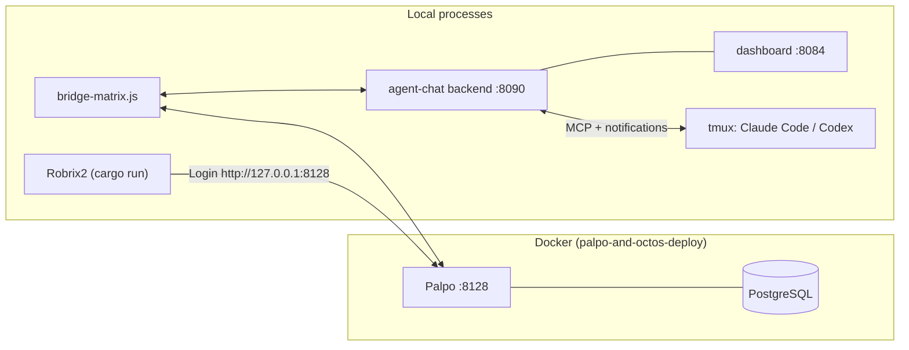

# Local Deployment: Palpo + agent-chat + Robrix2

> **Scope**: This chapter deploys all three components locally and verifies the full pipeline. Prerequisites: the route choice in Chapter 4. Examples use macOS / Linux; expect 30–60 minutes end to end.

Once deployed, the process topology on your machine looks like this:



## 1. Start Palpo (Matrix Homeserver)

The Robrix2 repository ships a ready-to-use Docker Compose deployment (`palpo-and-octos-deploy/`) containing PostgreSQL plus Palpo built from source (x86_64 / ARM64 supported):

```bash
cd robrix2/palpo-and-octos-deploy

./setup.sh                  # One-time: clones the palpo source, generates .env
docker compose up -d        # Starts PostgreSQL + Palpo
docker compose logs -f      # Watch the logs
```

Default configuration (`palpo.toml`):

- The Client-Server API listens on `http://127.0.0.1:8128` (this is what Robrix2 connects to);
- `server_name` defaults to `127.0.0.1:8128`; for production use, change it to your own domain;
- **Open registration** is enabled, making it easy to create accounts for yourself and the bridge bot.

> This compose setup also starts an Octos bot container, which requires `DEEPSEEK_API_KEY` in `.env` (`setup.sh` will remind you). If you are only deploying HAgency, you can ignore that container's errors or stop it in the compose file — Palpo is unaffected.

**Verify**: `curl http://127.0.0.1:8128/_matrix/client/versions` returning a version list means it is ready.

You can also skip Docker and build and run Palpo with `cargo` per the instructions in the [Palpo repository](https://github.com/palpo-im/palpo); agent-chat only requires "a working Matrix server".

## 2. Start agent-chat

Prerequisites: **Node.js 22+**, **tmux**, and at least one coding runtime (Claude Code or Codex CLI).

```bash
git clone https://github.com/ZhangHanDong/agent-chat.git
cd agent-chat
npm install
cp .env.example .env
```

Edit `.env`, paying attention to four groups of settings:

| Setting | Purpose | Suggested value for local deployment |
|------|------|--------------|
| Matrix server address | Which homeserver the bridge connects to | `http://127.0.0.1:8128` |
| Bridge bot username/password | The bridge's Matrix identity (`agent-bridge-<your-name>`) | On a server with open registration, **the bridge registers this account automatically** — no need to create it in advance; only servers with registration closed require pre-registration or a registration token |
| `MATRIX_TRUSTED_INVITER_MXIDS` | **The bridge only trusts rooms it was invited into by these people** | Must be changed to your own human account (e.g. `@alex:127.0.0.1:8128`). The value in `.env.example` is a placeholder — if you leave it, under the default `MATRIX_TRUST_MODE=enforce` the bridge will **silently ignore** every message in your room |
| `MATRIX_OPERATOR_MXIDS` | Who counts as an **operator** (human accounts allowed to run admin commands like `!bindroom`) | Your own account here as well |

Start the services and bring up your first agent:

```bash
bin/agentchat service restart --profile local   # backend(:8090) + dashboard(:8084) + bridge
bin/agentchat up wf_coordinator ~/work/my-project claude   # Starts a Claude Code agent in tmux
bin/agentchat ls                                # List running agents
```

**Verify**:

```bash
curl --noproxy '*' http://127.0.0.1:8090/health   # Backend health check
open http://127.0.0.1:8084                        # Local monitoring dashboard
```

When an agent starts, agent-chat automatically takes care of three things: registering its `@ac_<name>:<server>` puppet account; wiring up the MCP messaging tools; and configuring the runtime's permissions in a **managed** fashion — Claude Code uses `--permission-mode auto` plus the approval channel, while Codex uses the `workspace-write` sandbox plus an approval hook (on first startup you must type `TRUST` once in the terminal to explicitly trust the approval hook — this one-time confirmation is deliberate; do not bypass it).

## 3. Start Robrix2

The workflow command palette and other agent-chat integrations are provided by the `agent_chat` Cargo feature (not compiled by default), so build with the feature enabled:

```bash
cd robrix2
cargo run --features agent_chat
```

On the login screen: enter `http://127.0.0.1:8128` as the **Homeserver**, then register / log in with your human account (e.g. `@alex:127.0.0.1:8128`).

After logging in, you also need to flip a runtime switch once: **Settings → Preferences → Enable agent-chat support**. The compile-time feature plus the runtime switch is deliberate double-gating — users who don't need agent functionality get a pure IM client.

## 4. Wire Humans and Agents Together

1. **Create a group**: Agents in agent-chat are organized by group. First create a group and add your agent to it:

   ```bash
   bin/agentchat cli create-group robrix2-board wf_coordinator
   ```

2. **Bind the room**: In Robrix2, create a room to serve as the project board room, invite the bridge bot (you are in `MATRIX_TRUSTED_INVITER_MXIDS`, so the bridge accepts the invitation), then send as an operator:

   ```text
   !bindroom robrix2-board
   ```

   From then on, the room and the group are bridged bidirectionally. Note that `!bindroom` binds an **existing** group — if you skipped step 1, it replies `Group not found`.

3. **Accept invitations**: The bridge bot will invite you into the agent-related rooms (approval DMs, etc.); click Join under Invites in Robrix2.

4. **Smoke test**: In the board room, `@` your agent and say something — if its puppet account replies, the whole chain (Robrix2 → Palpo → bridge → backend → tmux → back the same way) is working.

## Troubleshooting

| Symptom | Where to look first |
|------|---------|
| Robrix2 login fails | Palpo container logs; does the homeserver address include the right port |
| **The bridge does not react to room messages at all** | Nine times out of ten it's the trust gate: confirm that `MATRIX_TRUSTED_INVITER_MXIDS` in `.env` is your account and that this is the account that invited the bridge into the room; check the trust decision in the bridge logs |
| `!bindroom` replies Group not found | Create the group first with `agentchat cli create-group` |
| `!bindroom` says no permission | The sender is not in `MATRIX_OPERATOR_MXIDS` |
| @agent gets no response | Check `agentchat ls` to see whether the agent is online; check the bridge logs for the incoming room event |
| No workflow commands in the `/` palette | Did you build with `--features agent_chat` and enable the Preferences switch; is there a `*_coordinator` in the room |
| Approval card never appears | Check the bridge logs for sends to the approval room; was the agent runtime started in managed mode (see Chapter 6) |

Next: [Team Collaboration in Practice](collab-overview.md).
