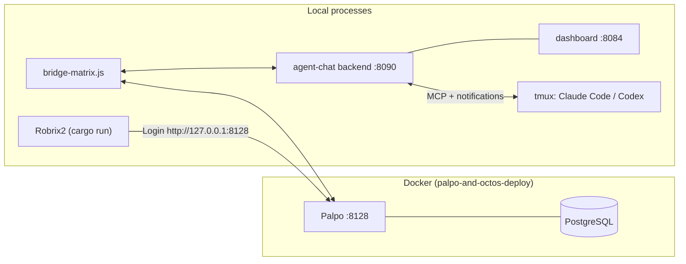

# Local Deployment: Palpo + agent-chat + Robrix2

> **Scope**: This chapter deploys all three components and verifies a one-Agent path. Linux is the supported install path; macOS currently uses a development run path.

Once deployed, the process topology on your machine looks like this:



## 1. Start Palpo (Matrix Homeserver)

The Robrix2 repository ships a ready-to-use Docker Compose deployment (`palpo-and-octos-deploy/`) containing PostgreSQL plus Palpo built from source (x86_64 / ARM64 supported):

```bash
cd robrix2/palpo-and-octos-deploy

./setup.sh
docker compose up -d palpo_postgres palpo
docker compose logs -f palpo
```

Default configuration (`palpo.toml`):

- The Client-Server API listens on `http://127.0.0.1:8128` (this is what Robrix2 connects to);
- `server_name` defaults to `127.0.0.1:8128`; for production use, change it to your own domain;
- **Open registration** is enabled for local testing of human, bridge, and puppet accounts.

> Starting only `palpo_postgres` and `palpo` keeps Octos model configuration out of the HAgency smoke test. Open registration is for loopback or a trusted development network; do not expose this test configuration publicly.

**Verify**: `curl http://127.0.0.1:8128/_matrix/client/versions` returning a version list means it is ready.

You can also skip Docker and build and run Palpo with `cargo` per the instructions in the [Palpo repository](https://github.com/palpo-im/palpo); agent-chat only requires "a working Matrix server".

## 2. Configure and Start agent-chat

Prerequisites: **Node.js 22+**, **tmux**, and at least one coding runtime (Claude Code or Codex CLI).

```bash
git clone https://github.com/ZhangHanDong/agent-chat.git
cd agent-chat
npm install
cp .env.example .env
```

Generate independent secrets:

```bash
openssl rand -hex 32  # API_TOKEN
openssl rand -hex 32  # MATRIX_BRIDGE_SECRET
openssl rand -hex 32  # MATRIX_AGENT_PASSWORD_SECRET
```

At minimum, set:

```dotenv
API_TOKEN=<random-long-token>
MATRIX_HOMESERVER=http://127.0.0.1:8128
MATRIX_SERVER_NAME=127.0.0.1:8128
MATRIX_BOT_USERNAME=agent-bridge-alexlocal
MATRIX_BOT_PASSWORD=<bridge-account-password>
MATRIX_AGENT_PASSWORD_SECRET=<another-random-secret>
MATRIX_BRIDGE_SECRET=<shared-by-backend-and-bridge>

MATRIX_TRUST_MODE=enforce
MATRIX_TRUSTED_INVITER_MXIDS=@alex:127.0.0.1:8128
MATRIX_OPERATOR_MXIDS=@alex:127.0.0.1:8128
MATRIX_DEFAULT_WAKE=off
```

Use full MXIDs, never a display name or localpart. Do not leave both operator/admin ACLs empty: the command layer has a legacy `no_acl` compatibility fallback. On a closed homeserver, pre-provision the bridge and every puppet account or configure a supported registration token.

### Linux: supported installer

```bash
./install-full.sh --with-bridge
systemctl --user status agent-chat-v2 agent-chat agent-chat-push-relay bridge-matrix 2>/dev/null \
  || systemctl status agent-chat-v2 agent-chat agent-chat-push-relay bridge-matrix
```

Whether the units are user or system services depends on the installer options; follow its output.

### macOS: development run path

There is no equivalent full macOS installer yet. Replace/remove every `<...>` placeholder and quote values containing shell-special characters before sourcing `.env`; then run the four processes with the same exported environment:

```bash
set -a; source .env; set +a
node backend-v2.js
node server.js
PUSH_RELAY_MODE=local node push-relay.js
node bridge-matrix.js
```

These are four separate long-running commands: backend `:8090`, dashboard `:8084`, local relay, and Matrix bridge. An existing local supervisor/LaunchAgent setup may use `bin/agentchat service restart --profile local`, but clone + `npm install` does not create those macOS services.

**Verify the services**:

```bash
curl --noproxy '*' http://127.0.0.1:8090/health   # Backend health check
open http://127.0.0.1:8084                        # Local monitoring dashboard
```

### Bind a Local Project and Start an Agent

```bash
bin/agentchat project add wf_coordinator /absolute/path/to/my-project --mode symlink
bin/agentchat project list wf_coordinator
bin/agentchat up wf_coordinator /absolute/path/to/my-project claude
bin/agentchat ls
```

`symlink` writes through to the source repository; `copy` is an isolated copy. Expose only required project paths. Select a model at process startup with `--model <model>`; changing it requires a managed restart. Natural-language per-task model selection from Robrix2 is not wired yet.

Managed startup registers the puppet, wires MCP, and fixes the runtime policy: Claude uses auto mode plus the approval channel; Codex uses `workspace-write` plus an `on-request` hook. The first Codex `up` requires typing `TRUST` in a local TTY. Do not edit trust state directly or manually restart the runtime inside tmux.

## 3. Start Robrix2

The workflow command palette and other agent-chat integrations are provided by the `agent_chat` Cargo feature (not compiled by default), so build with the feature enabled:

```bash
cd robrix2
cargo run --features agent_chat
```

On the login screen: enter `http://127.0.0.1:8128` as the **Homeserver**, then register / log in with your human account (e.g. `@alex:127.0.0.1:8128`).

After logging in, you also need to flip a runtime switch once: **Settings → Preferences → Enable agent-chat support**. The compile-time feature plus the runtime switch is deliberate double-gating — users who don't need agent functionality get a pure IM client.

## 4. Create the Project Room and Establish the Owner

1. **Create a group**: Agents in agent-chat are organized by group. First create a group and add your agent to it:

   ```bash
   bin/agentchat cli create-group robrix2-board wf_coordinator
   ```

   **Current bootstrap limitation**: when the bridge observes a new group, it automatically creates a same-name Matrix room and joins the Agent. There is no “backend group only / no room” switch. The bridge-issued Agent invitation does not establish a human owner. A supported no-room mode or validated owner-claim flow is required before this becomes a clean production bootstrap.

2. **Choose an unencrypted project room**:

   - For a colleague's existing project room, invite your bridge there and send `!bindroom robrix2-board`; do not use the extra auto-created room for approval acceptance.
   - For a fresh solo test, send `!mkgroup robrix2-board wf_coordinator` in the bridge DM, accept the generated room, then use the remove-and-human-reinvite step below.

   Current Agent group outbound messages do not support E2EE. When binding an existing room, send:

   ```text
   !bindroom robrix2-board
   ```

   `!bindroom` creates only `room → group`; it does **not** invite an Agent or establish an owner.

3. **Have the owner invite the actual Agent**:

   - In an existing project room, invite the exact `@ac_wf_coordinator:<server_name>` from the human account.
   - In the `!mkgroup` room, the bridge already joined the Agent. Send `!rmember wf_coordinator`, wait for the puppet to leave, then invite it from the human account. Matrix→backend reconciliation adds it back to the group.

   The bridge records the human membership event's actual sender:

   ```text
   (project_room_id, wf_coordinator) → @alex:127.0.0.1:8128
   ```

   Whoever invites that Agent is its owner in that room. Invite polling may take about 60 seconds. Once joined, the Agent invites its companion bridge.

4. **Accept the approval-room invitation**: the bridge creates or reuses `Approval: wf_coordinator` and invites the owner. Before the owner joins, the channel reports `owner_invite_pending`.

5. **Smoke test**: explicitly `@wf_coordinator`. With `MATRIX_DEFAULT_WAKE=off`, unmentioned room messages are stored but do not wake an Agent. Then trigger a protected command and verify that the project room gets only a redacted waiting notice while the detailed card appears in the approval room.

## Troubleshooting

| Symptom | Where to look first |
|------|---------|
| Robrix2 login fails | Palpo container logs; does the homeserver address include the right port |
| Bridge fails to start | Required token/secrets/passwords are non-empty; backend and bridge read the same `.env` |
| **The bridge does not react to room messages** | Confirm enforce mode and that the full trusted MXID invited the bridge; inspect trust logs |
| `!bindroom` replies Group not found | Create the group first with `agentchat cli create-group` |
| `!bindroom` says no permission | The sender is not in `MATRIX_OPERATOR_MXIDS` |
| @agent gets no response | Is the Agent joined and online; did the bridge see an explicit mention; is the push relay healthy |
| No workflow commands in the `/` palette | Did you build with `--features agent_chat` and enable the Preferences switch; is there a `*_coordinator` in the room |
| Approval is immediately denied / no card | Unique owner binding, accepted approval invitation, managed runtime, and a pending backend record |

See [Operations Acceptance and Troubleshooting](operations.md) for the full decision tree. Next: [Team Collaboration in Practice](collab-overview.md).
