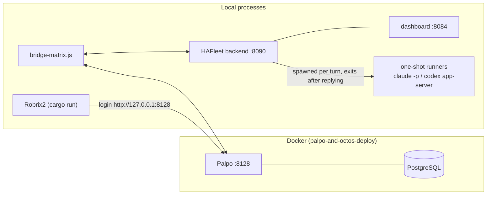

# Local Deployment: Palpo + agent-chat + Robrix2

> **Scope**: This chapter deploys the three components locally and verifies the single-agent pipeline. Prerequisite: the route selection in Chapter 4. Linux is the supported install path; macOS is currently a development run path.

Once deployment is complete, the process topology on your machine looks like this:


```mermaid
flowchart LR
    subgraph docker["Docker (palpo-and-octos-deploy)"]
        PG[("PostgreSQL")]
        PALPO["Palpo :8128"]
        PALPO --- PG
    end
    subgraph local["Local processes"]
        ROBRIX["Robrix2 (cargo run)"]
        BE["HAFleet backend :8090"]
        DASH["dashboard :8084"]
        BRIDGE["bridge-matrix.js"]
        RUNNER["one-shot runners<br/>claude -p / codex app-server"]
    end
    ROBRIX -->|login http://127.0.0.1:8128| PALPO
    BRIDGE <--> PALPO
    BRIDGE <--> BE
    BE --- DASH
    BE -->|spawned per turn, exits after replying| RUNNER
```

> The agent-chat project has been renamed **HAFleet**; the CLI and env-var prefix changed from `agentchat`/`AGENTCHAT_*` to `hafleet`/`HAFLEET_*` accordingly. This chapter is written for the thread-session runner mode (recommended, and the mode this book was verified against): agents have no resident process — the backend spawns a one-shot runner per conversational turn, and idle agents cost zero processes. The legacy resident-tmux mode remains in the code as a rollback path (turn off `HAFLEET_THREAD_SESSIONS` to fall back) but is no longer the recommended deployment.

## 1. Start Palpo (Matrix Homeserver)

The Robrix2 repository ships a ready-to-use Docker Compose deployment (`palpo-and-octos-deploy/`), consisting of PostgreSQL + Palpo built from source (x86_64 / ARM64 supported):

```bash
cd robrix2/palpo-and-octos-deploy

./setup.sh
docker compose up -d palpo_postgres palpo
docker compose logs -f palpo
```

Default configuration (`palpo.toml`):

- The Client-Server API listens on `http://127.0.0.1:8128` (Robrix2 connects here);
- `server_name` defaults to `127.0.0.1:8128`; for production use, change it to your own domain;
- **Open registration**, so local testing can easily create the human, bridge bot, and agent puppet accounts.

> We explicitly start only `palpo_postgres` and `palpo` here, to keep Octos's model-API configuration out of the HAgency smoke test. Open registration is only suitable for loopback addresses or a trusted development network; do not expose this test configuration directly to the public internet.

**Verify**: `curl http://127.0.0.1:8128/_matrix/client/versions` returning a version list means it is ready.

You can also skip Docker and build/run with `cargo` per the [Palpo repository](https://github.com/palpo-im/palpo)'s instructions; agent-chat only requires "a working Matrix server."

## 2. Configure and Start agent-chat

Prerequisites: **Node.js 22+** and at least one coding runtime (Claude Code or Codex CLI). Under thread-session mode tmux is no longer required (it is only used transiently for one-time agent registration, see below).

```bash
git clone https://github.com/hagency-org/HAFleet.git
cd HAFleet
npm install
cp .env.example .env
```

First generate three independent secrets:

```bash
openssl rand -hex 32  # for API_TOKEN
openssl rand -hex 32  # for MATRIX_BRIDGE_SECRET
openssl rand -hex 32  # also recommended: an independent value for MATRIX_AGENT_PASSWORD_SECRET
```

`.env` must explicitly set at least the following. The backend and the bridge must read the **same** `.env` and the same `MATRIX_BRIDGE_SECRET`:

```dotenv
API_TOKEN=<long random token>
MATRIX_HOMESERVER=http://127.0.0.1:8128
MATRIX_SERVER_NAME=127.0.0.1:8128
MATRIX_BOT_USERNAME=agent-bridge-alexlocal
MATRIX_BOT_PASSWORD=<bridge account password>
MATRIX_AGENT_PASSWORD_SECRET=<another long random secret>
MATRIX_BRIDGE_SECRET=<secret shared by backend and bridge>

MATRIX_TRUST_MODE=enforce
# Note: besides the human operator, the bridge bot itself must be listed —
# it issues room invites on behalf of the agent puppets
MATRIX_TRUSTED_INVITER_MXIDS=@alex:127.0.0.1:8128,@agent-bridge-alexlocal:127.0.0.1:8128
MATRIX_OPERATOR_MXIDS=@alex:127.0.0.1:8128
MATRIX_DEFAULT_WAKE=off

# thread-session runner mode (recommended): one isolated session per Matrix thread
HAFLEET_THREAD_SESSIONS=1
HAFLEET_ROUTER_TASK_CUTOVER=1
```

> On first start, `HAFLEET_ROUTER_TASK_CUTOVER=1` migrates `tasks.json` one-way into SQLite (a `.bak` is kept automatically); SQLite is the task store of record afterwards. `HAFLEET_THREAD_SESSIONS` requires it. Both variables must reach the backend AND the bridge.

Do not write just a display name or `alex`; security boundaries use full MXIDs. **Omitting the bridge bot from `MATRIX_TRUSTED_INVITER_MXIDS` is the most common deployment mistake** — the symptom is the bridge log filling with `UNTRUSTED reason=untrusted_inviter` while agent puppets never join rooms. `MATRIX_OPERATOR_MXIDS` / `MATRIX_ADMIN_MXIDS` must not both be left empty, because the admin-command ACL has a `no_acl` fallback for backward compatibility with old deployments (these two entries do not exist in `.env.example` — add them yourself). If homeserver registration is closed, you must also pre-create the bridge account and every `@ac_*` account, or configure a registration token supported by your server.

### Linux: The Supported Install Path

```bash
./install-full.sh --with-bridge
systemctl --user status agent-chat-v2 agent-chat agent-chat-push-relay bridge-matrix 2>/dev/null \
  || systemctl status agent-chat-v2 agent-chat agent-chat-push-relay bridge-matrix
```

The installer is currently a Linux/systemd path. Whether user units are used depends on your install options — trust the installer's output.

### macOS: The Development Run Path

macOS currently has no equivalent full installer. The recommended path is the repository's local supervisor, which brings up all four services (backend `:8090`, dashboard `:8084`, local notification relay, Matrix bridge) with one command and restarts children when they exit:

```bash
set -a; source .env; set +a
node services/hafleet-services.mjs run --profile services/services-local.json
```

**Two path variables that are easy to get wrong** (we hit both during a real upgrade):

- `HAFLEET_RUNTIME_DIR` — the data directory (where `data/` lives). The supervisor's `--runtime` flag only affects its own state files; **child processes rely entirely on this environment variable**. Left unset, the backend creates an empty `data/` next to the code — the symptom is "services healthy but agents: 0 and messages vanish". If code and data share a directory you can omit it.
- `HAFLEET_HOMEDIR` — the agent home root (tokens, state, workspaces), default `~/.hafleet`. When upgrading from old agent-chat where agents live under `~/.agentchat`, you must point this back explicitly, or runners fail with `agent token is unavailable`.

You can still start the four processes by hand in four terminals as the old docs described, but every terminal must source the same `.env` plus the variables above.

**Verify the base services**:

```bash
curl --noproxy '*' http://127.0.0.1:8090/health   # backend health check
open http://127.0.0.1:8084                        # local monitoring dashboard
```

### Register the Agent and Bind a Local Project

Declare the project boundary first, then do the one-time registration:

```bash
bin/hafleet project add wf_coordinator /absolute/path/to/my-project --mode symlink
bin/hafleet project list wf_coordinator
bin/hafleet up wf_coordinator /absolute/path/to/my-project claude   # one-time registration
bin/hafleet ls
```

`symlink` lets the agent write directly into the source repository; `copy` is an isolated replica that does not write changes back to the source directory. Add only the project paths the agent needs — do not expose your whole working directory or home.

What `up` accomplishes here is **registration**: it creates the `@ac_<name>` puppet account, mints the token, and writes the workspace and MCP configuration. Under thread-session mode those are everything a runner needs — once registration completes you can stop the tmux pane with `bin/hafleet down`, and Matrix messages are handled from then on by one-shot runners the backend spawns per turn; no resident runtime is needed. A Codex agent's first `up` requires typing `TRUST` once in a local TTY; do not hand-edit the trust state.

**Per-turn runner permissions are pinned by the backend**: an ordinary chat turn runs Claude with `--permission-mode plan` (read-only) and Codex in a `read-only` sandbox; only turns bound to a task (or explicitly granted by an operator via `/thread mode auto`, see chapter 5.3) get write access, and concurrent writes are serialized by the workspace lease. The model defaults to the agent's configuration and can be overridden per thread with `/thread model <name>` — the model must match the agent's framework (naming a Claude model for a Codex agent fails at runtime).

## 3. Start Robrix2

The workflow command palette and other agent-chat integrations are provided by the `agent_chat` Cargo feature (not compiled by default), so build with the feature:

```bash
cd robrix2
cargo run --features agent_chat
```

On the login screen, set **Homeserver** to `http://127.0.0.1:8128` and register / log in with your human account (for example `@alex:127.0.0.1:8128`).

After logging in, flip the runtime switch once: **Settings → Preferences → Enable agent-chat support**. The compile-time feature + runtime toggle is deliberate double gating — users who don't need agent features get a pure IM.

## 4. Create the Project Room and Establish the Owner

1. **Create the backend group**:

   ```bash
   bin/hafleet cli create-group robrix2-board wf_coordinator
   ```

   **Current bootstrap limitation**: when the bridge observes a new group, it automatically creates a Matrix room of the same name and joins the agent to it; there is currently no "backend group only / no room" switch. In the auto-created room, the agent's inviter is the bridge, so no human owner is established. A formal release should first add that mode or a validated owner-claim flow.

2. **Choose an unencrypted project room**:

   - Joining a colleague's existing project room: invite your own bridge into that room, then send `!bindroom robrix2-board`; the same-named room auto-created for the new group is just a superfluous room — do not use it for approval acceptance testing;
   - Fresh single-person test: you can also send `!mkgroup robrix2-board wf_coordinator` in a bridge DM and accept the auto-room invite, then perform the "remove, then re-invite by a human" step below.

   Do not enable project-room E2EE in the current version. When binding an existing room, send as an operator:

   ```text
   !bindroom robrix2-board
   ```

   `!bindroom` only establishes `room → group`; **it does not invite the agent and does not establish an owner**.

3. **Have the owner personally invite the actual agent**:

   - In an existing project room, use the same human account to invite the exact `@ac_wf_coordinator:<server_name>`;
   - In the `!mkgroup` auto-room, the agent has already been joined by the bridge. First run `!rmember wf_coordinator` in the room, confirm the puppet has left, then re-invite it from the human account; the Matrix→backend reconcile will add it back to the group.

   The bridge establishes, from the real `event.sender` of that human-sent membership invite:

   ```text
   (project_room_id, wf_coordinator) → @alex:127.0.0.1:8128
   ```

   **Whoever invites the agent is its owner in that room.** This is the source of approval authorization, not a UI convention. Invite polling may default to roughly 60 seconds; after joining, the agent invites its own companion bridge.

4. **Accept the approval-room invite**: the bridge creates or reuses the `Approval: wf_coordinator` E2EE room and invites the owner. Accept it; while unaccepted, approval status will be `owner_invite_pending`.

5. **Smoke test**: explicitly `@wf_coordinator` in the board room. With the default `MATRIX_DEFAULT_WAKE=off`, room messages without an @ are only recorded and do not wake the agent. Once the puppet replies, trigger one protected command that requires approval, and confirm the project room shows only the redacted waiting status while the detailed card appears only in the approval room.

## Diagnosing Common Problems

| Symptom | Where to look first |
|------|---------|
| Robrix2 login fails | Palpo container logs; does the homeserver address include the right port |
| Bridge won't start | Are `API_TOKEN`, `MATRIX_BRIDGE_SECRET`, the bot password, and the agent password secret non-empty; are backend/bridge reading the same `.env` |
| **The bridge is completely unresponsive to room messages** | Confirm trust mode is enforce and the trusted inviter is the full MXID that invited the bridge; check the bridge trust logs |
| `!bindroom` replies Group not found | Create the group first with `hafleet cli create-group` |
| `!bindroom` says no permission | The sender is not in `MATRIX_OPERATOR_MXIDS` |
| @Agent gets no reaction | Is the agent actually in the room; is the agent registered in `hafleet ls`; did the bridge receive an explicit mention; is the push relay healthy |
| No workflow commands in the `/` palette | Built with `--features agent_chat` + the Preferences toggle on; is there a `*_coordinator` in the room |
| Approval instantly denied / card missing | Is there a unique owner binding; was the approval-room invite accepted; are runners spawning normally (backend log `[router-runner]`); did the backend create a pending record |
| Services healthy but agents: 0, messages vanish | `HAFLEET_RUNTIME_DIR` does not point at the real data directory — the backend is running against an empty `data/` |
| Every runner fails with `agent token is unavailable` | `HAFLEET_HOMEDIR` disagrees with where the agents actually live (old deployments: `~/.agentchat`) |
| The agent says it is in plan mode and cannot write | Expected: chat turns are read-only; use the task flow or `/thread mode auto` for write access |

For full layer-by-layer diagnosis see [Operations Acceptance and Troubleshooting](operations.md). Next: [Team Collaboration in Practice](collab-overview.md).
