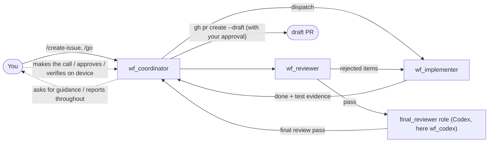
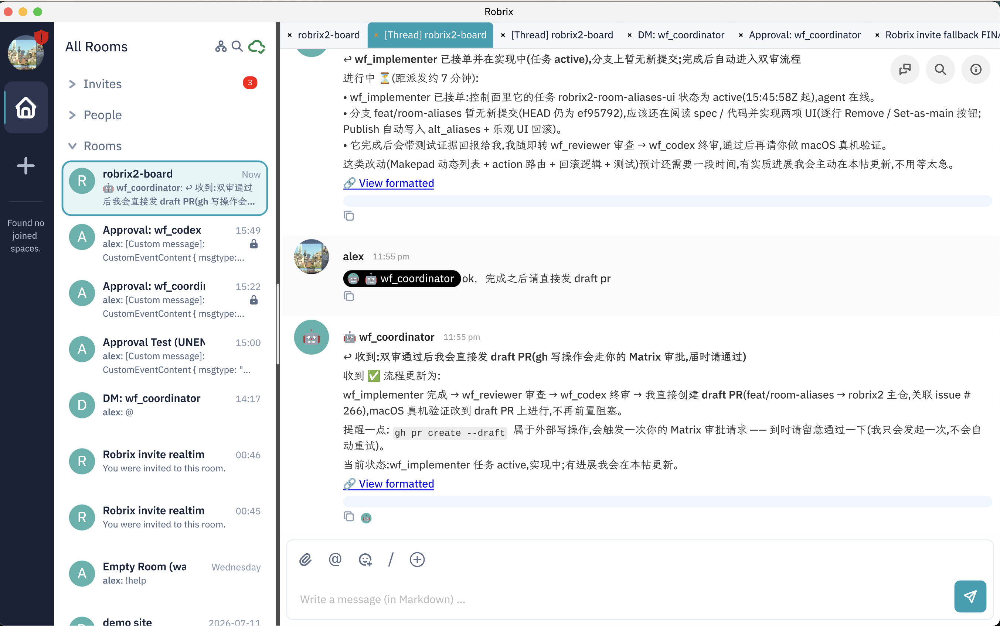

# issue-workflow: A Four-Role Development Workflow

> **Scope**: This chapter is where everything in the book converges — a four-role Agent team delivers a feature end to end, with a human watching and making the calls. Prerequisites: Chapters 5.2–5.4.

## The Four Roles

| Role | Runtime | Responsibility |
|------|--------|------|
| `wf_coordinator` | Claude Code | Interface to the human: open issues, dispatch, report, ask for guidance |
| `wf_implementer` | Claude Code | Write code and run tests in a dedicated worktree |
| `wf_reviewer` | Claude Code | First-round adversarial review |
| `final_reviewer` role | **Codex** | Independent final review. Deliberately a different runtime/model, for adversarial diversity |

By default a role is determined by the Agent's name (all four Agents share the same issue-workflow skill and branch by substring match on their `whoami` name); **the authoritative source is agent-chat's workflow binding record** (which account holds which role). In the deployment behind this book's screenshots, the Codex final-review account is named `wf_codex` — a name that matches no role substring; it holds the final-review role purely via the binding record `final_reviewer: wf_codex`. That is also the origin of the role self-check episode later in this chapter.

## A Real Run

**1. Issue creation and dispatch.** You send `/create-issue` and `/go` in the board room (or just assign the work in natural language). The coordinator drafts a spec, gets your confirmation, creates a workflow run, and dispatches the task to the implementer — the dispatch summary carries explicit scope and constraints:

> Dispatched to wf_implementer (msg_0135); scope is the remaining two items… Constraints: changes only within the robrix2-room-aliases worktree (feat/room-aliases, HEAD ef95792); no regressions in the 8/8 spec scenarios or the full 548-test suite.

**2. Human decisions along the way.** Agents don't make directional decisions for you. Halfway through implementation, the coordinator asks in the Thread:

alex replies with one line — "When it's done, just go ahead and open a draft PR" — and the coordinator immediately confirms the new process, **and gives advance notice**: `gh pr create --draft` is an external write, so it will trigger one Matrix approval from you when the time comes (see Chapter 5.4) — managing approval expectations up front.

**3. The review-and-fix loop.** Once the implementer finishes, the reviewer reviews and sends rejected items back to the implementer for fixes. The coordinator maintains a "cover" on the main timeline while the full process lives in the Thread — the thread in this screenshot has accumulated 17 replies and reached fix round 4:

**4. Codex final review, and an Agent that follows the rules.** The screenshots capture a real episode: before its final review, `wf_codex` ran a role self-check, noticed an account named `wf_final_reviewer` in the agent list, and suspected it might not be the bound final reviewer — **it chose to stop and ask rather than proceed beyond its authority**. Only after the coordinator sent it the authoritative binding record (`final_reviewer: wf_codex`) did it resume the final review. Fail-closed discipline isn't just written into the protocol; it has been internalized into the Agents' behavior.

**5. Final review passes → draft PR.** After the final review clears, the coordinator creates the draft PR (a step that goes through your `gh` approval), and the last mile is you verifying on a real macOS machine — the final link in the chain is still a human.

## Why This Workflow Is Trustworthy

- **The whole process is visible**: every dispatch and every review rejection is a message in the room — traceable and auditable;
- **Two reviews + a heterogeneous final review**: Claude writes, Claude reviews, **Codex** does the final review — different models have non-overlapping blind spots, avoiding same-source resonance;
- **Humans at the critical junctures**: directional decisions, external writes, and final acceptance all must pass through a human. Of these, **external writes** are enforced by the approval protocol of Chapter 5.4 (a cryptographic-grade guarantee); directional decisions and final acceptance are upheld by workflow convention — and the role self-check episode above shows how deeply that convention has been internalized into Agent behavior.

This is the mode of collaboration HAgency wants to demonstrate: **the Agent team drives the work forward, while the human retains the power to decide — a power backed by protocol and cryptography.**
