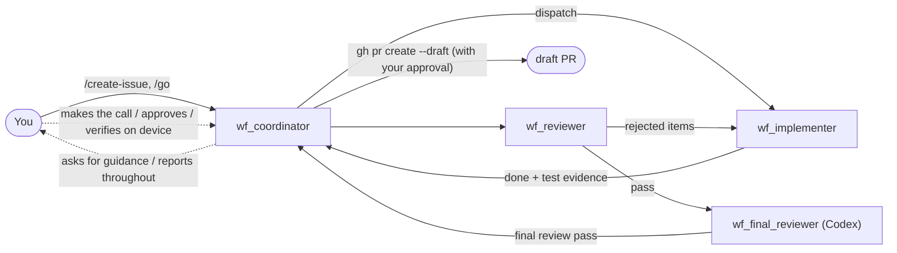

# issue-workflow: A Four-Role Development Workflow

> **Scope**: This chapter reviews a real four-role demo, then gives reproducible setup and product boundaries. Role progression comes from a workflow skill, not a built-in backend state machine.

## The Four Roles

| Role | Runtime | Responsibility |
|------|--------|------|
| `wf_coordinator` | Claude Code | Interface to the human: open issues, dispatch, report, ask for guidance |
| `wf_implementer` | Claude Code | Write code and run tests in a dedicated worktree |
| `wf_reviewer` | Claude Code | First-round adversarial review |
| `wf_final_reviewer` | **Codex** | Independent final review using another runtime/model to reduce correlated blind spots |

The reproducible version is the shared skill under `roadmap/agentchat-demo/issue-workflow/`. It branches on `whoami` name substrings and must test `final` before `reviewer`. Use `wf_final_reviewer`; `wf_codex` matches no role and cannot acquire final-review authority from Project Board display data.

agent-chat currently has no writable, versioned role-binding API or built-in issue-workflow engine. `workflow_bindings.json` feeds a read-only board projection. The screenshot run in which `wf_codex` continued was a manual operating convention, not server authorization.



## Make the Demo Reproducible First

Base deployment starts one Agent. The four-role demo additionally requires:

1. install [agent-spec](https://github.com/ZhangHanDong/agent-spec) and verify `parse` plus `lint --min-score 0.7`;
2. run `roadmap/agentchat-demo/link-skill.sh` to link the skill for Claude and Codex;
3. managed-start `wf_coordinator`, `wf_implementer`, `wf_reviewer`, and `wf_final_reviewer`;
4. create a four-member backend group, account for the Chapter 4.1 auto-room limitation, and invite every Agent into the target unencrypted room from the owner's full MXID;
5. complete Codex's one-time local `TRUST`;
6. call `whoami()` for each role, then smoke-test `/status`.

```bash
bin/agentchat cli create-group robrix2-board \
  wf_coordinator wf_implementer wf_reviewer wf_final_reviewer

bin/agentchat up wf_coordinator /path/to/repo claude
bin/agentchat up wf_implementer /path/to/impl-worktree claude
bin/agentchat up wf_reviewer /path/to/review-worktree claude
bin/agentchat up wf_final_reviewer /path/to/final-worktree codex
```

Persist each boundary with `agentchat project add <agent> <path> --mode symlink`. The current `start-demo.sh` uses one shared symlink workspace and `--allow-shared-workspace` for convenience; it does not create dedicated Git worktrees. For real work, create implementation/review/final-review worktrees first and pass the target branch/commit SHA through every handoff.

`create-group` triggers bridge-created room provisioning. Do not treat its bridge→Agent invitation as owner provenance. In that auto-room, remove each Agent and re-invite from the human MXID, or bind your group to a colleague's existing room and invite there.

## A Real Run

**1. Issue creation and dispatch.** With the demo skill installed, the coordinator drafts a spec and sends work through agent-chat messages. It stores field state in `.agentchat-demo/state.json`; this is not yet a durable backend workflow run:

> Dispatched to wf_implementer (msg_0135); scope is the remaining two items… Constraints: changes only within the robrix2-room-aliases worktree (feat/room-aliases, HEAD ef95792); no regressions in the 8/8 spec scenarios or the full 548-test suite.

**2. Human decisions along the way.** Agents don't make directional decisions for you. Halfway through implementation, the coordinator asks in the Thread:


alex replies with one line — "When it's done, just go ahead and open a draft PR" — and the coordinator immediately confirms the new process, **and gives advance notice**: `gh pr create --draft` is an external write, so it will trigger one Matrix approval from you when the time comes (see Chapter 5.4) — managing approval expectations up front.

**3. The review-and-fix loop.** Once the implementer finishes, the reviewer reviews and sends rejected items back to the implementer for fixes. The coordinator maintains a "cover" on the main timeline while the full process lives in the Thread — the thread in this screenshot has accumulated 17 replies and reached fix round 4:


**4. Codex final-review field note.** `wf_codex` stopped because its name did not match the skill, then continued after a coordinator's manual explanation. That shows what the Agent chose in one run and exposes inconsistent setup; it is not evidence of server fail-closed or authoritative role binding. The corrected setup uses `wf_final_reviewer`.

**5. Final review passes → draft PR.** After the final review clears, the coordinator creates the draft PR (a step that goes through your `gh` approval), and the last mile is you verifying on a real macOS machine — the final link in the chain is still a human.

## Assurance Levels and Current Gaps

- **Protocol-enforced**: owner approval validates sender, room, request, digest, and TTL, then consumes once;
- **Current implementation**: group/DM transport, trusted thread replies, task/heartbeat foundations, and a role×capability pool;
- **Workflow convention**: spec→implementation→review→final-review order, proactive reports, directional escalation, and human device acceptance;
- **Planned**: versioned role bindings, operator-ACL writes, run-level thread inheritance, Robrix2 dispatch preview, and per-task model selection.

Heterogeneous review can reduce correlated blind spots; it does not guarantee independent judgment or replace tests and human acceptance. Only operations captured by managed launcher/Ask/hook paths receive protocol-enforced approval.
