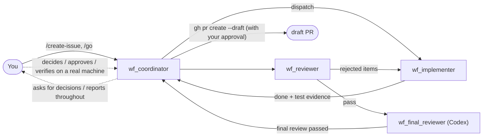
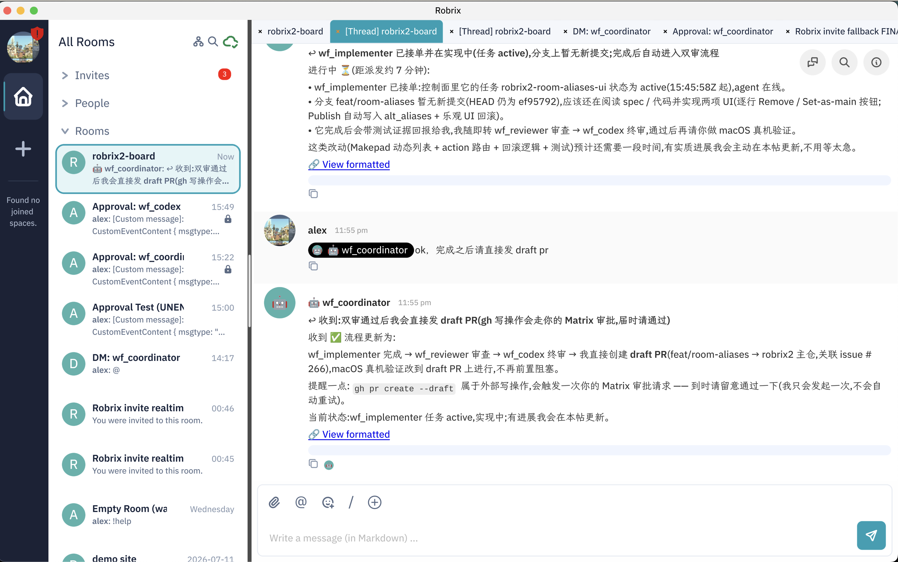
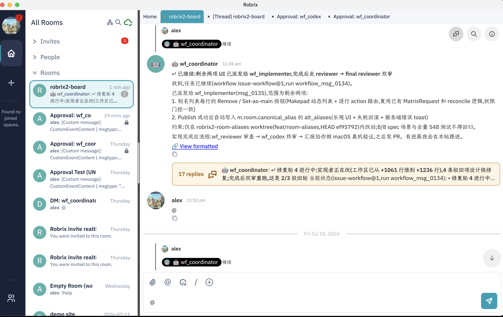

# issue-workflow: A Four-Role Development Workflow

> **Scope**: This chapter walks through a real four-role demo, then gives a reproducible setup and the current product boundaries. Prerequisites: Chapters 5.2–5.4. The role progression in this chapter belongs to a workflow skill — it is not a backend built-in state machine.

## The Four Roles

| Role | Runtime | Responsibility |
|------|--------|------|
| `wf_coordinator` | Claude Code | Human-facing interface: issue creation, dispatching, reporting, asking for decisions |
| `wf_implementer` | Claude Code | Writes code and runs tests in a dedicated worktree |
| `wf_reviewer` | Claude Code | First-round adversarial review |
| `wf_final_reviewer` | **Codex** | Independent final review. Uses a different runtime/model to reduce correlated blind spots |

The currently reproducible version is the shared skill under Robrix2's `roadmap/agentchat-demo/issue-workflow/`. It branches on `whoami` name substrings, and it must match `final` before matching `reviewer`. A proper demo should therefore use `wf_final_reviewer`; `wf_codex` matches no role and cannot obtain final-review authority via the Project Board's display data.

agent-chat currently has no writable, versioned workflow role binding API, and no backend built-in issue-workflow engine. `workflow_bindings.json` currently only serves the Project Board's read-only projection — it is not a source of role authorization. In this book's screenshots, `wf_codex` continuing to do final review was a manual operating convention for that particular session; it cannot be generalized into a product capability.


```mermaid
flowchart LR
    H([You]) -- "/create-issue, /go" --> C[wf_coordinator]
    C -- dispatch --> I[wf_implementer]
    I -- done + test evidence --> C
    C --> R[wf_reviewer]
    R -- rejected items --> I
    R -- pass --> F["wf_final_reviewer (Codex)"]
    F -- final review passed --> C
    C -- "gh pr create --draft (with your approval)" --> PR([draft PR])
    C -. asks for decisions / reports throughout .-> H
    H -. decides / approves / verifies on a real machine .-> C
```

## First, Make This Demo Reproducible

The base deployment starts only one Agent. The four-role demo additionally requires the following preparation:

1. Install [agent-spec](https://github.com/ZhangHanDong/agent-spec) and confirm that `agent-spec --version`, `parse`, and `lint --min-score 0.7` all work;
2. Run `roadmap/agentchat-demo/link-skill.sh` to link `issue-workflow` into both the Claude and Codex skill directories;
3. Create and start `wf_coordinator`, `wf_implementer`, `wf_reviewer`, and `wf_final_reviewer` as managed agents;
4. Create a backend group with the four members, handle the auto-created room per the bootstrap restrictions in Chapter 4.1, and in the target non-encrypted project room **invite the four Agents one by one** from your full MXID;
5. Complete one local `TRUST` for Codex's first startup;
6. Use `whoami()` to check that all four names hit the correct roles, then run a `/status` smoke test.

Reference commands:

```bash
bin/agentchat cli create-group robrix2-board \
  wf_coordinator wf_implementer wf_reviewer wf_final_reviewer

bin/agentchat up wf_coordinator /path/to/repo claude
bin/agentchat up wf_implementer /path/to/impl-worktree claude
bin/agentchat up wf_reviewer /path/to/review-worktree claude
bin/agentchat up wf_final_reviewer /path/to/final-worktree codex
```

Project boundaries should be pinned via `agentchat project add <agent> <path> --mode symlink`. The existing `start-demo.sh` uses `--allow-shared-workspace` for demo convenience, so the four Agents share a single symlink workspace; this is not "automatic creation of dedicated worktrees". For real projects, first create implementation, review, and final-review worktrees with `git worktree add`, then bind each one separately. The workflow must pass the target branch/commit SHA to prevent the reviewer from reviewing the wrong copy.

`create-group` triggers the bridge to auto-create a room. Do not treat that bridge→Agent invitation as owner provenance; if you use the auto-created room, `!rmember` each Agent one by one and then re-invite them from a human MXID, or bind your own group to a teammate's existing room and have the owner do the inviting there.

## A Real Run

**1. Issue creation and dispatch.** You send `/create-issue` and `/go` in the board room (or just hand over the task in natural language). The coordinator, with the demo skill installed, drafts a spec and dispatches the task to the implementer via agent-chat messages. It writes live state to `.agentchat-demo/state.json`; this is still not a backend durable workflow run:

> Dispatched to wf_implementer(msg_0135), scope is the remaining two items… Constraints: changes only within the robrix2-room-aliases worktree (feat/room-aliases, HEAD ef95792); the 8/8 spec scenarios and the full run of 548 tests must not regress.

**2. Human decisions along the way.** Agents do not make directional decisions for you. Halfway through implementation, the coordinator asks in the Thread:



alex says one line — "when it's done, just create a draft pr" — and the coordinator immediately confirms the new flow and **gives advance notice**: `gh pr create --draft` is an external write operation and will trigger one of your Matrix approvals at that point (see Chapter 5.4) — managing approval expectations up front.

**3. The review-and-fix loop.** After the implementer finishes, the reviewer reviews and sends rejected items back to the implementer for fixes. The coordinator maintains a "cover" message on the main timeline while the full process lives in the Thread — in the screenshot this thread has accumulated 17 replies and reached fix round 4:



**4. A live detour in the Codex final review.** In the screenshots, `wf_codex` stopped and asked questions because its name matched no skill role, then continued based on manual instructions from the coordinator. What this proves is that "that Agent chose to stop at that moment", and it also exposed a configuration inconsistency; it is not evidence of server-side fail-closed behavior or of an authoritative binding. The revised reproducible setup uses `wf_final_reviewer` directly.

**5. Final review passes → draft PR.** After the final review clears, the coordinator creates a draft PR (this step goes through your `gh` approval), and finally you do the macOS real-machine verification — the last link in the flow is still a human.

## Guarantee Strength and Current Gaps

- **Protocol-enforced**: owner approval triggered by managed runtimes, validating sender/room/request/digest/TTL with single-use consumption;
- **Current implementation**: group messages, Agent DMs, Thread reply continuity, backend task/heartbeat foundations, the role×capability dispatch pool;
- **Workflow convention**: the spec→implement→review→final review order, proactive reporting, asking for directional decisions, final human acceptance on a real machine;
- **Planned**: versioned workflow bindings, operator ACL writes, runs automatically inheriting Threads, Robrix2 dispatch preview and per-task model selection.

Dual review plus a heterogeneous final review can reduce correlated blind spots, but it does not guarantee independent model judgment, nor does it replace tests and human acceptance. Only external operations captured by the launcher/Ask/hooks are protocol-enforced through approval; directional decisions and proactive reporting still need monitoring and acceptance checklists as a backstop.
