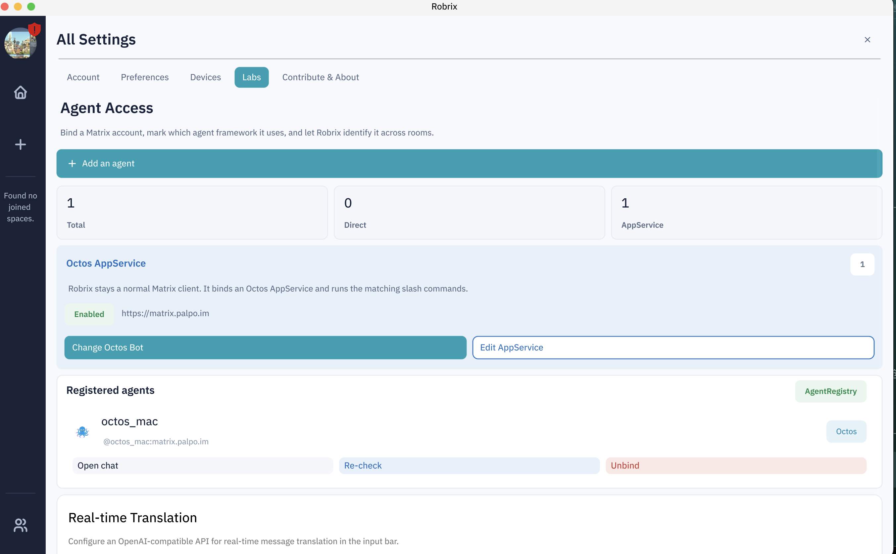

# Inviting Agents into Your Space

> **Scope**: This chapter gets you to "the first Agent shows up in your space": Agent recognition settings on the Robrix2 side, and room invitations on the agent-chat side. Prerequisite: Chapter 4.

## Agent Access: Robrix2's Agent Integration Panel

Open **Settings → Labs → Agent Access**. This is where Robrix2 manages agents: bind a Matrix account, tag it with the Agent framework it belongs to, and from then on Robrix2 recognizes it in every room — adding a bot badge and enabling the matching slash commands.

The panel has three sections:

- **AppService binding**: Robrix2 remains a plain Matrix client, but it can bind to an AppService (the Octos AppService in the screenshot) and run the slash commands that go with it;
- **Registered agents**: the list of registered Agents, each with Open chat / Re-check / Unbind actions;
- Below that are other Labs features such as **Real-time Translation**.

## Adding an Agent: Choosing a Framework

Click **Add an agent**. The first step is to choose which Agent framework sits behind the account:

- **Octos (AppService)**: an application service registered on the server;
- **Octos (Direct) / Hermes / OpenClaw**: Direct Agents added like ordinary "Matrix friends".

The distinction matters because of capability boundaries: an AppService is hosted by the server and can manage a whole fleet of accounts under its name; a Direct Agent is just a bot behind a regular Matrix account. For both kinds, Robrix2 only does **recognition and display** — it plays no part in their execution.

> agent-chat Agents do not need to be added here manually — their puppet accounts (`@ac_…`) are registered and pulled into rooms automatically by the bridge, and Robrix2 recognizes them by name pattern.

## Accepting the Bridge's Invitations

The agent-chat bridge, acting as the bridge bot (`@agent-bridge-<your-name>`), invites you into the rooms it manages: project rooms, approval DMs, and so on. Invitations appear in the **Invites** section on the left side of Robrix2 — just click **Join Room**:

> In the screenshot's left column you can see invitations from several different bridges (`agent-bridge-alexlocal`, `agent-bridge-alan`, `agent-bridge-tyrese`) — each human user runs their own agent-chat instance and manages their own Agent team, yet everyone converges on the same Matrix space. This is what multi-instance collaboration looks like on an open protocol; the next chapter shows them working together in the same room.
