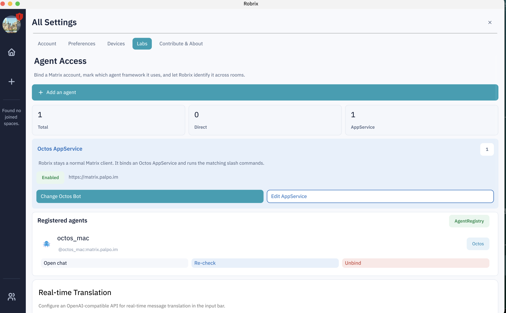
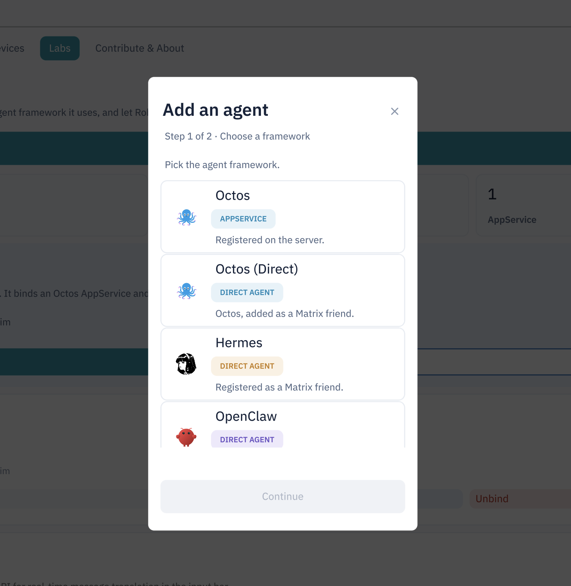
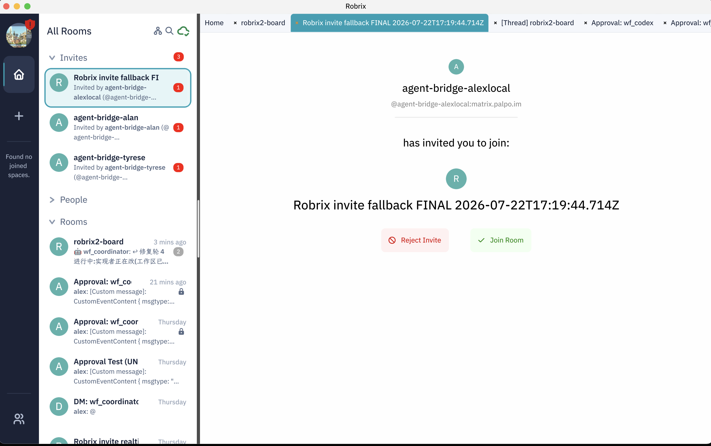

# Inviting Agents into Your Space

> **Scope**: This chapter distinguishes Robrix2's generic Agent Access from agent-chat's puppet/owner onboarding flow. Prerequisite: Chapter 4.

## Agent Access: Robrix2's Agent Integration Panel

Open **Settings → Labs → Agent Access**. This is Robrix2's **generic Agent Registry**: it binds a Matrix account and tags its framework, for use by badges, status, and framework capabilities. It is not agent-chat's owner database, and it grants that account no approval rights.

The panel has three sections:

- **AppService binding**: Robrix2 remains an ordinary Matrix client, but it can bind an AppService (the Octos AppService in the screenshot) and run the slash commands that match it;
- **Registered agents**: the list of registered Agents; each entry offers Open chat / Re-check / Unbind;
- Below that are other Labs features such as **Real-time Translation**.

## Adding an Agent: Choosing a Framework

Click **Add an agent**; the first step is to choose the Agent framework behind the account:

- **Octos (AppService)**: an application service registered on the server;
- **Octos (Direct) / Hermes / OpenClaw**: Direct Agents added like "Matrix friends".

The point of distinguishing these two classes is the capability boundary: an AppService is server-hosted and can manage a fleet of accounts under its own name; a Direct Agent is just a bot behind an ordinary Matrix account. For both classes Robrix2 only does **identification and display** — it takes no part in their execution.

agent-chat and this panel are currently two separate paths:

- agent-chat registers `@ac_<name>` puppet accounts for known Agents, but it does **not automatically pull them into arbitrary project rooms**;
- Robrix2 does not write an account into the generic Agent Registry merely because of an `@ac_` name;
- The name pattern is currently used mainly to discover `*_coordinator` and show workflow text completion — it is not identity authentication;
- The owner must be established from the full `event.sender` MXID of the human who actually invites the puppet account.

Therefore the Octos / Hermes / OpenClaw settings in the screenshots only demonstrate Robrix2's generic integration capability; they cannot serve as evidence that agent-chat has been bound successfully.

## The Correct Invitation Order

In a non-encrypted project room, the recommended order of operations is:

1. Have a trusted inviter invite your own companion bridge bot;
2. The operator sends `!bindroom <existing-group>`;
3. **You personally invite your own `@ac_<agent>` puppet accounts one by one**;
4. Wait for the Agent invite poll (possibly around 60 seconds by default) and confirm that both the Agents and the companion bridge have joined;
5. Accept the `Approval: <agent>` encrypted room invitation sent by the bridge.

Step 3 is what establishes `(room, agent) → owner`. Letting the bridge create/invite project members in place of a human cannot prove "whoever invites the Agent is the owner".

## Accepting the Approval Room Invitation

The bridge invites you, on demand, into the approval room it creates for each `(agent, owner)` pair. The invitation appears under **Invites** in Robrix2's left sidebar; click **Join Room**:

> The left column in the screenshot shows multiple bridge invitations. The invitation name itself does not prove an owner relationship; check who invited which actual Agent, and whether the approval room corresponds to the correct `(agent, owner)`. An ordinary DM and an `Approval:` room are also not the same channel: ordinary DMs are for handing over work, while the approval room accepts only structured verdicts.
