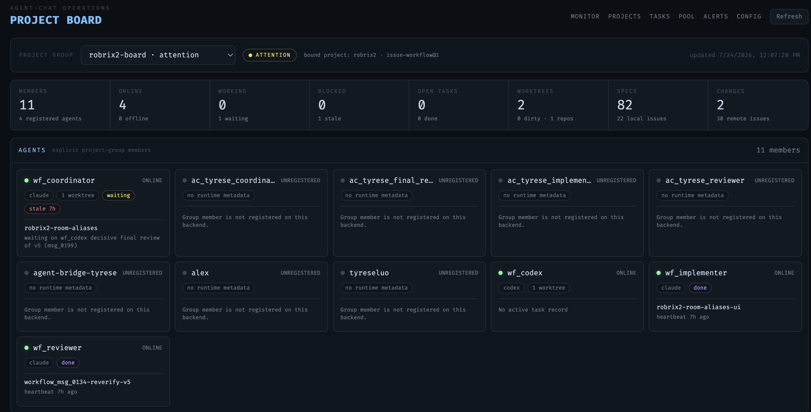
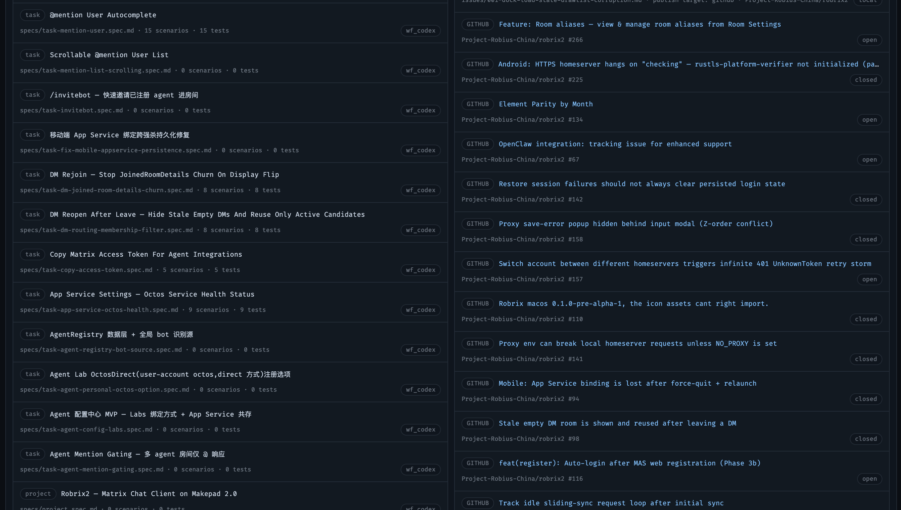

# Project Board: A Global View of Tasks and Artifacts

> **Scope**: This chapter covers agent-chat's built-in Project Board — the second screen beyond chat: a global dashboard of team status, specs, and issues. Prerequisite: Chapter 5.5 (the board displays exactly what issue-workflow is running).

Chat rooms are where collaboration **happens**, but they are a timeline view — to answer "what is the state of the whole project right now?", scrolling back through chat is no match for a dashboard. agent-chat's local dashboard (`http://127.0.0.1:8084`) provides the **Project Board** for this (the `/projects` page; the top navigation also offers Monitor / Tasks / Pool / Alerts / Config operations pages).

## Team Overview

At the top of the board you pick a **project group** (here `robrix2-board`, bound to the `robrix2` project and the `issue-workflow@1` workflow). The row of stat tiles below answers the most common questions at a glance:

- **Members / Online**: group membership and how many are online;
- **Working / Blocked / Open Tasks**: how many are working and how many are stuck (`waiting` / `stale` states are called out separately — in the screenshot the coordinator has been waiting 7 hours for wf_codex's final review; this kind of *silent stall* is precisely what the board exists to expose);
- **Worktrees**: agent workspace count and dirty state (`0 dirty` means no unfinished changes);
- **Specs / Changes**: spec and local/remote issue counts (expanded in the next section).

Member cards show each Agent's runtime (claude / codex), current task, and heartbeat. Note the **UNREGISTERED** cards: members seen through the Matrix room but not owned by this backend — teammate Tyrese's Agent puppets and human account, for example. The board faithfully renders the difference between "who is in the room" and "who I manage" — Chapter 5.2's multi-instance collaboration, seen from the operations side.

## Specs & Issues: The Spec-Driven Artifact Panel

The lower half of the board puts the project's two core artifact types side by side:

**Left column — Specifications**: every [agent-spec](https://github.com/ZhangHanDong/agent-spec) contract file in the project (`specs/*.spec.md`), each showing scenario/test counts and the responsible Agent. This book's own spec (`task-hagency-book.spec.md · 6 scenarios · 6 tests`) sits at the top of the list — the HAgency way of working is self-hosting: **every task given to an Agent starts with a spec, and acceptance runs against that spec**. The board makes contract coverage visible at a glance.

**Right column — Issues**, aggregated from two sources:

- **LOCAL**: issue documents under the `issues/` directory, annotated with their publish target (`publish target: github · Project-Robius-China/robrix2`) — Agents file locally first, and only push to GitHub after your approval (`gh` writes go through the Chapter 5.4 approval gate);
- **GITHUB**: real issues from the remote repository, with open / closed status — including issue #266 that the coordinator linked in the Chapter 5.5 screenshots.

## Where the Board Sits in HAgency

The Project Board is a **read-only operations view**: it sends no messages, dispatches no tasks, approves nothing — all of that happens in the Matrix rooms (and the approval rooms). It answers a different class of question: who is online, who has stalled, which spec has no tests, which issue hasn't been published yet. Chat is for collaborating; the board is for **auditing** — with both screens together, you are both *present* and *in command*.
