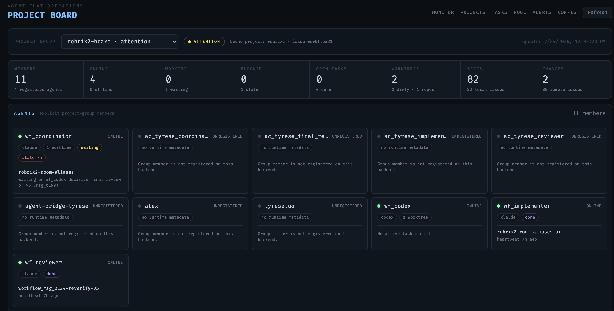
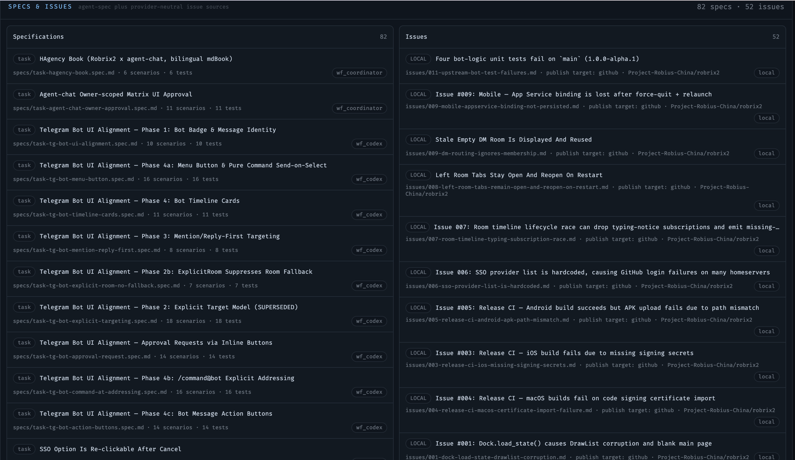
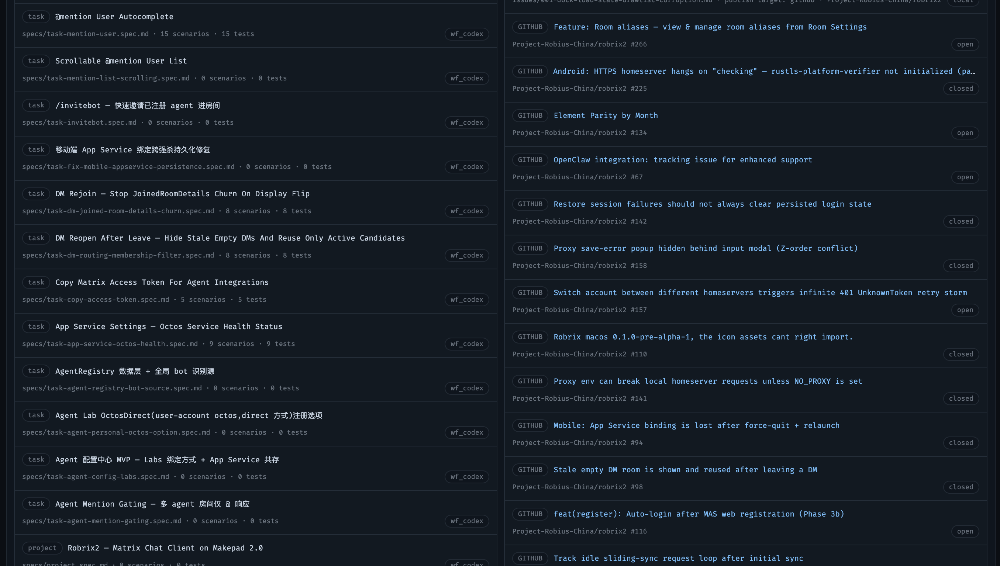

# Project Board: A Global View of Tasks and Artifacts

> **Scope**: This chapter introduces agent-chat's Project Board preview implementation: a read-only projection of backend state and project artifacts. The baseline is `feat/project-board` commit `3102a5f`, which was not yet an agent-chat mainline feature at the time this book was verified.

Chat rooms are where public collaboration **happens**, but they are a timeline view. The Project Board (`/projects`) aggregates backend durable tasks / task graphs / heartbeat with a local artifact scan of the bound projects. The top navigation stays consistent with Monitor / Tasks / Pool / Alerts / Config; Agent cards can jump to the corresponding Monitor view.

It does not read the demo workflow's `.agentchat-demo/state.json`. If a workflow creates no backend task/task graph, the internal stages of `/go` will not automatically appear on the board. Before publishing this chapter, the Project Board branch should first be merged into the target release, and a supported group→project binding write flow should be provided; the current binding data has to be prepared in advance.

## Team Overview

At the top of the board you select a **project group** (in the screenshot, `robrix2-board`, bound to the `robrix2` project and the `issue-workflow@1` workflow), and the row of stat tiles below directly answers the most common questions:

- **Members / Online**: the number of project group members and how many are online;
- **Working / Blocked / Open Tasks**: how many are working and how many are stuck (`waiting` / `stale` states are flagged separately — e.g. in the screenshot the coordinator has been waiting 7 hours for wf_codex's final review; this kind of "silent stall" is exactly what the board is meant to expose);
- **Worktrees**: the number of Agent managed projects/worktrees and their Git dirty state. `0 dirty` only means `git status --porcelain` shows no uncommitted changes; it does not mean the task is finished, committed, pushed, or merged;
- **Specs / Changes**: the counts of specs and local/remote issues (expanded in the next section).

Member cards show the runtime, backend-known tasks, and heartbeat. **UNREGISTERED** means a Matrix room member that does not belong to the current backend — e.g. a teammate's Agent puppet or a human account; it is a read-only observation and grants no scheduling or approval rights. When one Agent belongs to multiple groups, v1 tasks carry no project ID, so a task may be projected into multiple projects — a current limitation.

## Specs & Changes: The Spec-Driven Artifact Panel

The lower half of the board puts the project's two core artifact classes side by side:

**Left column, Specifications** — scans the project's [agent-spec](https://github.com/ZhangHanDong/agent-spec) contract files (`specs/*.spec.md`), showing the declared number of Scenario / `Test:` mappings and the Agent that provided this worktree's inspection result. It does not run tests and does not indicate coverage/pass; the "Agent" is also not a formal spec owner.

**Right column, Changes** — a provider-neutral aggregation:

- **LOCAL**: local issue documents in the `issues/` directory plus their `publish target` metadata. The Board only displays the target; it does not perform publishing;
- **GitHub**: remote issues and pull requests;
- **AtomGit**: remote issues and merge/pull requests, read via the [AtomGit OpenAPI](https://docs.openatom.tech/en/category/api/); private-repo tokens stay only in the backend's `ATOMGIT_TOKEN`;
- Unsupported or temporarily unavailable providers remain shown as unsynced, and no tokens, absolute paths, or upstream error bodies are sent to the browser.

The unified term **change request** refers to GitHub PRs / AtomGit MRs. Creating remote issues, publishing local issues, and creating change requests are all outside Board v1; these write operations are still done through Agent tools with owner approval.

## Where the Board Sits in HAgency

The Project Board is a **read-only projection**: it sends no messages, dispatches no tasks, approves nothing, and is not a source of authorization. The projects it displays must come from an explicit group→project binding, and it includes only that group's members, tasks/graphs, and project artifacts; DMs, approval details, full message bodies, API keys, and absolute paths must not enter its responses.

What it answers is "what the backend has recorded, what the worktree declares, and what the remote providers currently observably show" — not "which step the workflow has definitely executed to". To judge whether a delivery is complete, you still need to combine Threads, backend tasks, Git commits, test execution results, and PR/MR status.
