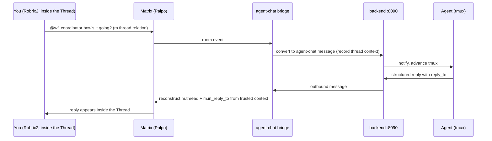
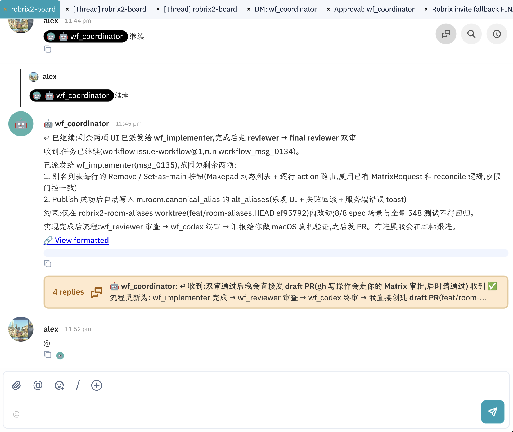
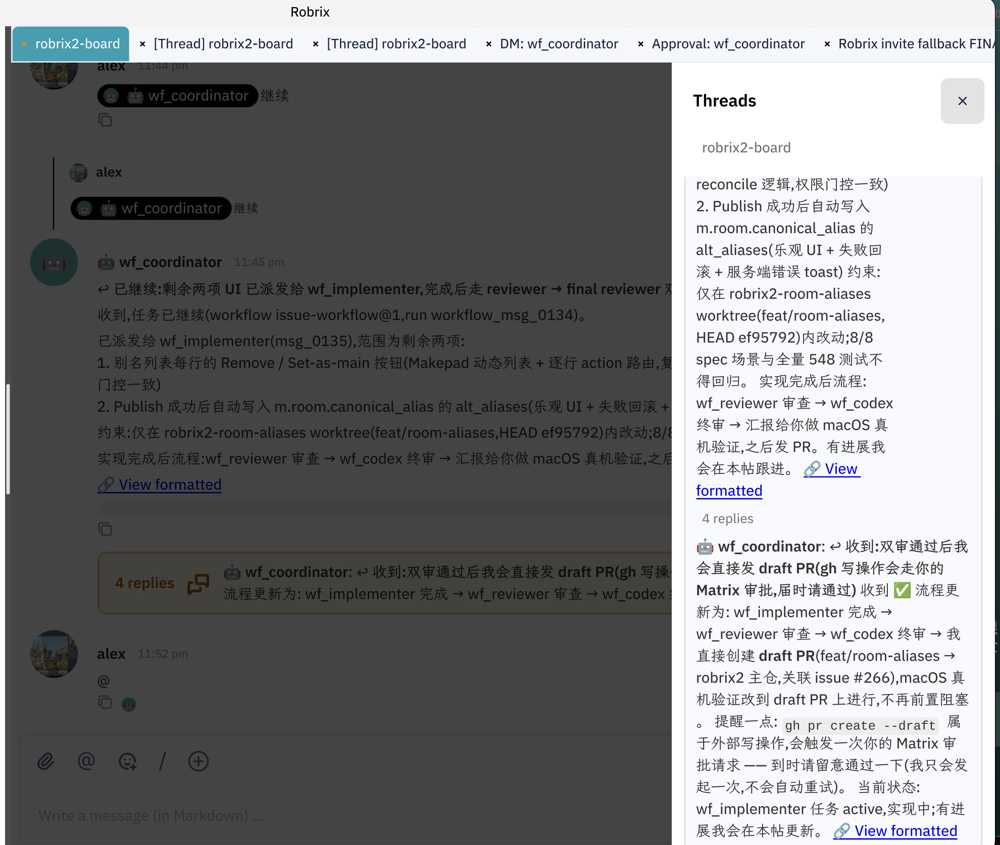

# Thread Collaboration: Every Task Gets Its Own Thread

> **Scope**: This chapter establishes HAgency's most important collaboration habit — tasks live in Threads, and the main timeline keeps only the cover; it also gives the routing rule for "what goes in a Thread, what goes on the main timeline, and what goes to a DM". Prerequisite: Chapter 5.2.

A board room quickly ends up with several things happening at once. HAgency's convention is **one Thread per task**. This is a collaboration convention; whether a message actually returns to the thread depends on backend reply context.

The full journey of a message from your Thread, to the Agent, and back into the same Thread:

## Dispatch Goes into the Thread

Once the coordinator takes a task, it posts a dispatch summary on the main timeline (who it was dispatched to, what the scope is, what the follow-up process looks like), and that message immediately becomes the Thread root:

Note the **`4 replies`** card under the message — that is the collapsed Thread. All subsequent progress lives inside it, and the main timeline stops getting flooded.

## Following Up and Interjecting in the Thread

Open the Thread (it becomes its own tab, `[Thread] robrix2-board`), and you can `@` the Agent to follow up just like in a normal room:

In the screenshot alex asked "@wf_coordinator how's it going?", and the coordinator returned structured status and promised proactive updates.

Proactive reporting is a **workflow-skill convention, not a transport guarantee**. A busy Agent, stalled relay, interrupted session, or `post()` without `reply_to` can produce no update or a top-level post. Use `/status`, Project Board, backend task/heartbeat, and Git state as fallbacks.

## How Thread Continuity Actually Works

1. The bridge parses inbound `m.thread` root and `m.in_reply_to`, storing them as message `matrixContext`;
2. the Agent replies to a trusted backend message ID;
3. the bridge resolves that message's `matrixDelivery`;
4. a threaded source reconstructs `m.thread` plus rich reply; a top-level source remains a top-level rich reply;
5. Matrix event IDs enter a local delivery journal before an idempotent backend upsert, allowing restart recovery between send and write-back;
6. a cross-room reply fails closed, while legacy missing delivery falls back to a top-level message with a warning.

This write-back is what lets Agent B reply to Agent A's puppet message on a second hop. For multi-event output such as body plus attachments, `primaryEventId` is the future reply target.

## The Threads Panel

The Threads button in the top-right corner opens a panel of all threads in the room, letting you scan the latest state of each one at a glance:

Combined with the multi-tab workspace, a typical working posture is: one tab for the main room, one tab each for two or three active Threads, one tab for the approval room — every collaboration venue laid out on a single screen.

## Routing Rule: Thread, Main Timeline, DM

| Message type | Where it goes | Examples |
|---------|------|------|
| Task process: progress, review rejections, requests for guidance, test evidence | **Thread** | "Fix round 4 in progress", "Ship the draft PR directly once both reviews pass?" |
| Conclusions the whole room needs to know | **Main timeline** | Task cover, final delivery summary |
| One-on-one assignments to a single Agent | **DM: <agent>** | Small jobs not worth the board room's attention |
| Approval requests and their details | **Approval: <agent>** (automatic) | See Chapter 5.4; not something you choose |

> **One boundary note**: Robrix2's main timeline hides in-Thread messages by default (they only show in the Thread tab). So when an Agent's replies land correctly inside a Thread, the main timeline "doesn't see" them — that is expected behavior, not lost messages. Conclusions that need room-wide broadcast are explicitly posted to the main timeline by the coordinator.

The current thread outbound path covers **unencrypted group rooms only**. E2EE approval DMs use another path. Do not enable board-room E2EE and expect Agent thread replies to keep working.
