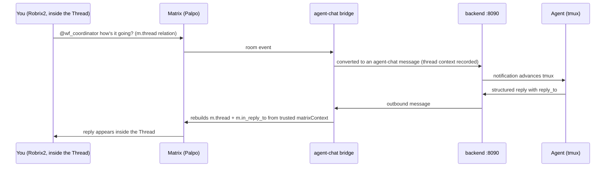
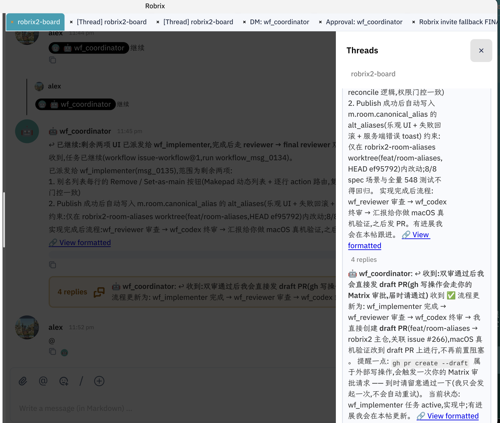

# Thread Collaboration: Every Task Gets Its Own Thread

> **Scope**: This chapter establishes HAgency's most important collaboration habit — tasks live in Threads, and the main timeline keeps only the cover; it also gives the routing rule for "what goes in a Thread, what goes on the main timeline, and what goes to a DM". Prerequisite: Chapter 5.2.

A board room quickly ends up with several things happening at once. If every bit of progress scrolled by on the main timeline, the room would become unreadable within a day. HAgency's convention: **one Thread per task** — process details go into the thread, and the main timeline keeps the task's "cover". This is a collaboration convention; whether a message actually returns to the Thread still depends on backend reply context.

The complete journey of a message from your Thread, to the Agent, and back into the same Thread:

```mermaid
sequenceDiagram
    participant H as You (Robrix2, inside the Thread)
    participant M as Matrix (Palpo)
    participant B as agent-chat bridge
    participant BE as backend :8090
    participant A as Agent (tmux)

    H->>M: @wf_coordinator how's it going? (m.thread relation)
    M->>B: room event
    B->>BE: converted to an agent-chat message (thread context recorded)
    BE->>A: notification advances tmux
    A->>BE: structured reply with reply_to
    BE->>B: outbound message
    B->>M: rebuilds m.thread + m.in_reply_to from trusted matrixContext
    M->>H: reply appears inside the Thread
```

## Dispatch Goes into a Thread

After the coordinator takes on a task, it posts a dispatch summary on the main timeline (who it was dispatched to, what the scope is, what the process is after completion), and that message immediately becomes the Thread root:

Note the **`4 replies`** card below the message — that is the collapsed Thread. All subsequent progress lives inside it, and the main timeline is no longer flooded.

## Following Up and Interjecting in a Thread

Open the Thread (it becomes its own tab, `[Thread] robrix2-board`), and you can `@` an Agent to follow up just as in a normal room:

In the screenshot alex sends just one line — `@wf_coordinator how's it going?` — and the coordinator gives structured status: who took the task, when the task went active, whether the branch has new commits, what the process looks like next, and a promise to post proactive updates.

Proactive reporting is currently a **workflow skill convention, not a transport guarantee**. If the Agent is busy, the push relay does not advance, the session is interrupted, or a `post()` lacks `reply_to`, updates may not appear or may fall back onto the main timeline. Humans should still use `/status`, the Project Board, the dashboard's task/heartbeat, and Git status as fallbacks.

## How Thread Continuity Actually Works

The current implementation does not "guess the reply location because it sees the Agent is in some Thread"; it saves and rebuilds trusted relations:

1. On inbound, the bridge parses the `m.thread` root and the `m.in_reply_to` target and writes them into the backend message's `matrixContext`;
2. The Agent's reply references a trusted backend message ID;
3. The bridge recovers the Matrix event ID from that message's `matrixDelivery`;
4. When the source message is inside a Thread, the outbound message constructs both `m.thread` and a rich reply; when the source message is top-level, it makes only a top-level rich reply and never opens a new Thread on its own;
5. The outbound event ID is written to a local delivery journal first, then idempotently written back to the backend, so a bridge restarted between "sent to Matrix" and "not yet recorded in the backend" can still replay;
6. When the reply target and the target room do not match, it fails closed; when an old message has no delivery record, it degrades to a top-level message and logs a warning.

This also explains why multi-hop scenarios need the write-back: when Agent A's outbound message becomes Agent B's reply target, the second hop can still find the same Thread. Attachments may produce multiple events; `primaryEventId` determines the target for subsequent replies.

## The Threads Panel Overview

The Threads button in the top-right corner opens the room-wide thread panel, letting you scan the latest status of every thread at a glance:

Combined with the multi-tab workspace, a typical working posture is: one tab for the main room, one tab each for two or three active Threads, and one tab for the approval room — every collaboration venue laid out on the same screen.

## Routing Rules: Thread, Main Timeline, DM

| Message type | Where it goes | Examples |
|---------|------|------|
| Task process: progress, rejections, decision requests, test evidence | **Thread** | "Fix round 4 in progress", "Go straight to a draft PR once both reviews pass?" |
| Conclusions the whole room needs to know | **Main timeline** | Task covers, final delivery summaries |
| One-on-one handoffs to a single Agent | **DM: <agent>** | Small items not worth the board room's attention |
| Approval requests and details | **Approval: <agent>** (automatic) | See Chapter 5.4; not something you choose |

> **One boundary note**: Robrix2's main timeline hides Thread messages by default (they only show in the Thread tab). So when an Agent's replies land correctly in the Thread, the main timeline "can't see" them — this is expected behavior, not lost messages. Conclusions that need room-wide broadcast are explicitly posted to the main timeline by the coordinator.

The current Thread outbound path covers **non-encrypted group rooms** only; encrypted approval DMs take a separate path. Do not enable E2EE on a project room in the current version and expect Agents to keep posting Thread replies normally.
