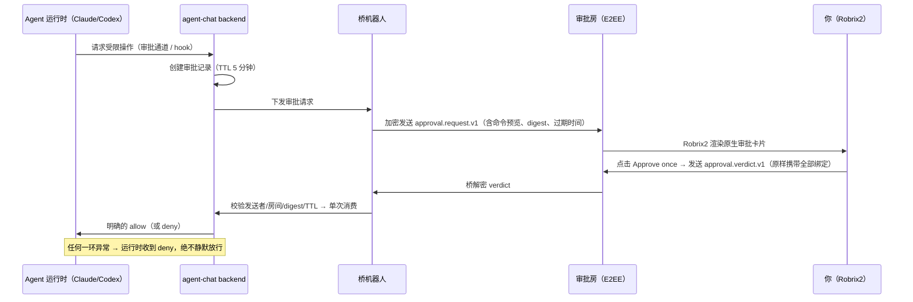

# Owner 审批：高危操作由人拍板

> **定位**：本章讲 HAgency 安全模型的核心闸门 —— 加密审批房里的一次性授权卡片：长什么样、协议如何绑定、失败时如何收敛。前置依赖：第 5.2 章；机制全景见第 6 章。

在 agent-chat **受管启动**的运行时里，沙箱外操作和被策略标记为 ask 的命令会进入 owner approval。当前明确覆盖的典型路径包括 Claude 的 `Bash(gh *)` / `Bash(git push *)` Ask 规则，以及 Codex `workspace-write` 沙箱下触发的 `PermissionRequest`。不要把“任何网络访问都会审批”理解为跨所有 runtime/version 的无条件事实。

一次审批的完整旅程：

## 审批卡片长什么样

bridge 按 **`(agent, owner MXID)`** 创建或复用一个 `Approval: <agent>` 端到端加密房间，成员只有该 owner、桥机器人和该 Agent。同一 owner 跨项目可复用；不同 owner 使用不同房间。owner 尚未接受邀请时，审批通道不是 ready。

卡片包含：

- **工具与命令预览**：如 `Bash: cargo test --lib`，以及 Agent 自述的目的（「允许我在固定的 v4 room-aliases artifact 上运行完整 Rust 库测试以完成最终复审吗？」）；
- **过期时间**：默认 5 分钟，过期后卡片标记 **Expired**、按钮禁用；
- **两个按钮**：pending 卡片提供 `Approve once`（仅放行这一次）和 `Deny`。本书现有截图捕获的是过期现场，能证明 Expired 状态与原始事件渲染，不能单独证明 pending/成功交互；发布版应补 pending、approved/denied 三张状态截图。

协议层要点（对应截图中可见的原始事件）：

- 请求事件 `com.agentchat.approval.request.v1` 携带 agent、runtime、project、project room、owner、approval room、request_id、upstream request、工具名、描述、最多 8KB 的输入预览等规范字段；`input_digest` 对这组规范化字段做 SHA-256。它绑定的是服务端保存的规范记录，不是无限长度原始 stdin 的承诺；
- 点击按钮后，Robrix2 发出 `com.agentchat.approval.verdict.v1` 并保留全部绑定字段；发送前刷新 bridge 设备列表并轮换出站 Megolm session，以降低 bridge 设备轮换导致的 unable-to-decrypt。设备查询、Olm/OTK 或 room key 传递仍可能失败，此时不发送或等待密钥，最终保持 fail-closed；
- **文字回复不是审批**。卡片上明确写着 "Text replies are not approval" —— 只有结构化 verdict 有效，杜绝「在聊天里说句好的就放行」的社会工程路径。

## Fail-closed：所有异常都是拒绝

审批链路每一环都遵循**失败即拒绝**：没有唯一 owner binding、owner 还没加入审批房、请求过期、重复消费、sender/room/digest 不匹配、审批通道故障，都会拒绝。常见拒绝码包括 `owner_binding_missing`、`owner_binding_ambiguous`、`owner_invite_pending`、`expired`、`not_pending` 与字段 mismatch；诊断时应看 backend audit 和 bridge 日志，而不是猜按钮含义。

同时，agent-chat 在服务端校验 verdict 的**真实 Matrix 发送者**（`event.sender`）必须是绑定的 owner 账号、房间必须是绑定的审批房。即使有人伪造卡片或 verdict，也过不了服务端这关。**Robrix2 上的按钮只是 UI 便利，授权判定永远发生在 agent-chat 服务端** —— 这是第 3 章「Robrix2 不是授权来源」原则的落点。

## 项目房间里看到什么？

审批详情（含命令内容）只出现在加密审批房。项目作战室里，其他成员只看到一条脱敏状态：*"Agent wf_codex is waiting for approval from its owner."* —— 团队知道流程卡在哪，但看不到敏感细节。多人同房协作时，这条边界保证了「透明」不以泄露为代价。

项目房与审批房中的通用 `!ctl` / `!agentctl` 被显式禁止，即使管理员也不能用这些命令绕过 owner approval。审批者为空时服务端拒绝，不会退回“所有管理员都可批准”。

## Claude 与 Codex 的入口不同

| Runtime | 受管策略 | 容易误判的现象 |
|---------|---------|---------------|
| Claude Code | `--permission-mode auto`；受保护 Bash Ask 规则进入 agent-chat channel | 手工重开的 Claude 或不兼容的本地规则可能让 TUI 自己停在选择框，而 backend 根本没有 pending request |
| Codex | `workspace-write` + `on-request` PermissionRequest hook | 首次必须在本地 TTY 输入 `TRUST`；hook 命令/hash 变化后要重新确认；hook timeout 与审批 TTL 联动 |

使用 `bin/agentchat down <name>` / `up <name>` 重启受管实例，不要在 tmux 里退出后直接手工运行 Claude/Codex。退出 tmux 界面但保留进程可按 `Ctrl-b`，再按 `d`。
