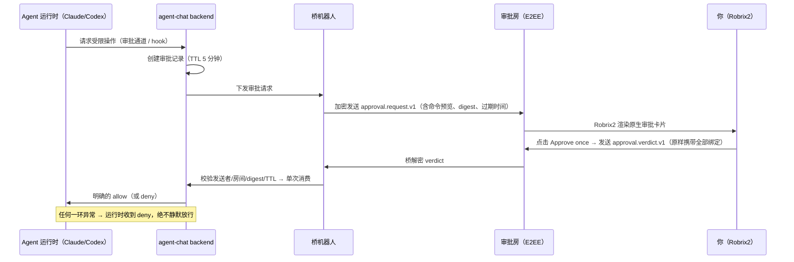

# Owner 审批：高危操作由人拍板

> **定位**：本章讲 HAgency 安全模型的核心闸门 —— 加密审批房里的一次性授权卡片：长什么样、协议如何绑定、失败时如何收敛。前置依赖：第 5.2 章；机制全景见第 6 章。

Agent 可以自由地在自己的沙箱里读写项目代码，但**越过沙箱的操作** —— 执行 `gh issue create` / `gh pr create` 这类外部写操作、访问网络、动沙箱外的文件 —— 必须经过它的 owner（也就是你）批准。

一次审批的完整旅程：

## 审批卡片长什么样

每个 Agent 有一个专属的 **`Approval: <agent>` 端到端加密房间**，成员只有你、桥机器人和该 Agent。当 Agent 的运行时请求受限操作时，房间里出现一张原生审批卡片：

卡片包含：

- **工具与命令预览**：如 `Bash: cargo test --lib`，以及 Agent 自述的目的（「允许我在固定的 v4 room-aliases artifact 上运行完整 Rust 库测试以完成最终复审吗？」）；
- **过期时间**：默认 5 分钟，过期后卡片标记 **Expired**、按钮禁用；
- **两个按钮**：`Approve once`（仅放行这一次）和 `Deny`。

协议层要点（对应截图中可见的原始事件）：

- 请求事件 `com.agentchat.approval.request.v1` 携带 agent、project、request_id、`input_digest`、expires_at 等完整绑定。`input_digest` 是对**整个请求的规范化内容**（agent、项目、工具名、命令输入预览等）做的 SHA-256 —— 输入预览取前 8KB，足以覆盖真实命令；
- 点击按钮后，Robrix2 发出 `com.agentchat.approval.verdict.v1`，**原样保留全部绑定字段**；发送前刷新桥的设备密钥并轮换出站房间密钥，确保桥一定能解密；
- **文字回复不是审批**。卡片上明确写着 "Text replies are not approval" —— 只有结构化 verdict 有效，杜绝「在聊天里说句好的就放行」的社会工程路径。

## Fail-closed：所有异常都是拒绝

审批链路每一环都遵循**失败即拒绝**：请求过期 → 拒绝；重复消费 → 拒绝；字段不匹配（digest、房间、发送者身份）→ 拒绝；审批通道本身故障 → Agent 收到明确的 deny 而不是卡死等待。

同时，agent-chat 在服务端校验 verdict 的**真实 Matrix 发送者**（`event.sender`）必须是绑定的 owner 账号、房间必须是绑定的审批房。即使有人伪造卡片或 verdict，也过不了服务端这关。**Robrix2 上的按钮只是 UI 便利，授权判定永远发生在 agent-chat 服务端** —— 这是第 3 章「Robrix2 不是授权来源」原则的落点。

## 项目房间里看到什么？

审批详情（含命令内容）只出现在加密审批房。项目作战室里，其他成员只看到一条脱敏状态：*"Agent wf_codex is waiting for approval from its owner."* —— 团队知道流程卡在哪，但看不到敏感细节。多人同房协作时，这条边界保证了「透明」不以泄露为代价。
