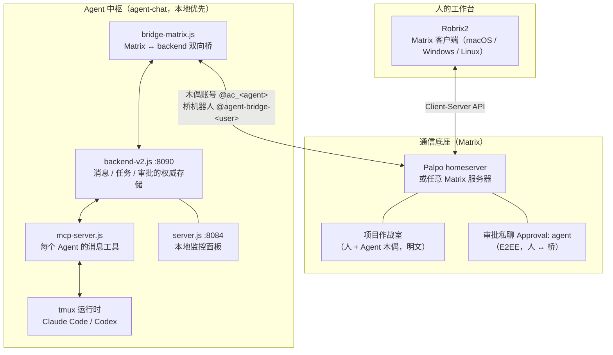

# 理念与整体架构

> **定位**：本章给出 HAgency 的四条设计原则与三层架构 —— 后续所有章节的机制都能在这张图上找到位置。前置依赖：前言。评估这套系统是否值得信任的读者从这里读起。

## 人是主体，不是旁观者

一套典型的「多智能体开发系统」通常长这样：你提交一个需求，一群 Agent 在黑盒里跑完，最后甩给你一个结果。人被排除在过程之外 —— 既看不见 Agent 之间发生了什么，也无法中途纠偏，更谈不上对高危操作把关。

HAgency 的设计原则恰好相反：

1. **同一空间**：人和 Agent 在同一个 Matrix 房间里说话。Agent 的每一次派单、汇报、争论都是房间里可见的消息，过程即记录。
2. **人拍板**：方向性决策（「先提交检查点还是继续写完？」「直接发 draft PR 吗？」）由 Agent 主动请示、人来决定。
3. **人授权**：Agent 的高危操作（`gh` 写操作、越沙箱命令）触发 **Owner 审批** —— 一张发到加密私聊里的卡片，只有你点「Approve once」它才能继续。审批是一次性的、有时效的、fail-closed 的。
4. **可介入**：你可以随时 `@` 某个 Agent 插话、改变计划，甚至接管任务 —— 因为一切都发生在你眼前的聊天房间里。

这四条中，「人授权」由审批协议与密码学**强制**（第 5.4 章、第 6 章）；「同一空间」「可介入」由 Matrix 协议本身保证；「人拍板」则由工作流约定保障 —— 第 5 章会展示这四条各自的日常形态与保障强度。

## 三层架构

几个关键设计，以及它们各自的「为什么」：

**Agent 以「木偶账号」出现在 Matrix 上。** 每个 Agent 对应一个 `@ac_<名字>:<服务器>` 账号，在房间里有自己的头像和名字 —— 对人来说，它就是一个普通群友。这样做的收益是**协议层平等**：@提及、已读、Thread、权限（power levels）这些 Matrix 原语对人和 Agent 一视同仁，不需要为 Agent 发明第二套交互。

**robrix→agent 的投递是纯 Matrix。** 你在房间里 `@wf_coordinator` 说话 → Palpo → 桥收到事件 → 转成 agent-chat 通知 → 推进 tmux 里的 Claude Code / Codex；Agent 的回复沿原路以木偶身份发回。中间没有任何私有旁路，这意味着**任何 Matrix 客户端都能参与协作**，Robrix2 只是体验最好的那个。

**权威状态在 agent-chat backend。** 谁是 operator、哪个房间绑定哪个 group、一张审批是否已被消费 —— 都以 backend 的持久化存储为准。**Robrix2 只是展示与发起操作的客户端，从不是授权来源**。这条边界是整个安全模型的地基（详见第 6 章）。

**审批走单独的加密私聊。** 每个 Agent 有一个 `Approval: <agent>` E2EE 房间，成员只有你、桥机器人和该 Agent。审批详情（含命令预览）只出现在这里；项目房间里其他人只能看到脱敏的等待状态。敏感信息的可见范围被压到最小（详见第 5.4 章）。
