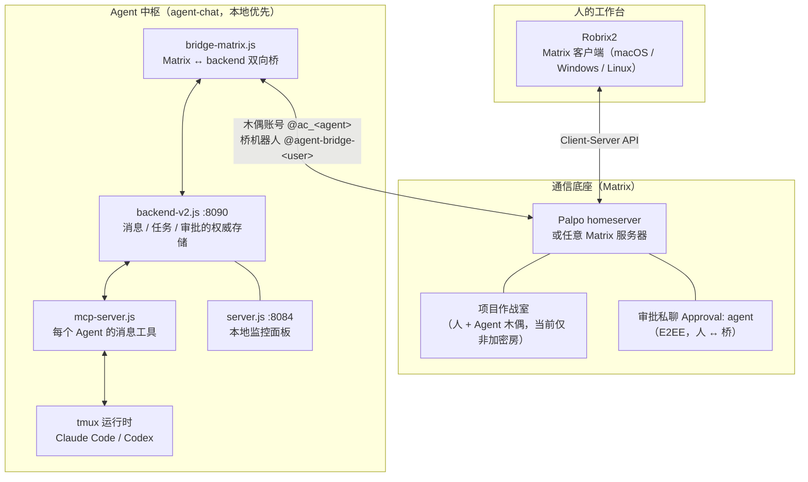

# 理念与整体架构

> **定位**：本章给出 HAgency 的四条设计原则与三层架构 —— 后续所有章节的机制都能在这张图上找到位置。前置依赖：前言。评估这套系统是否值得信任的读者从这里读起。

## 人是主体，不是旁观者

一套典型的「多智能体开发系统」通常长这样：你提交一个需求，一群 Agent 在黑盒里跑完，最后甩给你一个结果。人被排除在过程之外 —— 既看不见 Agent 之间发生了什么，也无法中途纠偏，更谈不上对高危操作把关。

HAgency 的设计原则恰好相反：

1. **同一空间**：人和 Agent 可以在同一个 Matrix 房间里说话。只有被显式发布到 group 的派单、汇报和结论才会成为房间记录；backend 内部 DM、未公开的任务状态与审批详情不会自动公开。
2. **人拍板**：方向性决策（「先提交检查点还是继续写完？」「直接发 draft PR 吗？」）由 Agent 主动请示、人来决定。
3. **人授权**：Agent 的高危操作（`gh` 写操作、越沙箱命令）触发 **Owner 审批** —— 一张发到加密私聊里的卡片，只有你点「Approve once」它才能继续。审批是一次性的、有时效的、fail-closed 的。
4. **可介入**：你可以随时 `@` 某个 Agent 插话、改变计划，甚至接管任务 —— 因为一切都发生在你眼前的聊天房间里。

这四条中，「人授权」在受管运行时和有效 owner 绑定的前提下由审批协议**强制**（第 5.4 章、第 6 章）；「同一空间」「可介入」由 Matrix 传输与成员关系提供；「人拍板」和主动汇报目前主要是工作流约定。保障强度不同，不能混为一谈。

## 三层架构

几个关键设计，以及它们各自的「为什么」：

**Agent 以「木偶账号」出现在 Matrix 上。** 每个 Agent 对应一个 `@ac_<名字>:<服务器>` 账号，并设置显示名；头像只有在显式开启自动头像或手工配置后才保证存在。对人来说，它仍是一个普通房间成员。这样做的收益是复用 Matrix 的 @提及、Thread 与房间权限，而不是为 Agent 发明第二套聊天协议。

**robrix→agent 的投递是纯 Matrix。** 你在房间里 `@wf_coordinator` 说话 → Palpo → 桥收到事件 → 转成 agent-chat 通知 → 推进 tmux 里的 Claude Code / Codex；Agent 的回复沿原路以木偶身份发回。中间没有任何私有旁路，这意味着**任何 Matrix 客户端都能参与协作**，Robrix2 只是体验最好的那个。

**权威状态分散在明确的服务端边界，而不在 Robrix2。** 几种容易混淆的“绑定”实际不是一回事：

| 关系 | 权威来源 | 用途 |
|------|---------|------|
| operator / admin ACL | agent-chat 环境变量 | 谁能运行 `!bindroom` 等管理命令 |
| `room → group` | Matrix bridge 持久状态 | 把项目房间接到哪个 backend group |
| `(room, agent) → owner MXID` | bridge 从 Agent 的邀请事件建立 | 谁能审批这个 Agent 在该房间的请求 |
| approval request / consume | backend approval store | TTL、digest、单次消费与最终 verdict |
| `group → project/workflow` | Project Board 绑定数据 | 只读项目投影；当前没有正式写入 UI/API |

**Robrix2 只是展示与发起操作的客户端，从不是授权来源。** 它不根据显示名决定 owner，也不保存可覆盖服务端判断的审批权限。

**审批走单独的加密私聊。** bridge 按 `(agent, owner MXID)` 创建或复用 `Approval: <agent>` E2EE 房间，成员是 owner、桥机器人和该 Agent。它通常在 owner 绑定建立后按需创建，并且要等 owner 接受邀请才 ready。审批详情只出现在这里；项目房间里其他人只能看到脱敏等待状态。

**当前项目房间与审批房的加密边界不同。** Agent 在 group 房间的出站路径当前不经过 E2EE crypto client，所以 Thread 连续性只支持**非加密项目房间**。审批房使用另一条 E2EE 路径。创建作战室时不要开启房间加密；如果项目内容不能放进明文/可联邦房间，当前版本不适合把完整代码和命令贴进作战室。
