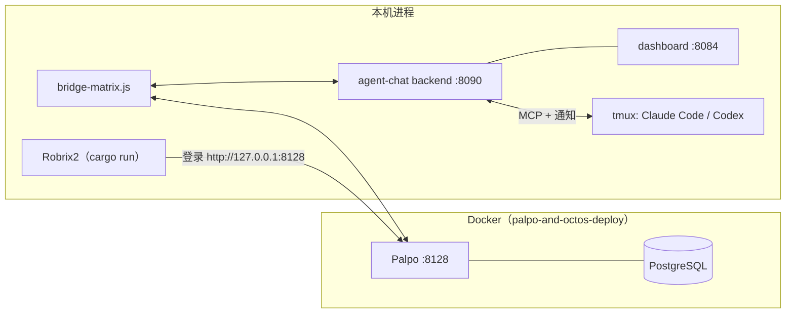

# 本地部署：Palpo + agent-chat + Robrix2

> **定位**：本章把三个组件全部部署在本地并验证打通。前置依赖：第 4 章路线选择。以 macOS / Linux 为例，全程约 30–60 分钟。

部署完成后，你机器上的进程拓扑是：



## 1. 启动 Palpo（Matrix homeserver）

Robrix2 仓库自带一套开箱即用的 Docker Compose 部署（`palpo-and-octos-deploy/`），包含 PostgreSQL + 从源码构建的 Palpo（支持 x86_64 / ARM64）：

```bash
cd robrix2/palpo-and-octos-deploy

./setup.sh                  # 一次性：克隆 palpo 源码、生成 .env
docker compose up -d        # 启动 PostgreSQL + Palpo
docker compose logs -f      # 观察日志
```

默认配置（`palpo.toml`）：

- Client-Server API 监听 `http://127.0.0.1:8128`（Robrix2 连这里）；
- `server_name` 默认 `127.0.0.1:8128`，正式使用建议改成你的域名；
- **开放注册**，方便为自己和桥机器人创建账号。

> 这套 compose 还会启动一个 Octos 机器人容器，它需要 `.env` 里的 `DEEPSEEK_API_KEY`（`setup.sh` 会提醒）。只部署 HAgency 可以忽略该容器的报错，或在 compose 中把它停掉 —— Palpo 不受影响。

**验证**：`curl http://127.0.0.1:8128/_matrix/client/versions` 返回版本列表即为就绪。

也可以不用 Docker，按 [Palpo 仓库](https://github.com/palpo-im/palpo) 的说明用 `cargo` 构建运行；agent-chat 只要求「一个可用的 Matrix 服务器」。

## 2. 启动 agent-chat

前置要求：**Node.js 22+**、**tmux**，以及至少一个编码运行时（Claude Code 或 Codex CLI）。

```bash
git clone https://github.com/ZhangHanDong/agent-chat.git
cd agent-chat
npm install
cp .env.example .env
```

编辑 `.env`，重点关注四组配置：

| 配置 | 作用 | 本地部署建议值 |
|------|------|--------------|
| Matrix 服务器地址 | 桥连接哪个 homeserver | `http://127.0.0.1:8128` |
| 桥机器人用户名/密码 | 桥的 Matrix 身份（`agent-bridge-<你的名字>`） | 开放注册的服务器上**桥会自动注册**该账号，无需预先创建；关闭注册的服务器才需要预注册或配置注册 token |
| `MATRIX_TRUSTED_INVITER_MXIDS` | **桥只信任这些人拉它进的房间** | 必须改成你自己的人类账号（如 `@alex:127.0.0.1:8128`）。`.env.example` 里是占位符 —— 不改的话，默认 `MATRIX_TRUST_MODE=enforce` 下桥会**静默忽略**你房间里的一切消息 |
| `MATRIX_OPERATOR_MXIDS` | 谁是 **operator**（可执行 `!bindroom` 等管理命令的人类账号） | 同样填你自己的账号 |

启动服务并拉起第一个 Agent：

```bash
bin/agentchat service restart --profile local   # backend(:8090) + dashboard(:8084) + bridge
bin/agentchat up wf_coordinator ~/work/my-project claude   # 在 tmux 中启动一个 Claude Code Agent
bin/agentchat ls                                # 查看运行中的 Agent
```

**验证**：

```bash
curl --noproxy '*' http://127.0.0.1:8090/health   # backend 健康检查
open http://127.0.0.1:8084                        # 本地监控面板
```

启动 Agent 时，agent-chat 会自动完成三件事：给它注册 `@ac_<名字>:<服务器>` 木偶账号；接好 MCP 消息工具；以**受管方式**配置运行时权限 —— Claude Code 使用 `--permission-mode auto` + 审批通道，Codex 使用 `workspace-write` 沙箱 + 审批 hook（首次启动需在终端输入一次 `TRUST`，显式信任审批 hook —— 这是刻意设计的一次性确认，不要绕过它）。

## 3. 启动 Robrix2

workflow 命令面板等 agent-chat 集成功能由 `agent_chat` Cargo feature 提供（默认不编译），所以带上 feature 构建：

```bash
cd robrix2
cargo run --features agent_chat
```

登录界面中：**Homeserver** 填 `http://127.0.0.1:8128`，注册 / 登录你的人类账号（例如 `@alex:127.0.0.1:8128`）。

登录后还需打开一次运行时开关：**Settings → Preferences → Enable agent-chat support**。编译期 feature + 运行时开关是有意的双重门控 —— 不需要 Agent 功能的用户拿到的是一个纯粹的 IM。

## 4. 把人和 Agent 接到一起

1. **创建 group**：Agent 在 agent-chat 里按 group 组织。先创建一个 group 并把 Agent 加进去：

   ```bash
   bin/agentchat cli create-group robrix2-board wf_coordinator
   ```

2. **绑定房间**：在 Robrix2 里建一个房间作为项目作战室，把桥机器人拉进来（你在 `MATRIX_TRUSTED_INVITER_MXIDS` 里，所以桥会接受邀请），然后以 operator 身份发送：

   ```text
   !bindroom robrix2-board
   ```

   房间与该 group 从此双向桥接。注意 `!bindroom` 绑定的是**已存在**的 group —— 第 1 步没做的话它会回复 `Group not found`。

3. **接受邀请**：桥机器人会邀请你加入 Agent 相关房间（审批私聊等），在 Robrix2 的 Invites 里点 Join；

4. **冒烟测试**：在作战室里 `@` 你的 Agent 说一句话 —— 它的木偶账号回复了，整条链路（Robrix2 → Palpo → 桥 → backend → tmux → 原路返回）就是通的。

## 常见问题定位

| 症状 | 先查哪里 |
|------|---------|
| Robrix2 登录失败 | Palpo 容器日志；homeserver 地址是否带对端口 |
| **桥对房间消息完全无反应** | 十有八九是 trust 门禁：确认 `.env` 的 `MATRIX_TRUSTED_INVITER_MXIDS` 是你的账号、拉桥进房的人就是这个账号；看桥日志里的 trust 判定 |
| `!bindroom` 回复 Group not found | 先 `agentchat cli create-group` 创建 group |
| `!bindroom` 没有权限 | 发送者不在 `MATRIX_OPERATOR_MXIDS` 里 |
| @Agent 没反应 | `agentchat ls` 看 Agent 是否在线；桥日志有没有收到房间事件 |
| `/` 面板里没有 workflow 命令 | 是否 `--features agent_chat` 构建 + 打开了 Preferences 开关；房间里是否有 `*_coordinator` |
| 审批卡片不出现 | 桥日志中审批房间的发送记录；Agent 运行时是否为受管启动（详见第 6 章） |

下一步：[团队协作实战](collab-overview.md)。
