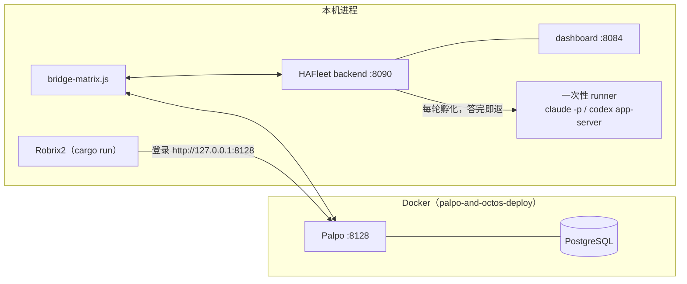

# 本地部署：Palpo + agent-chat + Robrix2

> **定位**：本章把三个组件部署在本地并验证单 Agent 链路。前置依赖：第 4 章路线选择。Linux 是正式安装路径；macOS 当前是开发运行路径。

部署完成后，你机器上的进程拓扑是：


```mermaid
flowchart LR
    subgraph docker["Docker（palpo-and-octos-deploy）"]
        PG[("PostgreSQL")]
        PALPO["Palpo :8128"]
        PALPO --- PG
    end
    subgraph local["本机进程"]
        ROBRIX["Robrix2（cargo run）"]
        BE["HAFleet backend :8090"]
        DASH["dashboard :8084"]
        BRIDGE["bridge-matrix.js"]
        RUNNER["一次性 runner<br/>claude -p / codex app-server"]
    end
    ROBRIX -->|登录 http://127.0.0.1:8128| PALPO
    BRIDGE <--> PALPO
    BRIDGE <--> BE
    BE --- DASH
    BE -->|每轮孵化，答完即退| RUNNER
```

> agent-chat 项目现已更名为 **HAFleet**，CLI 与环境变量前缀随之从 `agentchat`/`AGENTCHAT_*` 变为 `hafleet`/`HAFLEET_*`。本章按 thread-session runner 模式（推荐、也是本书验证过的模式）撰写：Agent 没有常驻进程，每轮对话由 backend 孵化一次性 runner，空闲时零进程。旧的 tmux 常驻会话模式仍作为回退路径保留在代码中（关闭 `HAFLEET_THREAD_SESSIONS` 即回退），但不再推荐部署。

## 1. 启动 Palpo（Matrix homeserver）

Robrix2 仓库自带一套开箱即用的 Docker Compose 部署（`palpo-and-octos-deploy/`），包含 PostgreSQL + 从源码构建的 Palpo（支持 x86_64 / ARM64）：

```bash
cd robrix2/palpo-and-octos-deploy

./setup.sh
docker compose up -d palpo_postgres palpo
docker compose logs -f palpo
```

默认配置（`palpo.toml`）：

- Client-Server API 监听 `http://127.0.0.1:8128`（Robrix2 连这里）；
- `server_name` 默认 `127.0.0.1:8128`，正式使用建议改成你的域名；
- **开放注册**，方便本地测试时创建人类、桥机器人和 Agent 木偶账号。

> 这里显式只启动 `palpo_postgres` 和 `palpo`，避免把 Octos 的模型 API 配置混进 HAgency 冒烟测试。开放注册只适合环回地址或受信开发网络；不要把这份测试配置直接暴露到公网。

**验证**：`curl http://127.0.0.1:8128/_matrix/client/versions` 返回版本列表即为就绪。

也可以不用 Docker，按 [Palpo 仓库](https://github.com/palpo-im/palpo) 的说明用 `cargo` 构建运行；agent-chat 只要求「一个可用的 Matrix 服务器」。

## 2. 配置并启动 HAFleet

前置要求：**Node.js 22+**，以及至少一个编码运行时（Claude Code 或 Codex CLI）。thread-session 模式下 tmux 不再是必需项（仅首次注册 Agent 时临时用到，见下文）。

```bash
git clone https://github.com/hagency-org/HAFleet.git
cd HAFleet
npm install
cp .env.example .env
```

先生成三个独立 secret：

```bash
openssl rand -hex 32  # 填 API_TOKEN
openssl rand -hex 32  # 填 MATRIX_BRIDGE_SECRET
openssl rand -hex 32  # 也建议为 MATRIX_AGENT_PASSWORD_SECRET 生成独立值
```

`.env` 至少要显式设置以下项目。backend 与 bridge 必须读取**同一份** `.env` 和同一个 `MATRIX_BRIDGE_SECRET`：

```dotenv
API_TOKEN=<随机长 token>
MATRIX_HOMESERVER=http://127.0.0.1:8128
MATRIX_SERVER_NAME=127.0.0.1:8128
MATRIX_BOT_USERNAME=agent-bridge-alexlocal
MATRIX_BOT_PASSWORD=<桥账号密码>
MATRIX_AGENT_PASSWORD_SECRET=<另一个随机长 secret>
MATRIX_BRIDGE_SECRET=<backend 与 bridge 共享 secret>

MATRIX_TRUST_MODE=enforce
# 注意:除了人类 operator,还必须列入桥机器人自己——它要替 Agent 木偶发房间邀请
MATRIX_TRUSTED_INVITER_MXIDS=@alex:127.0.0.1:8128,@agent-bridge-alexlocal:127.0.0.1:8128
MATRIX_OPERATOR_MXIDS=@alex:127.0.0.1:8128
MATRIX_DEFAULT_WAKE=off

# thread-session runner 模式(推荐):每个 Matrix thread 独立会话,一次性 runner
HAFLEET_THREAD_SESSIONS=1
HAFLEET_ROUTER_TASK_CUTOVER=1
```

> `HAFLEET_ROUTER_TASK_CUTOVER=1` 首次启动时会把 `tasks.json` 单向迁入 SQLite(自动留 `.bak`),之后任务库以 SQLite 为准;`HAFLEET_THREAD_SESSIONS` 依赖它。两个变量 backend 与 bridge 都要读到。

不要只写 display name 或 `alex`；安全边界使用完整 MXID。**`MATRIX_TRUSTED_INVITER_MXIDS` 漏掉桥机器人是最常见的部署错误**——症状是 bridge 日志刷 `UNTRUSTED reason=untrusted_inviter`、Agent 木偶进不了房。`MATRIX_OPERATOR_MXIDS` / `MATRIX_ADMIN_MXIDS` 不能都留空，因为管理命令 ACL 为兼容旧部署存在 `no_acl` 回退（这两项在 `.env.example` 里没有现成条目，需自行新增）。关闭 homeserver 注册时，还要预创建桥账号和每个 `@ac_*` 账号，或配置服务器支持的 registration token。

### Linux：正式安装路径

```bash
./install-full.sh --with-bridge
systemctl --user status agent-chat-v2 agent-chat agent-chat-push-relay bridge-matrix 2>/dev/null \
  || systemctl status agent-chat-v2 agent-chat agent-chat-push-relay bridge-matrix
```

安装器当前是 Linux/systemd 路径。是否使用 user unit 取决于你的安装选项，以安装器输出为准。

### macOS：开发运行路径

macOS 目前没有等价的完整安装器。推荐用仓库自带的本地 supervisor 一条命令拉起全部四个服务（backend `:8090`、dashboard `:8084`、本地通知 relay、Matrix bridge），它会在子进程退出时自动重启：

```bash
set -a; source .env; set +a
node services/hafleet-services.mjs run --profile services/services-local.json
```

**两个容易踩的路径变量**（我们在真实升级中都踩过）：

- `HAFLEET_RUNTIME_DIR`——数据目录（`data/` 所在处）。supervisor 的 `--runtime` 参数只影响它自己的状态文件，**子进程完全依赖这个环境变量**；不设时 backend 会在代码目录下新建一个空 `data/`，表现为「服务健康但 agents: 0、消息石沉大海」。代码和数据同目录时可不设。
- `HAFLEET_HOMEDIR`——Agent 家目录（token、状态、工作区所在处），默认 `~/.hafleet`。从旧版 agent-chat 升级、Agent 还住在 `~/.agentchat` 时必须显式指回去，否则 runner 起不来，日志报 `agent token is unavailable`。

也可以像旧文档那样在四个终端里分别手工启动四个进程，但每个终端都必须 source 同一份 `.env` 并带上上述变量。

**验证基础服务**：

```bash
curl --noproxy '*' http://127.0.0.1:8090/health   # backend 健康检查
open http://127.0.0.1:8084                        # 本地监控面板
```

### 注册 Agent 并绑定本地项目

推荐先声明项目边界，再做一次性注册：

```bash
bin/hafleet project add wf_coordinator /absolute/path/to/my-project --mode symlink
bin/hafleet project list wf_coordinator
bin/hafleet up wf_coordinator /absolute/path/to/my-project claude   # 一次性注册
bin/hafleet ls
```

`symlink` 会让 Agent 直接写源仓库；`copy` 是隔离副本，不会把修改直接写回源目录。只把需要的项目路径加入 Agent，避免把整个工作目录或 home 暴露进去。

`up` 完成的是**注册**：创建 `@ac_<name>` 木偶账号、铸 token、写入工作区与 MCP 配置。thread-session 模式下这些是 runner 的全部依赖——注册完成后 tmux 面板即可 `bin/hafleet down` 停掉，Matrix 消息此后由 backend 按轮孵化一次性 runner 处理，不需要任何常驻运行时。Codex Agent 第一次 `up` 必须在本地 TTY 输入一次 `TRUST`；不要手工改 trust state。

**每轮 runner 的权限策略由 backend 固定**：普通聊天回合 Claude 跑 `--permission-mode plan`（只读）、Codex 跑 `read-only` sandbox；只有绑定任务（或 operator 显式 `/thread mode auto` 授权，见第 5.3 章）的回合才拿到写权限，且并发写由工作区租约序列化。模型默认取 Agent 配置，房间内可用 `/thread model <name>` 按 thread 覆盖——注意模型要与 Agent 框架匹配（给 Codex Agent 指定 Claude 模型会在运行时报错）。

## 3. 启动 Robrix2

workflow 命令面板等 agent-chat 集成功能由 `agent_chat` Cargo feature 提供（默认不编译），所以带上 feature 构建：

```bash
cd robrix2
cargo run --features agent_chat
```

登录界面中：**Homeserver** 填 `http://127.0.0.1:8128`，注册 / 登录你的人类账号（例如 `@alex:127.0.0.1:8128`）。

登录后还需打开一次运行时开关：**Settings → Preferences → Enable agent-chat support**。编译期 feature + 运行时开关是有意的双重门控 —— 不需要 Agent 功能的用户拿到的是一个纯粹的 IM。

## 4. 创建项目房间并建立 owner

1. **创建 backend group**：

   ```bash
   bin/hafleet cli create-group robrix2-board wf_coordinator
   ```

   **当前 bootstrap 限制**：bridge 观察到新 group 后会自动创建同名 Matrix 房并让 Agent 加入；目前没有 “backend group only / no room” 开关。自动房里的 Agent 邀请者是 bridge，不会建立人类 owner。正式发布应先补这个模式或受校验的 owner-claim 流程。

2. **选择非加密项目房间**：

   - 加入同事已有项目房：在那个房间邀请自己的 bridge，然后发送 `!bindroom robrix2-board`；新 group 自动创建的同名房只是多余房间，不要拿它做审批验收；
   - 全新单人测试：也可以先在 bridge DM 发送 `!mkgroup robrix2-board wf_coordinator` 并接受自动房邀请，然后执行下面的“移除再由人邀请”步骤。

   当前版本不要开启项目房 E2EE。绑定已有房时，以 operator 身份发送：

   ```text
   !bindroom robrix2-board
   ```

   `!bindroom` 只建立 `room → group`，**不会邀请 Agent，也不会建立 owner**。

3. **由 owner 亲自邀请实际 Agent**：

   - 在已有项目房中，直接用同一个人类账号邀请准确的 `@ac_wf_coordinator:<server_name>`；
   - 在 `!mkgroup` 自动房中，Agent 已由 bridge 加入。先在房内执行 `!rmember wf_coordinator`，确认木偶离开，再由人类账号重新邀请它；Matrix→backend reconcile 会把它加回 group。

   bridge 从这条人类发出的 membership invite 的真实 `event.sender` 建立：

   ```text
   (project_room_id, wf_coordinator) → @alex:127.0.0.1:8128
   ```

   **谁邀请这个 Agent，谁就是它在这个房间里的 owner。** 这是审批授权来源，不是 UI 约定。邀请轮询默认可能约 60 秒；Agent 加入后会邀请自己的 companion bridge。

4. **接受审批房邀请**：bridge 会创建或复用 `Approval: wf_coordinator` E2EE 房并邀请 owner。接受它；未接受时审批状态会是 `owner_invite_pending`。

5. **冒烟测试**：在作战室里显式 `@wf_coordinator`。默认 `MATRIX_DEFAULT_WAKE=off` 下，未 @ 的房间消息只被记录，不唤醒 Agent。收到木偶回复后，再触发一条需要审批的受保护命令，确认项目房只显示脱敏等待状态、详细卡片只在审批房出现。

## 常见问题定位

| 症状 | 先查哪里 |
|------|---------|
| Robrix2 登录失败 | Palpo 容器日志；homeserver 地址是否带对端口 |
| bridge 无法启动 | `API_TOKEN`、`MATRIX_BRIDGE_SECRET`、bot 密码与 Agent 密码 secret 是否非空；backend/bridge 是否读取同一 `.env` |
| **桥对房间消息完全无反应** | 确认 trust mode 为 enforce、trusted inviter 是邀请桥的完整 MXID；看 bridge trust 日志 |
| `!bindroom` 回复 Group not found | 先 `hafleet cli create-group` 创建 group |
| `!bindroom` 没有权限 | 发送者不在 `MATRIX_OPERATOR_MXIDS` 里 |
| @Agent 没反应 | Agent 是否真的在房间；`hafleet ls` 是否注册；bridge 是否收到了 explicit mention；push relay 是否健康 |
| `/` 面板里没有 workflow 命令 | 是否 `--features agent_chat` 构建 + 打开了 Preferences 开关；房间里是否有 `*_coordinator` |
| 审批立即拒绝 / 卡片不出现 | 是否存在唯一 owner binding；审批房邀请是否接受；runner 是否由 backend 正常孵化(看 backend 日志 `[router-runner]`)；backend 是否创建 pending record |
| 服务健康但 agents: 0、消息无反应 | `HAFLEET_RUNTIME_DIR` 未指向真实数据目录,backend 对着空 `data/` 在跑 |
| runner 全部失败:`agent token is unavailable` | `HAFLEET_HOMEDIR` 与 Agent 实际家目录不一致(旧部署在 `~/.agentchat`) |
| Agent 回复说自己在 plan mode 写不了文件 | 预期行为:聊天回合只读;要写权限用任务流或 `/thread mode auto` |

完整分层定位见[运行验收与故障排查](operations.md)。下一步：[团队协作实战](collab-overview.md)。
