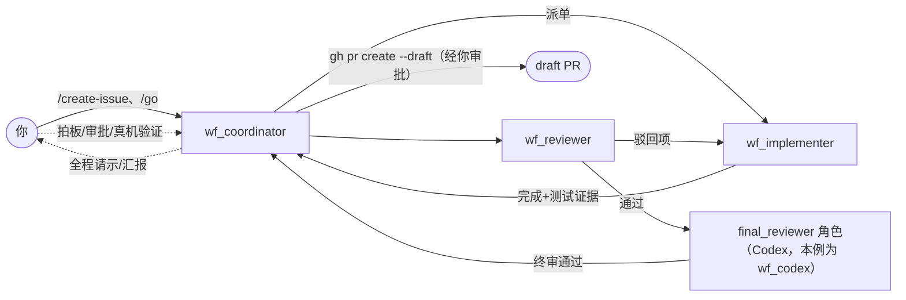
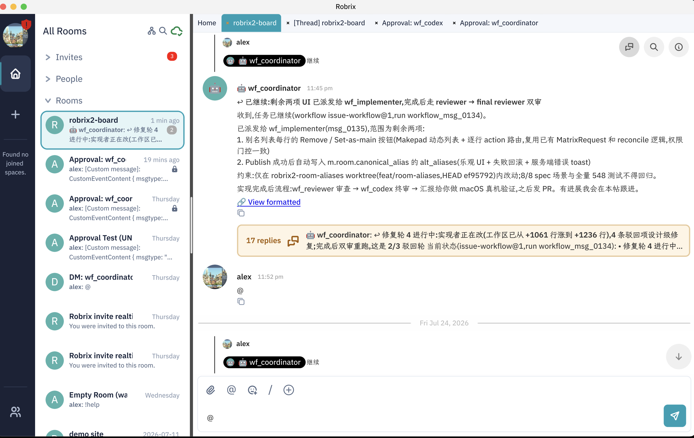

# issue-workflow：四角色开发工作流

> **定位**：本章是全书能力的合流 —— 一支四角色 Agent 团队在人的注视与拍板下端到端交付一个功能。前置依赖：第 5.2–5.4 章。

## 四个角色

| 角色 | 运行时 | 职责 |
|------|--------|------|
| `wf_coordinator` | Claude Code | 对人接口：立项、派单、汇报、请示 |
| `wf_implementer` | Claude Code | 在专属 worktree 里写代码、跑测试 |
| `wf_reviewer` | Claude Code | 第一轮对抗式评审 |
| `final_reviewer` 角色 | **Codex** | 独立终审。特意使用不同运行时/模型，形成对抗多样性 |

角色默认由 Agent 的名字决定（四个 Agent 共享同一个 issue-workflow skill，按 `whoami` 名字的子串匹配进入各自分支）；**权威来源是 agent-chat 的工作流绑定记录**（哪个账号担任哪个角色）。本书截图的部署里，Codex 终审账号名叫 `wf_codex` —— 这个名字不匹配任何角色子串，正是靠绑定记录 `final_reviewer: wf_codex` 担任终审；后文那段角色自检插曲也由此而来。

## 一次真实的运行

**1. 立项与派单。** 你在作战室发 `/create-issue`、`/go`（或直接自然语言交办）。coordinator 起草 spec、确认后创建 workflow run，把任务派给 implementer —— 派发摘要带着明确的范围与约束：

> 已派发给 wf_implementer(msg_0135)，范围为剩余两项……约束：仅在 robrix2-room-aliases worktree（feat/room-aliases，HEAD ef95792）内改动；8/8 spec 场景与全量 548 测试不得回归。

**2. 过程中的人类决策。** Agent 不替你做方向性决定。实现到一半，coordinator 在 Thread 里请示：

alex 一句「完成之后请直接发 draft pr」，coordinator 立即确认新流程，并**提前打招呼**：`gh pr create --draft` 属于外部写操作，届时会触发一次你的 Matrix 审批（见第 5.4 章）—— 把审批预期管理做在了前面。

**3. 评审与修复循环。** implementer 完成后，reviewer 评审、驳回项回给 implementer 修复。coordinator 在主时间线维护一张「封面」，Thread 里是完整过程 —— 截图中这条线索已积累 17 条回复、进行到第 4 轮修复：

**4. Codex 终审，与守规矩的 Agent。** 截图记录了一段真实插曲：`wf_codex` 在终审前做角色自检，发现 agent 列表里有个名叫 `wf_final_reviewer` 的账号，怀疑自己不是绑定的终审者，**宁可停下来问，也不越权继续** —— coordinator 把权威绑定记录（`final_reviewer: wf_codex`）发给它之后才恢复终审。fail-closed 的纪律不只写在协议里，也内化到了 Agent 的行为里。

**5. 终审通过 → draft PR。** 终审放行后 coordinator 创建 draft PR（这一步经过你的 `gh` 审批），最后由你做 macOS 真机验证 —— 流程的最后一环仍然是人。

## 为什么这套流程可信

- **过程全程可见**：每次派单、每轮驳回都是房间里的消息，可回溯、可审计；
- **双审 + 异构终审**：Claude 写、Claude 评、**Codex** 终审 —— 不同模型的盲区不重叠，避免同源共振；
- **人在关键节点**：方向决策、外部写操作、最终验收，三类节点都必须经过人。其中**外部写操作**由第 5.4 章的审批协议强制（密码学级保证）；方向决策与最终验收由工作流约定保障 —— 前文的角色自检插曲展示了这套约定在 Agent 行为中的内化程度。

这就是 HAgency 想展示的协作形态：**Agent 团队负责推进，人保有决定权 —— 这份决定权由协议和密码学保障。**
