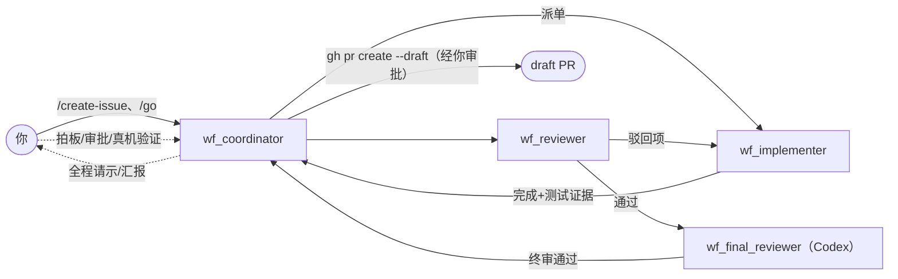

# issue-workflow：四角色开发工作流

> **定位**：本章复盘一个真实的四角色 demo，并给出可复现准备与当前产品边界。前置依赖：第 5.2–5.4 章。本章的角色推进属于 workflow skill，不是 backend 内建状态机。

## 四个角色

| 角色 | 运行时 | 职责 |
|------|--------|------|
| `wf_coordinator` | Claude Code | 对人接口：立项、派单、汇报、请示 |
| `wf_implementer` | Claude Code | 在专属 worktree 里写代码、跑测试 |
| `wf_reviewer` | Claude Code | 第一轮对抗式评审 |
| `wf_final_reviewer` | **Codex** | 独立终审。使用不同运行时/模型，降低相关性盲区 |

当前可复现版本是 Robrix2 `roadmap/agentchat-demo/issue-workflow/` 下的共享 skill。它按 `whoami` 名字子串分支，并且必须先匹配 `final` 再匹配 `reviewer`。因此正式 demo 应使用 `wf_final_reviewer`；`wf_codex` 不匹配任何角色，不能靠 Project Board 的展示数据取得终审权。

agent-chat 当前没有可写的、版本化的 workflow role binding API，也没有 backend 内建 issue-workflow engine。`workflow_bindings.json` 目前只服务 Project Board 只读投影，不是角色授权来源。本书截图中 `wf_codex` 继续终审属于当次会话的人工作业约定，不能推广为通用能力。



## 先让这个 demo 可复现

基础部署只启动一个 Agent。四角色 demo 还要做以下准备：

1. 安装 [agent-spec](https://github.com/ZhangHanDong/agent-spec)，确认 `agent-spec --version`、`parse` 与 `lint --min-score 0.7` 可用；
2. 运行 `roadmap/agentchat-demo/link-skill.sh`，把 `issue-workflow` 同时链接到 Claude 与 Codex skill 目录；
3. 创建并受管启动 `wf_coordinator`、`wf_implementer`、`wf_reviewer`、`wf_final_reviewer`；
4. 创建含四个成员的 backend group，按第 4.1 章的 bootstrap 限制处理自动房，在目标非加密项目房里由你的完整 MXID **逐个邀请四个 Agent**；
5. 为 Codex 首次启动完成一次本地 `TRUST`；
6. 用 `whoami()` 检查四个名字命中正确角色，再做 `/status` 冒烟测试。

参考命令：

```bash
bin/agentchat cli create-group robrix2-board \
  wf_coordinator wf_implementer wf_reviewer wf_final_reviewer

bin/agentchat up wf_coordinator /path/to/repo claude
bin/agentchat up wf_implementer /path/to/impl-worktree claude
bin/agentchat up wf_reviewer /path/to/review-worktree claude
bin/agentchat up wf_final_reviewer /path/to/final-worktree codex
```

项目边界应通过 `agentchat project add <agent> <path> --mode symlink` 固化。现有 `start-demo.sh` 为了演示方便使用 `--allow-shared-workspace`，四个 Agent 共享一个 symlink workspace；这不是“自动创建专属 worktree”。真实项目建议先用 `git worktree add` 创建实现、复审、终审 worktree，再分别绑定。工作流必须传递目标分支/提交 SHA，避免 reviewer 审错副本。

`create-group` 会触发 bridge 自动建房。不要把那次 bridge→Agent 邀请当作 owner provenance；若使用自动房，逐个 `!rmember` 后再由人类 MXID 重新邀请，或把自己的 group 绑定到同事已有房并在那里由 owner 邀请。

## 一次真实的运行

**1. 立项与派单。** 你在作战室发 `/create-issue`、`/go`（或直接自然语言交办）。安装了 demo skill 的 coordinator 起草 spec，并通过 agent-chat 消息把任务派给 implementer。它会把现场状态写到 `.agentchat-demo/state.json`；这还不是 backend durable workflow run：

> 已派发给 wf_implementer(msg_0135)，范围为剩余两项……约束：仅在 robrix2-room-aliases worktree（feat/room-aliases，HEAD ef95792）内改动；8/8 spec 场景与全量 548 测试不得回归。

**2. 过程中的人类决策。** Agent 不替你做方向性决定。实现到一半，coordinator 在 Thread 里请示：


alex 一句「完成之后请直接发 draft pr」，coordinator 立即确认新流程，并**提前打招呼**：`gh pr create --draft` 属于外部写操作，届时会触发一次你的 Matrix 审批（见第 5.4 章）—— 把审批预期管理做在了前面。

**3. 评审与修复循环。** implementer 完成后，reviewer 评审、驳回项回给 implementer 修复。coordinator 在主时间线维护一张「封面」，Thread 里是完整过程 —— 截图中这条线索已积累 17 条回复、进行到第 4 轮修复：


**4. Codex 终审的现场插曲。** 截图中的 `wf_codex` 因名字不匹配 skill 角色而停下来询问，随后根据 coordinator 给出的人工说明继续。这证明的是“该 Agent 当时选择了停下”，也暴露了配置不一致；它不是服务端 fail-closed 或权威绑定的证据。修订后的可复现配置直接使用 `wf_final_reviewer`。

**5. 终审通过 → draft PR。** 终审放行后 coordinator 创建 draft PR（这一步经过你的 `gh` 审批），最后由你做 macOS 真机验证 —— 流程的最后一环仍然是人。

## 保障强度与当前缺口

- **协议强制**：受管运行时触发的 owner approval，校验 sender/room/request/digest/TTL 并单次消费；
- **当前实现**：group 消息、Agent DM、Thread reply continuity、backend task/heartbeat 基础、role×capability 调度池；
- **工作流约定**：spec→实现→评审→终审顺序、主动汇报、方向性决策请示、最后由人真机验收；
- **规划中**：版本化 workflow binding、operator ACL 写入、run 自动继承 Thread、Robrix2 调度预览与按任务选择模型。

双审与异构终审可以降低相关性盲区，但不保证模型判断独立，也不替代测试与人类验收。只有被 launcher/Ask/hook 捕获的外部操作受审批协议强制；方向决策和主动汇报仍需监控与验收清单兜底。
