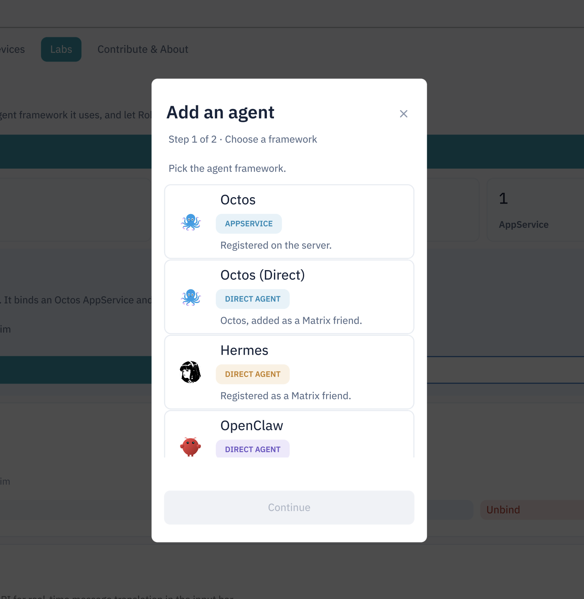
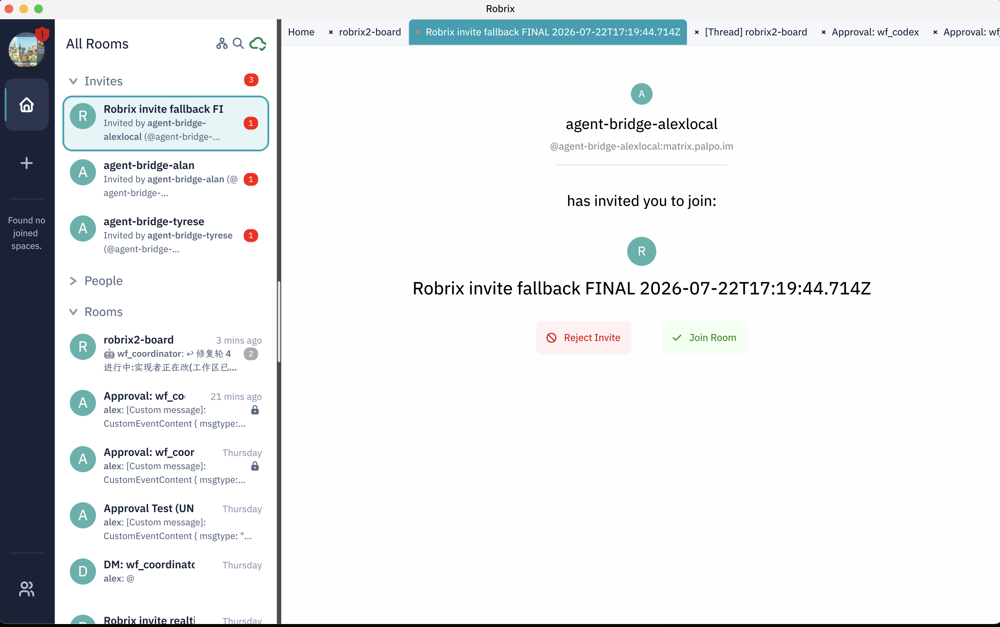

# 把 Agent 请进你的空间

> **定位**：本章区分 Robrix2 的通用 Agent Access 与 agent-chat 的木偶/owner 接入流程。前置依赖：第 4 章。

## Agent Access：Robrix2 的智能体接入面板

打开 **Settings → Labs → Agent Access**。这里是 Robrix2 的**通用 Agent Registry**：绑定一个 Matrix 账号并标记其框架，供徽标、状态和框架能力使用。它不是 agent-chat 的 owner 数据库，也不会给该账号审批权。

面板分三块：

- **AppService 绑定**：Robrix2 保持普通 Matrix 客户端的身份，但可以绑定一个 AppService（截图中为 Octos AppService），并运行与之匹配的斜杠命令；
- **Registered agents**：已注册 Agent 列表，每个条目可 Open chat / Re-check / Unbind；
- 下方还有 **Real-time Translation** 等 Labs 功能。

## 添加一个 Agent：选择框架

点 **Add an agent**，第一步选择该账号背后的 Agent 框架：

- **Octos（AppService）**：注册在服务器上的应用服务；
- **Octos（Direct）／Hermes／OpenClaw**：以「Matrix 好友」形式直接添加的 Direct Agent。

区分这两类的意义在于能力边界：AppService 由服务器托管、可以管理自己名下的一批账号；Direct Agent 就是一个普通 Matrix 账号背后的机器人。Robrix2 对两类都只做**识别与展示**，不参与它们的执行。

agent-chat 与这个面板目前是两条路径：

- agent-chat 会注册已知 Agent 的 `@ac_<name>` 木偶账号，但**不会自动把它拉进任意项目房间**；
- Robrix2 不会仅凭 `@ac_` 名字把账号写入通用 Agent Registry；
- 名字模式目前主要用于发现 `*_coordinator` 并显示 workflow 文本补全，不是身份认证；
- owner 必须由人类邀请实际木偶账号时的完整 `event.sender` MXID 建立。

因此截图中的 Octos / Hermes / OpenClaw 设置只能说明 Robrix2 的通用接入能力，不能当作 agent-chat 已绑定成功的证据。

## 正确邀请顺序

在非加密项目房间里，建议按以下顺序操作：

1. 由 trusted inviter 邀请自己的 companion bridge bot；
2. operator 发送 `!bindroom <existing-group>`；
3. **你本人逐个邀请自己的 `@ac_<agent>` 木偶账号**；
4. 等 Agent invite poll（默认可能约 60 秒），确认 Agent 与 companion bridge 都已加入；
5. 接受 bridge 发来的 `Approval: <agent>` 加密房邀请。

第 3 步同时建立 `(room, agent) → owner`。让 bridge 代替人类创建/邀请项目成员，不能证明“谁邀请 Agent，谁是 owner”。

## 接受审批房邀请

bridge 会按需邀请你进入它为 `(agent, owner)` 创建的审批房。邀请出现在 Robrix2 左侧 **Invites**，点 **Join Room**：

> 截图左栏有多个 bridge 邀请。邀请名称本身不证明 owner 关系；应检查是谁邀请了哪一个实际 Agent，以及审批房是否对应正确的 `(agent, owner)`。普通 DM 与 `Approval:` 房也不是同一种通道：普通 DM 用于交办，审批房只接受结构化 verdict。
