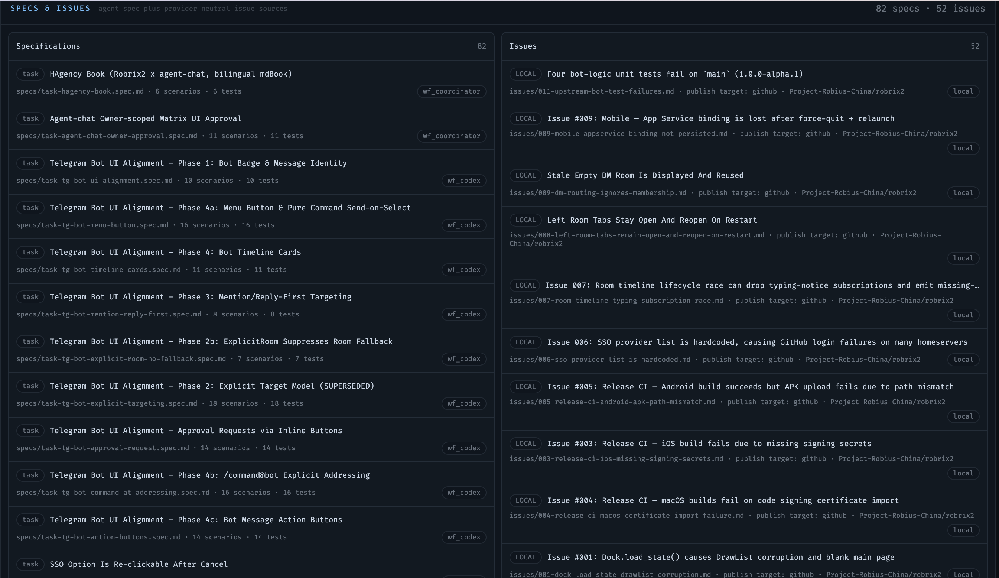

# 项目看板：任务与工件的全局视图

> **定位**：本章介绍 agent-chat 自带的 Project Board —— 聊天之外的第二块屏幕：团队状态、spec 与 issue 的全局仪表盘。前置依赖：第 5.5 章（看板展示的正是 issue-workflow 的运行状态）。

聊天房间是协作**发生**的地方，但它是时间线视角 —— 想回答「现在整个项目是什么状态？」，翻聊天记录不如看一眼仪表盘。agent-chat 的本地 dashboard（`http://127.0.0.1:8084`）为此提供了 **Project Board**（`/projects` 页面，顶部导航还有 Monitor / Tasks / Pool / Alerts / Config 等运维页面）。

## 团队总览

看板顶部选择一个 **project group**（截图为 `robrix2-board`，绑定 `robrix2` 项目与 `issue-workflow@1` 工作流），下方一排统计瓦片直接回答最常问的问题：

- **Members / Online**：项目组成员数与在线数；
- **Working / Blocked / Open Tasks**：几个在干活、几个被卡住（`waiting` / `stale` 状态单独提示，如截图中 coordinator 已等待 wf_codex 终审 7 小时 —— 这类「静默停滞」正是看板要暴露的）；
- **Worktrees**：Agent 工作区数量与脏状态（`0 dirty` 意味着没有未收尾的改动）；
- **Specs / Changes**：spec 与本地/远端 issue 的数量（下一节展开）。

成员卡片逐个展示每个 Agent 的运行时（claude / codex）、当前任务、心跳时间。注意那些 **UNREGISTERED** 卡片：它们是经 Matrix 房间看到、但不属于本 backend 的成员 —— 比如队友 Tyrese 的 Agent 木偶和人类账号。看板如实呈现「房间里有谁」与「我管着谁」的差别，这正是第 5.2 章多实例同房协作在运维视角下的样子。

## Specs & Issues：spec 驱动的工件面板

看板下半部分把项目的两类核心工件放在一起：

**左栏 Specifications** —— 项目里所有 [agent-spec](https://github.com/ZhangHanDong/agent-spec) 合约文件（`specs/*.spec.md`），每条显示场景数 / 测试数与负责的 Agent。本书自己的 spec（`task-hagency-book.spec.md · 6 scenarios · 6 tests`）就在列表第一行 —— 整个 HAgency 的工作方式是自举的：**给 Agent 的每个任务先立 spec，验收对着 spec 跑**，看板让这些合约的覆盖状态一目了然。

**右栏 Issues** —— 两个来源聚合：

- **LOCAL**：`issues/` 目录下的本地 issue 文档，标注了发布目标（`publish target: github · Project-Robius-China/robrix2`）—— Agent 在本地先立案，经你审批后才推到 GitHub（`gh` 写操作走第 5.4 章的审批）；
- **GITHUB**：远端仓库的真实 issue，带 open / closed 状态 —— 第 5.5 章截图里 coordinator 关联的 issue #266 也在其中。

## 看板在 HAgency 里的位置

Project Board 是**只读的运维视角**：它不发消息、不派任务、不审批 —— 那些都发生在 Matrix 房间里（以及审批房里）。它回答的是另一类问题：谁在线、谁停滞、哪个 spec 没测试、哪个 issue 还没发布。聊天负责协作，看板负责**审计** —— 两块屏幕合起来，人才能既「在场」又「掌局」。
