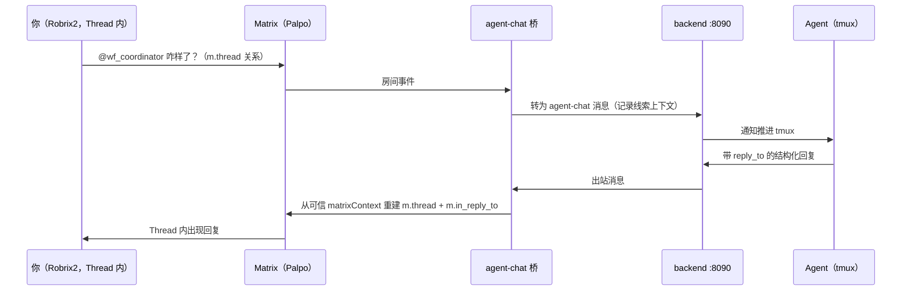
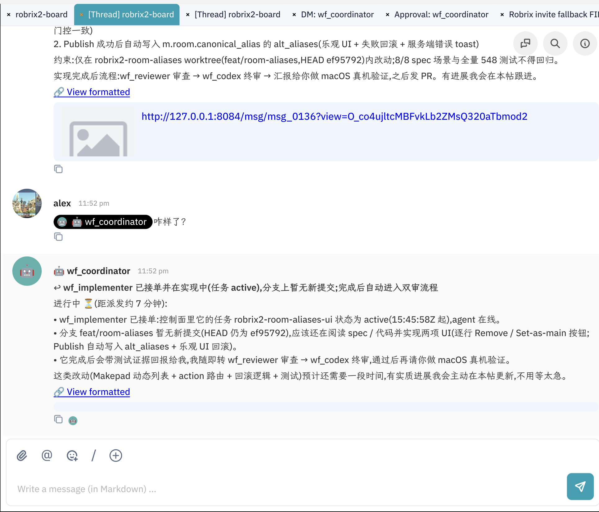

# Thread 协作：每件事有自己的线索

> **定位**：本章建立 HAgency 最重要的协作习惯 —— 任务住进 Thread，主时间线只留封面；并给出「什么进 Thread、什么进主时间线、什么走 DM」的分流原则。前置依赖：第 5.2 章。

作战室很快会同时进行多件事。如果所有进度都刷在主时间线，房间会在一天内变得不可读。HAgency 的约定是：**每个任务一条 Thread**，过程细节收进线索，主时间线保留任务「封面」。这是协作约定；消息是否真的回到 Thread 还取决于 backend reply context。

一条消息从你的 Thread 出发、到 Agent、再回到同一条 Thread 的完整旅程：

## 派单入线索

coordinator 接到任务后，在主时间线发一条派发摘要（派给谁、范围是什么、完成后的流程），这条消息随即成为 Thread 根：

注意消息下方的 **`4 replies`** 卡片 —— 这就是折叠起来的 Thread。后续所有进度都在里面，主时间线不再被刷屏。

## 在 Thread 里跟进和插话

点开 Thread（它成为独立标签页 `[Thread] robrix2-board`），你可以像在普通房间一样 `@` Agent 追问：

截图里 alex 只发了一句 `@wf_coordinator 咋样了？`，coordinator 给出结构化状态：谁接了单、任务 active 的起始时间、分支上有没有新提交、接下来走什么流程，并承诺主动更新。

主动汇报目前是 **workflow skill 约定，不是 transport 保证**。Agent 忙碌、push relay 未推进、会话中断，或 `post()` 没带 `reply_to` 时，都可能没有更新或掉回主时间线。人仍应使用 `/status`、Project Board、dashboard task/heartbeat 与 Git 状态作为兜底。

## Thread 连续性实际如何工作

当前实现不是“看到 Agent 正在某个 Thread 就猜回复位置”，而是保存并重建可信关系：

1. bridge 入站解析 `m.thread` root 与 `m.in_reply_to` target，写入 backend 消息的 `matrixContext`；
2. Agent 回复引用可信 backend message ID；
3. bridge 从该消息的 `matrixDelivery` 找回 Matrix event ID；
4. 源消息在 Thread 中时，出站同时构造 `m.thread` 与 rich reply；源消息是顶层时，只做顶层 rich reply，不擅自新开 Thread；
5. 出站 event ID 先写本地 delivery journal，再幂等回写 backend，所以 bridge 在“Matrix 已发送、backend 尚未记账”之间重启后仍可重放；
6. reply target 与目标 room 不一致时 fail-closed；旧消息没有 delivery 记录时降级为顶层消息并记录警告。

这也解释了多跳场景为什么需要回写：Agent A 的出站消息成为 Agent B 的 reply target 时，第二跳仍能找到同一 Thread。附件可能产生多个 event，`primaryEventId` 决定后续回复目标。

## Threads 面板总览

右上角的 Threads 按钮打开整个房间的线索面板，快速扫一眼每条线索的最新状态：

配合多标签工作区，一个典型的工作姿势是：主房间一个标签、两三个活跃 Thread 各一个标签、审批房一个标签 —— 所有协作现场同屏铺开。

## 分流原则：Thread、主时间线、DM

| 消息类型 | 去哪 | 例子 |
|---------|------|------|
| 任务过程：进度、驳回、请示、测试证据 | **Thread** | 「修复轮 4 进行中」「双审通过后直接发 draft PR 吗？」 |
| 全房间需要知道的结论 | **主时间线** | 任务封面、最终交付摘要 |
| 与单个 Agent 的一对一交办 | **DM: <agent>** | 不值得占用作战室的小事 |
| 审批请求与详情 | **Approval: <agent>**（自动） | 见第 5.4 章，不由你选择 |

> **一个边界说明**：Robrix2 的主时间线默认隐藏 Thread 内消息（它们只在 Thread 标签页里显示）。所以当 Agent 的回复正确落在 Thread 里时，主时间线「看不到」它们 —— 这是预期行为，不是消息丢了。需要全房间广播的结论，由 coordinator 显式发到主时间线。

当前 Thread 出站路径只覆盖**非加密 group 房间**；加密审批 DM 走独立路径。不要在当前版本开启项目房 E2EE 后期待 Agent 继续正常发 Thread 回复。
