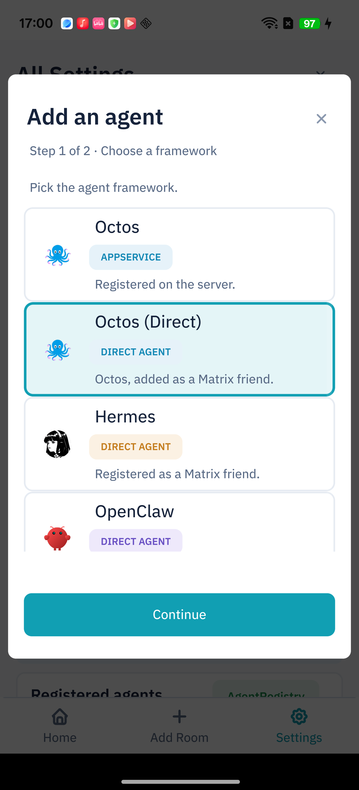

# Connecting Your Own Octos (Direct Mode) to Robrix

[中文](01-connecting-your-own-octos-to-robrix-zh.md)

> **Goal:** By the end of this guide you'll have a personal Octos agent running on
> **your own machine**, logged into your Matrix server as a regular user account,
> added in Robrix as an "Octos (Direct)" friend you can DM or invite into rooms —
> with **no** homeserver-admin registration and **no** public IP required.

This guide ships with a **ready-to-run example** ([`example/`](example/)): copy two
files, fill in five required values, run one command.

**Quick index**

| What you want | Jump to |
|---|---|
| Understand Direct vs AppService | [Section 1](#1-what-is-direct-mode) |
| Prerequisites | [Section 2](#2-prerequisites) |
| **Just run the example** | [Section 3](#3-the-runnable-example) |
| Every config field explained | [Section 4](#4-config-fields-explained) |
| Add it in Robrix | [Section 5](#5-connecting-in-robrix) |
| Bot not replying? | [Section 6](#6-troubleshooting) |

---

## 1. What is Direct mode

Octos connects to Matrix in one of two ways, differing only in a single `mode`
field on the channel:

| | **Octos (Direct)** — this guide | Octos AppService |
|---|---|---|
| Matrix identity | a **regular user account** (`user_id` + password) | a server-registered AppService (bridge identity) |
| Server requirement | **none** — any account you can log into | a homeserver admin must register an AppService YAML |
| Network direction | **outbound** `/sync` (works from a laptop, no public IP) | usually needs the homeserver to reach the bridge inbound |
| Where it runs | any machine (invisible to Robrix) | usually alongside the homeserver |
| BotFather / sub-bots | not supported (one account = one bot) | can spawn sub-bots dynamically |
| How to add in Robrix | "Add an agent" → pick **Octos (Direct)** → enter Matrix ID → **Add friend & bind** | "Add an agent" → pick **Octos** → enter AppService URL |

> **One-line pick:** want a private agent on **your own computer** without homeserver
> admin rights → use **Direct**. Want a server-side multi-bot platform with BotFather
> → use AppService (see the [Robrix + Palpo + Octos deployment guide](../robrix-with-palpo-and-octos/01-deploying-palpo-and-octos.md)).

On the Robrix side, Direct mode uses the **exact same direct-friend binding path as
Hermes / OpenClaw** — it's just a Matrix friend. Robrix talks to it through the
homeserver and **doesn't care which machine it runs on**.

---

## 2. Prerequisites

Before you start, confirm:

- [ ] **A compatible Octos binary** (a build that includes the Matrix user-account channel — [Octos PR #1475](https://github.com/octos-org/octos/pull/1475) or later)
- [ ] **A dedicated Matrix account for the bot** — registered on your homeserver, with its `user_id` and password (do **not** reuse your own account)
- [ ] **An LLM API key** — this guide uses DeepSeek (`DEEPSEEK_API_KEY`)
- [ ] **Robrix installed** and able to reach the **same** Matrix server
- [ ] An **unencrypted DM or room** for the agent — the current user-account channel reads plaintext `m.room.message` events and does not decrypt `m.room.encrypted` (see [Section 6](#6-troubleshooting))

> **Tip:** the dedicated bot account matters. Direct mode is literally "log in with a
> Matrix account and run the agent as it," so that account sends and receives as the
> bot — keep it separate from your own identity.

### 2.1 Install a compatible Octos binary

The Matrix user-account channel landed after the `v1.1.0` tag, so a plain `v1.1.0`
release binary cannot run this profile. Until a newer release explicitly includes
PR #1475, build a current Octos checkout with the Matrix feature enabled:

```bash
OCTOS_SRC="$(mktemp -d)/octos"
git clone https://github.com/octos-org/octos.git "$OCTOS_SRC"
cd "$OCTOS_SRC"
git merge-base --is-ancestor 355147f1 HEAD || {
  echo "This checkout does not contain Octos PR #1475" >&2
  exit 1
}
cargo install --path crates/octos-cli --locked --features "api,matrix" --force
octos --version
```

The `git merge-base` check prevents accidentally building a checkout from before the
feature landed. Once an Octos release newer than `v1.1.0` includes #1475, you can use
that release binary instead.

---

## 3. The runnable example

The [`example/`](example/) folder is a minimal, working set:

| File | What it is |
|---|---|
| [`myagent.example.json`](example/myagent.example.json) | The Octos gateway **profile** (loaded via `--profile`) |
| [`.env.example`](example/.env.example) | Holds `DEEPSEEK_API_KEY` |
| [`start.sh`](example/start.sh) | Loads `.env`, sets the proxy guard, runs `octos gateway` |
| [`.gitignore`](example/.gitignore) | Protects generated credentials and runtime data from accidental commits |

### 3.1 Run it in three steps

```bash
cd example

# 1. Create your profile, edit its 4 account/access values
cp myagent.example.json myagent.json
#    edit: homeserver, user_id, password, allowed_senders

# 2. Create your env file, add your LLM key
cp .env.example .env
#    edit: DEEPSEEK_API_KEY

# 3. Start (foreground; Ctrl-C to stop)
./start.sh
```

Success looks like this line in the output:

```
INFO Matrix user channel authenticated user_id=@myagent:example.org
```

> **You edit 5 required values:** four in `myagent.json`'s channel — `homeserver`,
> `user_id`, `password`, and **`allowed_senders` (your own MXID — who may drive the
> agent; see the security note in [§4](#4-config-fields-explained))** — plus
> `DEEPSEEK_API_KEY` in `.env`.
> Leave the rest (`llm`, `created_at`/`updated_at`, and the personal-assistant presets
> `auto_join`/`group_policy`/`require_mention`) as-is — the next section explains why.

---

## 4. Config fields explained

What makes it "Direct mode" is the object in the `channels` array. **Every field name
below maps to a real Octos user-channel setting; values and defaults are per the Octos
source** (not made up):

| Field | Purpose | Values / **default** |
|---|---|---|
| `type` | channel type | fixed `"matrix"` |
| `mode` | **selects Direct vs AppService** | `"user"` = Direct (this guide); **omitted/`"appservice"`** = AppService (then requires `as_token`/`hs_token`, else errors) |
| `homeserver` | CS-API address (with scheme + port) | e.g. `https://matrix.example.org`; **defaults to `http://localhost:6167`** |
| **auth (one of)** | missing → errors *requires access_token or user_id + password* | `access_token`; **or** `user_id` + `password` |
| `device_name` | login device name (shown in logs/sessions) | anything, e.g. `octos-personal` |
| `auto_join` | auto-accept invites? | `always`/`on`/`true` accept all; `allowlist`/`allowed` allowlist only; **default `off` (do not auto-join)** |
| `auto_join_allowlist` | allowlist used with `allowlist` | array or comma string, optional |
| `group_policy` | group authorization policy | `open`/`all` respond everywhere; `disabled`/`off`/`false` off; **default `allowlist`** |
| `require_mention` | must be @-mentioned in rooms? | **default `true`** (needs @ in rooms); personal assistant → `false` |
| `allowed_senders` | **whitelist of who may drive the bot** | array of your MXIDs, e.g. `["@you:example.org"]`; **empty `[]` = anyone in a joined room** |

> **⚠️ The defaults are "silently non-working" for a personal assistant.** Octos's three
> defaults (`auto_join=off`, `group_policy=allowlist`, `require_mention=true`) together
> mean: doesn't auto-join, ignores non-allowlisted senders in rooms, and only replies
> when @-mentioned. So the example flips them to `always` / `open` / `false` — exactly
> what a "personal assistant" should do. Tighten them back one by one when you want to.

> **🔒 `allowed_senders` is your most important security gate — always set it to your own MXID.**
> Once the three fields above are opened up (`always`/`open`/`false`), the agent
> auto-joins and answers everything. At that point **the only thing deciding "who can
> drive it and spend your LLM API budget" is `allowed_senders`**:
>
> - The three access-control layers are orthogonal: `auto_join` = **whose invites** it
>   accepts, `group_policy` = **which rooms** it's active in, `allowed_senders` = **who is
>   allowed to make it reply**. The wider the first two, the more `allowed_senders` is
>   your only line of defense.
> - `["@you:example.org"]` (the example default) = **only you** can use it; add MXIDs for
>   trusted teammates: `["@you:example.org", "@teammate:example.org"]`.
> - `[]` (empty) = **anyone** in a joined room can use it. On a **federated or shared**
>   homeserver, any stranger who learns the bot's MXID can invite it and run up your bill —
>   only use `[]` on a **private, trusted** server.

Other fields:

- `enabled` — **must be `true`** (defaults to `false` = profile disabled)
- `created_at` / `updated_at` — profile metadata, **required to load**; keep the example values (any valid RFC 3339 timestamp works)
- `llm.primary.{family_id, model_id, route.api_key_env}` — model routing; note the CLI `--provider` / `--model` in `start.sh` override it
- `gateway.max_history` / `max_output_tokens` — optional session tuning

> **Security:** the `password` in `myagent.json` and the key in `.env` are plaintext —
> **do not commit them**. The example's `.gitignore` protects the standard generated
> filenames, but still check `git status`; commit only the `*.example` templates. If
> your Octos build supports it, `access_token` avoids storing the account password,
> but it is still a bearer secret and must be protected and revoked if exposed.

---

## 5. Connecting in Robrix

Once the gateway is running and the bot has logged in, register it as an agent in Robrix:

### 5.1 Add an agent (Agent Lab two-step wizard)

1. Open Robrix and sign in with **your own account**
2. Go to **Settings → Labs → Agent Access**
3. Click **"Add an agent"**
4. **Step 1 of 2 · Choose a framework** — pick the **"Octos (Direct)"** card (Octos logo, tag "Direct Agent")
5. **Step 2** — enter your bot's full MXID in **Agent Matrix ID** (e.g. `@myagent:example.org`), then **"Add friend & bind"**



Robrix sends a friend request to that MXID. Because `auto_join: "always"` is set, the
octos bot **auto-accepts**, and it then appears as a recognized **Octos (Direct)** agent.

> **Tip:** this is a **client-side local action** (registering in the AgentRegistry +
> starting a DM), not a chat command to the bot. It's identical to the Hermes / OpenClaw
> binding flow.

### 5.2 DM it or invite it into rooms

Once registered, it's a normal Matrix friend:

- **DM:** open its conversation and send a message (with `require_mention: false`, it replies to everything in a DM)
- **Invite into a room:** invite its MXID in any room; it auto-joins. Whether it needs an @ depends on `require_mention`

Robrix shows an **Octos (Direct)** framework badge on it in rooms, so you can tell at a
glance it's an agent and not a person.

---

## 6. Troubleshooting

| Symptom | Common cause | Fix |
|---|---|---|
| `/sync` logs **502 Bad Gateway** | shell proxy is also proxying homeserver requests | use the `NO_PROXY` in `start.sh` to exclude your homeserver's address |
| login fails with *requires access_token or user_id + password* | auth fields incomplete | provide `access_token`, or `user_id` + `password` |
| profile fails to load | missing `created_at`/`updated_at`, or `enabled` not `true` | add those three fields as in the example |
| replies in DM, **silent in rooms** | `require_mention: true` (default) | @-mention it, or set `require_mention: false` |
| **nobody gets a reply** | your MXID isn't in `allowed_senders`; or `group_policy` is the default `allowlist`; or it didn't auto-join | add your MXID to `allowed_senders`; set `group_policy: "open"`, `auto_join: "always"` |
| no replies in an encrypted room | the current Direct channel does not decrypt `m.room.encrypted` events | create or use an **unencrypted** DM/room; new encrypted messages are unreadable too |
| can't add it in Robrix | Step 1 picked **Octos** (AppService) instead of **Octos (Direct)** | go back and pick the Direct card; Step 2 then shows "Agent Matrix ID + Add friend & bind" |

> **About the proxy trap:** if octos runs on a machine with a global proxy (Clash etc.),
> connecting to a **local or LAN** homeserver routes `/sync` through the proxy too → 502 →
> no messages. Set the homeserver's host/IP in `.env` as `MATRIX_NO_PROXY_HOST`;
> `start.sh` adds it to `NO_PROXY` while preserving existing exclusions, so external
> LLM calls can still use the proxy.

> **About encrypted rooms:** the current Direct channel only processes plaintext
> `m.room.message` events; it does not implement Matrix E2EE decryption. This applies
> to new messages as well as history. **Use unencrypted rooms for Direct agents.**

---

## Next

- [The `example/` bundle](example/) — copy-and-run `myagent.example.json` + `start.sh` + `.env.example`
- [Robrix + Palpo + Octos deployment guide](../robrix-with-palpo-and-octos/01-deploying-palpo-and-octos.md) — if you want a **server-side AppService + BotFather** multi-bot platform instead
- [Robrix + OpenClaw](../robrix-with-openclaw/02-using-robrix-with-openclaw.md) — another direct-friend agent; same connection flow as this guide

---

*Written against the July 2026 Octos user-account channel (PR #1475) and Robrix's Octos (Direct) flow. The `v1.1.0` Octos tag predates that feature; use a later build. Config fields follow the upstream project repos.*
