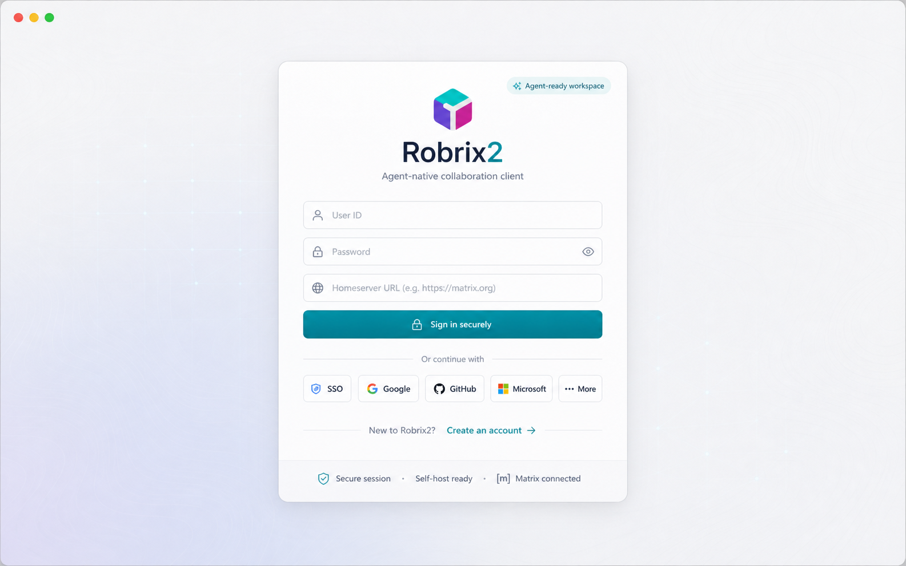
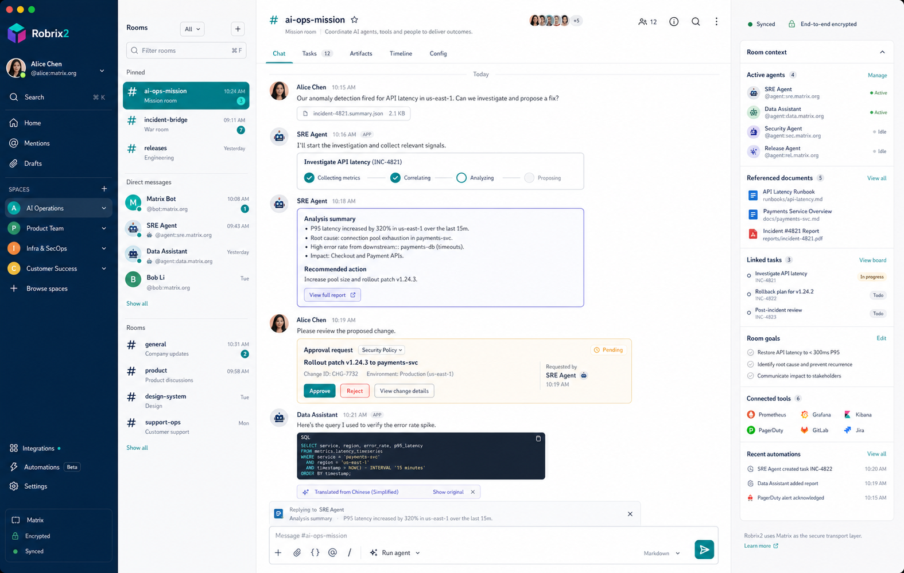
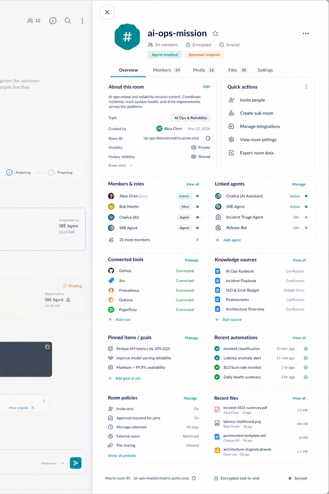
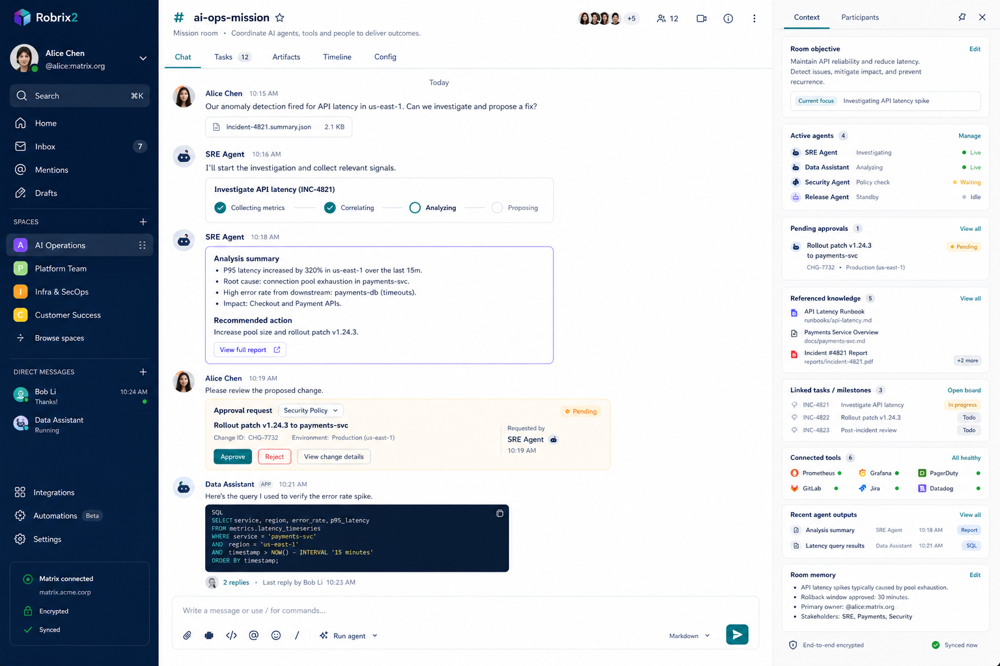
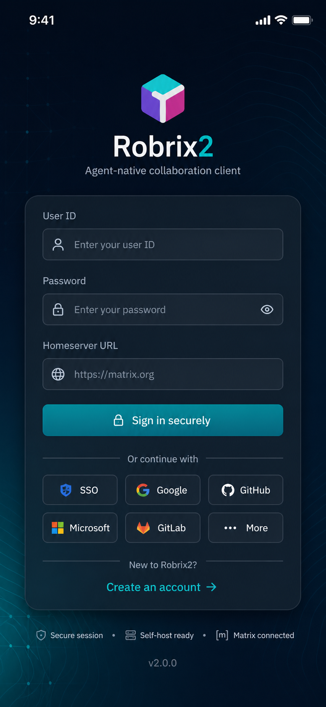
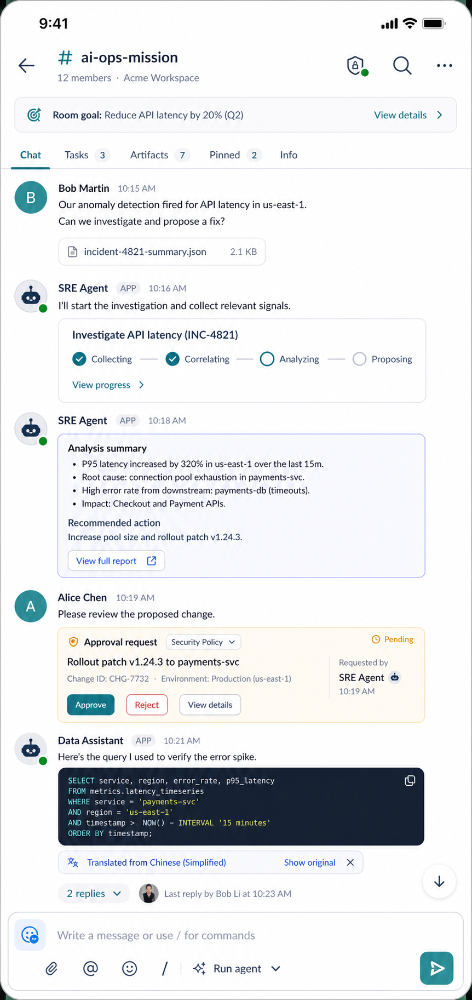
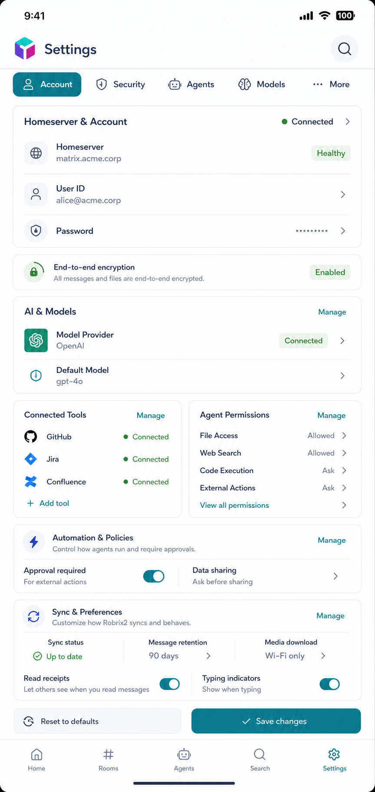
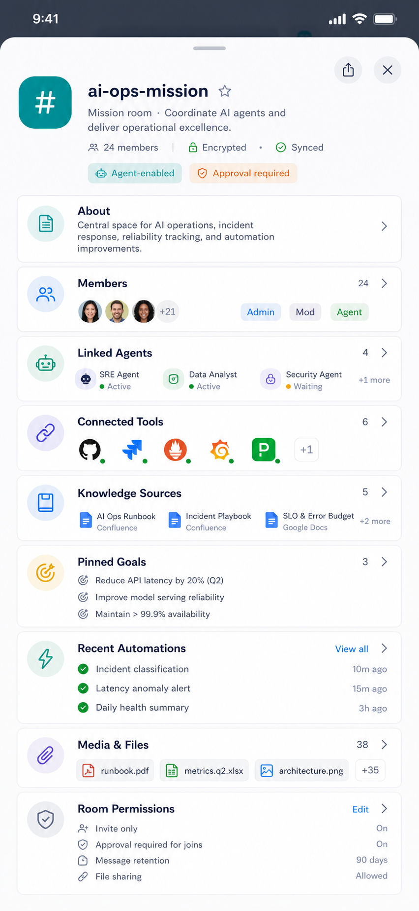

# Robrix2 UI 视觉 Spec

状态：**Draft v0.2**（基于 8 张参考设计稿 + 当前代码审计重写）
维护：UI / 设计系统
本仓库**只交付两样东西**：
- `src/shared/design_tokens.rs` —— 语义 token 层（本 spec 第 3 节的代码落地，**唯一交付的代码**）
- 本文档（实现合同）

**不预置成品组件**：卡片 / 徽章 / 行等一律由 agent 按第 4 节的合同 / recipe 实现。
**agent 行为约束**：见第 0 节「硬约束」，并已写入 `CLAUDE.md` / `AGENTS.md` / `specs/project.spec.md`。

**目录**：§0 用法 / 硬约束 / 参考稿 · §1 原则 · §2 视觉总览 · §3 Tokens（颜色 / 圆角 / 间距 / 尺寸 / 阴影 / 字号）· §4 组件合同（4.1–4.16）· §5 各界面 · §6 响应式 · §7 状态 & 交互 & 无障碍 · §8 Roadmap · §9 本地验证 · §10 DSL gotchas · §11 非目标 · §12 结论

---

## 0. 这份文档怎么用（给 agent / 实现者）

这不是一份"看着好看就行"的设计稿描述，而是**实现合同**。落地任何一个界面前：

1. **先读第 3 节 token 表**，所有颜色 / 圆角 / 字号一律用 `RBX_*` token，禁止在页面里写裸 hex。
2. **再读第 4 节组件合同**，按合同 / recipe 实现卡片 / 徽章 / 行，不要重新发明样式。
3. **对照第 5 节对应界面**：每个界面给了「参考图 → 线框 → 目标结构 → 当前代码与差距 → 落地步骤」。直接按"当前代码位置 + 差距"动手。
4. **遵守第 8 节构建顺序**：先 token，后组件，先 Settings，后 Detail，最后 Timeline。不要从 Timeline 开干。
5. **写 Makepad DSL 前看第 10 节 gotchas**，这些坑会让 `cargo build` 过、但运行时白屏 / panic。

### 0.1 硬约束（agent MUST / MUST NOT）

> 这些是**强制规则**，与 `CLAUDE.md` / `AGENTS.md` / `specs/project.spec.md` 一致；违反视为不合格实现。

- **MUST** 颜色 / 圆角 / 字号用 `RBX_*`（DSL：`(RBX_TOKEN)`；Rust：`crate::shared::design_tokens::RBX_*`）或既有 `styles.rs` token。
- **MUST NOT** 在界面里写裸 hex（`#xRRGGBB` 字面量）—— 需要新颜色先进 `design_tokens.rs`，再引用。
- **MUST NOT** 重新发明卡片 / 徽章 / 行样式；先按第 4 节合同 / recipe 实现，复用沉淀到 `src/shared/`。
- **MUST** 改 token 只改 `design_tokens.rs` 一处；不在各页 copy 一套视觉常量。
- **MUST** 写 Makepad DSL 前遵守第 10 节；尤其**不要**依赖「向项目内派生模板追加子节点」（本 fork 运行时不可靠）。
- **MUST** 按第 8 节顺序推进；视觉重构与业务逻辑改动**拆成独立提交**。
- **MUST** 同一状态语义固定一种色（见 3.1）；不得同语义换色。
- 状态必须补齐 `loading / empty / disabled / pending / success / warning / danger / stale`（见第 7 节），不是只做 happy path。

> 一句话方向：Robrix2 是**「可协作的 AI 工作空间」**，不是「给 bot 加了入口的聊天工具」。复杂对象卡片化、普通对话保持轻量。

本轮范围（来自 8 张参考稿，见 §0.2）：移动端 Login / Settings / Room Detail / Timeline，桌面端 Login / Workbench（三~四栏）。

### 0.2 参考设计稿（8 张 · source of truth）

来源（飞书 wiki，需登录）：<https://my.feishu.cn/wiki/B5aMwGr39iHcfdkAnVHc5g0un3c>
本地副本：[`docs/ui-reference/`](ui-reference/)。本文件的线框 / 目标结构均以这 8 张为准；§5 各界面会内嵌对应原图。

| # | 预览 | 界面 | 内嵌于 |
|---|------|------|--------|
| 01 |  | 桌面登录（浅色，品牌卡 + teal CTA + SSO 行） | §5.6 |
| 02 |  | 桌面工作台（深色导航 + 房列表 + 时间线 + 右信息栏） | §5.6 |
| 03 |  | 房间/任务详情总览（对象集合卡 + Quick actions） | §5.2 / §5.6 |
| 04 |  | 工作台 Activity 变体（分析卡 + 审批卡 + 代码块） | §5.3 / §5.6 |
| 05 |  | 移动登录（深色） | §5.6 |
| 06 |  | 移动时间线（goal banner + 步骤 chips + 审批 + 代码） | §5.3 |
| 07 |  | 移动设置（分组卡 + 状态徽章 + sticky 底栏 + tab bar） | §5.1 |
| 08 |  | 移动房间详情（hero + 对象集合卡） | §5.2 |

---

## 1. 设计北极星与原则

| 关键词 | 含义 | 反例（要避免） |
|--------|------|----------------|
| Calm | 冷白底、低饱和、靠描边分层 | 荧光 cyan、大色块后台感 |
| Layered | 卡片 / 分组 / 状态标签建立秩序 | 控件平铺、信息无层级 |
| Operational | 状态语义稳定（success/warning/danger 永远一种色） | 同语义换色 |
| Human + Agent | 人类发言轻量，Agent 对象卡片化 | 每条消息都像审批工单 |
| Cross-platform | 移动 / 桌面共享同一套 token 与组件，只在布局适配 | 两端各画一套视觉 |

硬约束：
- **一张卡片只回答一个问题**；**一个页面只保留一个主 CTA**。
- `Manage / Edit / View all` 这类次级操作统一放卡片右上角或行尾。
- 必须提前定义全部状态：`loading / empty / disabled / pending / success / warning / danger / stale-offline`（见第 7 节）。

---

## 2. 视觉语言总览（从 8 张稿提炼）

- **品牌**：3D 立方 logo（紫 `#572DCC` + 青 `#05CDC7` + 蓝），字标「Robrix」深色 +「2」青色。紫色**只**做品牌记忆点，不做功能主色。
- **主色 Accent = 冷静的青蓝 teal `#119FB3`**：主 CTA（"Sign in securely"）、选中态、链接、聚焦。承接 Robrix cyan 气质但降荧光。
- **明亮为主**：内容区（Settings / Detail / Timeline / 桌面主区）一律浅色；**仅两处深色**——桌面左侧导航栏、移动端登录页。本轮不做全量 dark mode。
- **房间 / 空间身份色**：teal 圆角方块头像（`#14B8A6`）。
- **状态色**：绿=Connected/Healthy/Active/Synced；琥珀=Approval required/Pending；红=Reject/Failed；蓝=info/链接；灰=Idle/中性。
- **卡片**：白底、大圆角（12–16）、1px 浅描边、**几乎不用重阴影**。
- **Badge / Chip**：胶囊形，浅底 + 同色系深字。
- **Agent 消息**：头像带绿色在线点 + 名字后 `APP` 标；步骤 chips；左侧强调边的分析卡；琥珀色审批卡；深底代码块 + "Translated from Chinese / Show original"。
- **Composer**：单一圆角容器，左侧 attach/emoji/slash，右侧 teal 圆形发送，外加显眼的 `Run agent` 模式切换。

---

## 3. Design Tokens（**唯一真源** → `src/shared/design_tokens.rs`）

DSL 中用 `(RBX_TOKEN)` 引用（已 `use mod.widgets.*`）；Rust 侧用 `crate::shared::design_tokens::RBX_*` 的 `Vec4` 常量。下表即代码，改值改这一处。

### 3.1 颜色

| Token | Hex | 用途 |
|-------|-----|------|
| `RBX_BG_CANVAS` | `#F7F9FC` | 页面底 |
| `RBX_BG_SURFACE` | `#FFFFFF` | 卡片 / sheet |
| `RBX_BG_SURFACE_SUBTLE` | `#F4F7FB` | 次级面板 / 分组底 |
| `RBX_BG_SUNKEN` | `#EEF2F8` | 浅色代码 / 预览内嵌 |
| `RBX_BG_HOVER` | `#EFF4FB` | 行 / 列表 hover |
| `RBX_BG_SELECTED` | `#E4F5F7` | 选中行 / 项（teal 微染） |
| `RBX_BG_PRESSED` | `#E7ECF3` | 按下态表面 |
| `RBX_BG_DISABLED` | `#F0F2F6` | 禁用控件表面 |
| `RBX_FG_PRIMARY` | `#16233B` | 主文字（非纯黑） |
| `RBX_FG_SECONDARY` | `#5A6B86` | 副文字 / meta |
| `RBX_FG_TERTIARY` | `#8A98AE` | 时间戳 / 极弱字 |
| `RBX_FG_ON_ACCENT` | `#FFFFFF` | accent/深底上的字 |
| `RBX_FG_DISABLED` | `#AEB7C6` | 禁用字 |
| `RBX_ACCENT` | `#119FB3` | 主 CTA / 选中 / 聚焦 |
| `RBX_ACCENT_HOVER` | `#0E8C9E` | accent hover |
| `RBX_ACCENT_PRESSED` | `#0B7484` | accent pressed |
| `RBX_ACCENT_SOFT` | `#E4F5F7` | 选中 chip 底 / 高亮行 |
| `RBX_LINK` | `#1887C9` | 链接 |
| `RBX_BRAND_PURPLE` | `#572DCC` | 仅品牌入口 |
| `RBX_BRAND_CYAN` | `#05CDC7` | 仅品牌 |
| `RBX_BRAND_BLUE` | `#2D7CFF` | 仅品牌（立方 logo 蓝面） |
| `RBX_IDENTITY_TEAL` | `#14B8A6` | 房间 / 空间头像 |
| `RBX_STROKE_SOFT` | `#E6EBF2` | 卡片 / 控件默认描边 |
| `RBX_STROKE_STRONG` | `#D5DEEA` | 强调 / 聚焦描边 |
| `RBX_DIVIDER` | `#00000010` | 行间分隔线 |
| `RBX_SUCCESS_FG` / `_BG` | `#1B8A4B` / `#E8F6EE` | Connected/Healthy/Active |
| `RBX_WARNING_FG` / `_BG` | `#C6790B` / `#FBF1DD` | Approval required/Pending |
| `RBX_DANGER_FG` / `_BG` | `#C5392F` / `#FBE9E7` | Reject/Failed/Error |
| `RBX_INFO_FG` / `_BG` | `#1E6FBF` / `#E7F0FB` | capability/linked |
| `RBX_NEUTRAL_FG` / `_BG` | `#5A6B86` / `#EEF1F6` | Idle/中性 |
| `RBX_NAV_BG` | `#1A2336` | 桌面导航栏底 |
| `RBX_NAV_FG` / `_FG_ACTIVE` | `#AEBAD0` / `#FFFFFF` | 导航项字 |
| `RBX_NAV_ITEM_ACTIVE_BG` | `#2A3650` | 导航选中底 |
| `RBX_NAV_ITEM_HOVER_BG` | `#222D43` | 导航 hover 底 |
| `RBX_NAV_DIVIDER` | `#2C384F` | 导航分隔 |
| `RBX_LOGIN_BG` | `#0E1626` | 预留深色登录 / 主题背景 |
| `RBX_LOGIN_SURFACE` | `#16213A` | 预留深色登录 / 主题卡片 |
| `RBX_LEGACY_BLUE` | `#0F88FE` | **DEPRECATED** 旧主色蓝（迁移时引用，新 UI 用 `RBX_ACCENT`） |

**代码面板（深色，Timeline `CodeOutputCard` §4.7）**：`RBX_CODE_BG`=`#1B2433` 底 · `RBX_CODE_FG`=`#D7DEE8` 正文 · `RBX_CODE_KEYWORD`=`#7CC4FF` · `RBX_CODE_STRING`=`#8FD19A` · `RBX_CODE_COMMENT`=`#7F8B9B`。

> **Primary 迁移**：旧代码主色是 `styles.rs` 的 `COLOR_ACTIVE_PRIMARY`（亮蓝 `#0F88FE`，~80 处）。新视觉唯一主色是 teal `RBX_ACCENT`（`#119FB3`）。新 UI **必须**用 `RBX_ACCENT`；旧蓝随 §5 各界面重构逐步替换，不在本轮一次性改。

### 3.2 圆角

| Token | 值 | 用途 |
|-------|----|----|
| `RBX_RADIUS_XS` | 6 | 小控件 |
| `RBX_RADIUS_SM` | 8 | 输入框 / 内嵌块 |
| `RBX_RADIUS_MD` | 12 | **卡片默认** |
| `RBX_RADIUS_LG` | 16 | 大卡片 / sheet |
| `RBX_RADIUS_XL` | 20 | hero / modal |
| `RBX_RADIUS_PILL` | 100 | badge / chip |

### 3.3 间距

沿用 `styles.rs` 的 4px 网格 `SPACE_XS..SPACE_XXL`（4/8/12/16/20/24），新增 `RBX_SPACE_2XL=32`、`RBX_SPACE_3XL=40` 用于 section 级留白。规则：卡片内上下 padding ≥ 16；移动端可点行高 ≥ 52。

### 3.4 字号（TextStyle preset）

| Token | 字号/字重 | 用途 |
|-------|-----------|------|
| `RBX_TEXT_PAGE_TITLE` | 17 bold | 页面标题（Settings、room hero 名） |
| `RBX_TEXT_SECTION_TITLE` | 13 bold | 分组标题 |
| `RBX_TEXT_CARD_TITLE` | 12 bold | 卡片标题 |
| `RBX_TEXT_BODY` | 11 regular | 正文 / 行标题 |
| `RBX_TEXT_BODY_STRONG` | 11 bold | 选中值 / 关键数字 |
| `RBX_TEXT_META` | 9.5 regular | meta / caption |
| `RBX_TEXT_BADGE` | 9 bold | badge / chip |

> 注：Makepad 字号偏小（项目现有 8.5–17），上表 token 范围 9–17 已对齐，并带 `line_spacing`（body 1.35 / title 1.25）。一张卡片内字号层级 ≤ 3，密度靠**颜色变浅**而非字号变小。

### 3.5 尺寸（控件 / 行 / 图标 / 头像）

| Token | 值 | 用途 |
|-------|----|----|
| `RBX_CONTROL_H_SM/MD/LG` | 32 / 36 / 44 | 紧凑 / 标准 / 大 控件高（按钮、输入、分段 tab） |
| `RBX_ROW_H_DESKTOP/MOBILE` | 48 / 52 | 列表 / SettingRow 最小行高 |
| `RBX_TAP_MIN` | 44 | 最小触控目标 |
| `RBX_BOTTOM_TAB_H` | 56 | 移动底部 tab 栏高 |
| `RBX_ICON_XS/SM/MD/LG` | 12 / 16 / 20 / 24 | 图标 |
| `RBX_AVATAR_SM/MD/LG` | 28 / 40 / 48 | 头像（行 / 消息 / hero） |

> 不再各页 hardcode 32/36/40/48/52，统一用上表。

### 3.6 阴影 / 浮层 / 焦点

| Token | 值 | 用途 |
|-------|----|----|
| `RBX_SCRIM` | `#16233B` @50% | modal / sheet 后的遮罩 |
| `RBX_SHADOW` | `#16233B` @15% | 卡 / dropdown / popup 投影色 |
| `RBX_SHADOW_STRONG` | `#16233B` @25% | sheet / modal 投影色 |
| `RBX_FOCUS_RING` | `#119FB3`（=accent） | 键盘焦点环色 |
| `RBX_FOCUS_WIDTH` | 2 | 焦点环宽 |

> 卡片靠圆角 + 描边，不用阴影；阴影只给浮层（sheet / modal / dropdown / composer）。blur/offset 在 recipe 里，token 只给颜色。

---

## 4. 组件合同（Component Contracts）

本仓库**不预置成品组件**——下面是 agent 实现这些组件时**必须遵守的合同**：解剖 + token + 状态机 + 落点。能用 recipe（纯 token + 内置 widget 组合）的优先 recipe；需要复用的沉淀到 `src/shared/`。

### 4.1 SectionCard（卡片）📐 recipe（非模板）
本 Makepad fork 运行时**不可靠支持**「向项目内派生模板追加子节点」（仓库零先例），所以卡片**不做成 `RbxXxx` 模板**，而是一段 token recipe：直接用 `RoundedView` + 下面的 `draw_bg`，和 Labs「App Service」卡同结构。
- 解剖：白底卡壳，`flow: Down`，内部塞 header / rows / content。
- recipe：
  ```
  RoundedView {
      width: Fill, height: Fit, flow: Down
      padding: Inset{left:(SPACE_LG), right:(SPACE_LG), top:(SPACE_LG), bottom:(SPACE_LG)}
      show_bg: true
      draw_bg +: {
          color: (RBX_BG_SURFACE)
          border_radius: (RBX_RADIUS_MD)
          border_size: 1.0
          border_color: (RBX_STROKE_SOFT)
      }
      // ...children...
  }
  ```

### 4.2 StatusBadge（状态徽章）⛏ 按合同实现
- 变体语义：success / warning / danger / info / neutral 五个**状态对**（`RBX_<STATE>_BG` + `RBX_<STATE>_FG`）；外加 **accent**（非状态，用 `RBX_ACCENT_SOFT` 底 + `RBX_ACCENT` 字，给 "Agent-enabled" 这类品牌强调）。映射见 3.1，**严禁**同语义换色。
- 解剖：胶囊（`RBX_RADIUS_PILL`），浅底 + 同色系深字，字 `RBX_TEXT_BADGE`，padding ≈ 9/3，高在 `RBX_CONTROL_H_SM`(32) 以内。
- 推荐实现：派生 `RobrixNeutralIconButton`（继承 focus-off），把 `draw_bg` / `draw_text` 重塑为对应状态色 + pill 半径，`text:` 即标签——这样 `XxxBadge { text: "Connected" }` 一行即用。
- 或内联 recipe：`RoundedView`(pill `draw_bg`) + `Label`。

### 4.3 `SettingRow` ⛏ 待建
- 解剖：`[左图标/小头像] [标题 + 副标题(Fill)] [右值 / StatusBadge / chevron]`，`flow: Right, align y:0.5`。
- 尺寸：行高 `RBX_ROW_H_DESKTOP`(48) / `RBX_ROW_H_MOBILE`(52)；左图标 `RBX_ICON_MD`(20) 或头像 `RBX_AVATAR_SM`(28)；左右 padding `SPACE_MD`(12)、上下 `SPACE_SM`(8)；图标–标题、标题–右值间距 `SPACE_MD`(12)；chevron `RBX_ICON_SM`(16)；右值/badge 区 min-width ≈ 60。
- token：标题 `RBX_TEXT_BODY_STRONG`，副标题 `RBX_TEXT_META`/`RBX_FG_SECONDARY`，底部 `RBX_DIVIDER` 1px。
- 状态：default / hover(`RBX_BG_HOVER`) / pressed(`RBX_BG_PRESSED`) / selected(`RBX_BG_SELECTED`) / disabled(`RBX_FG_DISABLED` + `RBX_BG_DISABLED`)。
- 截断：标题 `Fill` 可换行或 ellipsis；右值 max-width ~100 + ellipsis，禁止静默截断。
- 落点：先在 `src/settings/` 内提炼，稳定后移到 `src/shared/setting_row.rs`。

### 4.4 `CapabilityChip` ⛏ 待建
- 与 badge 同形，但语义=能力/标签/角色（Admin / Mod / Agent / Vision / Tool calls）。用 info / accent 徽章变体（§4.2）起步即可。

### 4.5 `AgentMessageCard` ⛏ 待建（Timeline 核心，高风险）
- 解剖：`头像(带绿点) + [名字][APP] + 时间` → 步骤 chips 行（§4.10 StepChip）→ 分析卡（左 accent 边）→ footer meta。
- 尺寸：头像 `RBX_AVATAR_MD`(40)，绿点 6×6 右下内缩 2；`APP` 标 = accent 徽章（§4.2）；分析卡左边 **4px** `RBX_ACCENT` 边 + 内 padding `SPACE_MD`(12)；chips 行间距 `SPACE_XS`(4)、高在 `RBX_CONTROL_H_SM`(32) 内；卡内各区竖向间距 `SPACE_SM`(8)。
- token：卡 `RBX_BG_SURFACE` + `RBX_STROKE_SOFT` + `RBX_RADIUS_MD`；`Recommended action` 用 `RBX_TEXT_BODY_STRONG`；footer `RBX_TEXT_META`/`RBX_FG_TERTIARY`。
- 落点：`src/home/room_screen.rs`，作为 `bot_message_card`（行 ~2044）的兄弟节点，插在 `username_view` 之后（见 5.4）。

### 4.6 `ApprovalCard` ⛏ 待建（Robrix2 标志性组件）
- 解剖：琥珀底（`RBX_WARNING_BG` 底 + `RBX_WARNING_FG` 1px 边 + `RBX_RADIUS_SM`）→ `[标题(RBX_TEXT_CARD_TITLE, warning 色)] [Pending badge]` → 待决动作正文(`RBX_TEXT_BODY`) → 请求者/时间 meta(`RBX_TEXT_META`) → `[Approve(success)] [Reject(danger)]`。
- 尺寸：内 padding 上 `SPACE_MD`(12) / 左右下 `SPACE_LG`(16)；行间 `SPACE_SM`(8)；按钮高 `RBX_CONTROL_H_MD`(36)、padding `SPACE_MD`、radius `RBX_RADIUS_MD`、间距 `SPACE_SM`。
- 状态：pending（默认）/ approved（success 收尾）/ rejected（danger 收尾）/ expired（neutral）。
- 现状：`approval_request_view`（room_screen.rs ~2139）已存在，但用**浅蓝** `COLOR_BOT_STATUS_BG`，需改为琥珀并补 `Pending` badge。
- 实现策略：**不要**原地 patch `approval_request_view`；新建 `src/shared/approval_card.rs`，在 §5.4 的 `agent_render_state` 里分发。

### 4.7 `CodeOutputCard` ⛏ 待建
- 解剖：深底面板（`RBX_CODE_BG` + `RBX_RADIUS_SM`）+ 语法高亮（`RBX_CODE_FG`/`_KEYWORD`/`_STRING`/`_COMMENT`）+ footer「↺ Translated from Chinese · Show original」。
- 尺寸：面板内 padding `SPACE_MD`(12)、min-height ~120；footer 单行在面板**下方**，`RBX_TEXT_META`，上 1px `RBX_DIVIDER` 分隔，链接 `RBX_LINK`。
- 字体：用 `styles.rs` 的 `MESSAGE_CODE_TEXT_STYLE`（等宽 + CJK fallback）。
- 现状：bot markdown 代码块已渲染但为**浅底**（`COLOR_BOT_CODE_BG`），缺统一深底与翻译 footer。

### 4.8 `Composer`（房间输入区）⛏ 改造
- 目标：单一圆角容器；左 cluster（attach/emoji/slash）；显眼 `Run agent` 模式切换（比普通图标按钮重）；右 teal 圆形发送。
- 现状与落点见 5.5。

### 4.9 SegmentedTabs（分段标签）⛏ 待建
- 用途：Settings 主分类 / Timeline 二级 tab（Chat/Tasks/…）。**注意**与 §6 底部全局 tab 栏（§4.14）是两套独立系统（见 §5.1 说明）。
- 解剖：`flow: Right` 紧密按钮行；选中=`RBX_ACCENT` 实底 + `RBX_FG_ON_ACCENT` 字 + `RBX_TEXT_BODY_STRONG`；未选=透明底 + `RBX_FG_SECONDARY` + `RBX_TEXT_BODY`。
- 尺寸：高 `RBX_CONTROL_H_MD`(36)，左右 padding `SPACE_MD`，外侧段 `RBX_RADIUS_SM` 圆角；窄屏 `Flow.Right{wrap:true}` 或横向滚动。
- 状态：selected / unselected / disabled；落点 `src/shared/segment_tabs.rs`。

### 4.10 StepChip（步骤 chip）⛏ 待建
- 用途：Agent 进度（Collecting / Committing / Analyzing / Proposing）。与 CapabilityChip 同形。
- 状态色：待开始 `RBX_BG_SURFACE_SUBTLE` + `RBX_FG_SECONDARY`；进行中 `RBX_ACCENT_SOFT` + `RBX_ACCENT`；完成 success；失败 danger。
- 尺寸：pill，高 ≤ `RBX_CONTROL_H_SM`(32)，行间 `SPACE_SM`；落点 `AgentMessageCard`(§4.5) 内。

### 4.11 ToggleSwitch（开关）⛏ 待建
- 解剖：轨道 + 滑块，瞬间 snap；off=`RBX_STROKE_STRONG` 轨；on=`RBX_ACCENT` 轨 + 白滑块。
- 尺寸：轨 44×24，滑块 ⌀18，内缩 3；落点 `src/shared/toggle_switch.rs`。
- 状态：on / off / disabled(`RBX_FG_DISABLED`)；a11y role=switch。

### 4.12 Dropdown（下拉，Settings 变体）⛏ 待建 / 迁移
- 触发：`RBX_TEXT_BODY` + 右侧 chevron `RBX_ICON_SM`，padding `SPACE_MD`，无边或 `RBX_STROKE_SOFT` 边。
- 弹层：`RBX_BG_SURFACE` + `RBX_STROKE_SOFT` + `RBX_RADIUS_MD` + `RBX_SHADOW`；项高 `RBX_CONTROL_H_MD`，hover `RBX_BG_HOVER`，选中 `RBX_BG_SELECTED` + `RBX_ACCENT` 字。
- 迁移：现用 `styles.rs` 的 `COLOR_DROPDOWN_*`，重构时换 `RBX_*`。

### 4.13 StickyActionBar（底部动作条）⛏ 待建
- 用途：Settings 底部 `Reset to defaults`(次) + `Save changes`(主)。
- 解剖：贴底，上 1px `RBX_DIVIDER`，底色 `RBX_BG_CANVAS`，padding `SPACE_MD`（移动端含 safe-area）。
- 尺寸：高 ~60（按钮 `RBX_CONTROL_H_LG`(44) + padding）；主按钮 `RBX_ACCENT` 实底 + `RBX_FG_ON_ACCENT`；次按钮幽灵（透明 + `RBX_ACCENT` 字 / `RBX_STROKE_SOFT` 边）。

### 4.14 BottomTabBar（移动底部导航）⛏ 改造
- 5 tab：Home / Rooms / Agents / Search / Settings（图标 `RBX_ICON_LG`(24) + 下方 `RBX_TEXT_META` 标签）。
- 尺寸：高 `RBX_BOTTOM_TAB_H`(56)，等宽，上 1px `RBX_STROKE_SOFT`，底 `RBX_BG_SURFACE`（**非**深色），含 safe-area，触控 ≥ `RBX_TAP_MIN`。
- 状态：active=`RBX_ACCENT`，inactive=`RBX_FG_SECONDARY`。
- 现状：现为 Home/Add Room/Spaces/Profile（4 项），缺 Rooms/Agents/Search；落点 `src/home/navigation_tab_bar.rs` Mobile 变体。

### 4.15 GoalBanner（房间目标条）⛏ 待建
- 用途：Timeline 顶、二级 tab 之上。左 accent 4px 边 + 目标文 + 时间范围，右 `[View details]`(`RBX_LINK`)。
- token：底 `RBX_ACCENT_SOFT`，左边 `RBX_ACCENT`，文 `RBX_TEXT_BODY_STRONG` / `RBX_TEXT_META`；padding `SPACE_MD`。
- 状态：default / loading(skeleton) / empty(隐藏)；落点 `room_screen.rs` Timeline 顶。

### 4.16 RoomHero（房间详情头）⛏ 待建
- 解剖：返回行 → `[头像 RBX_AVATAR_LG(48) RBX_IDENTITY_TEAL] [名 RBX_TEXT_PAGE_TITLE] [收藏/更多]` → `[人数 + Encrypted/Synced badges]` → `[Admin/Mod/Agent CapabilityChip 群]`。
- 尺寸：行间 `SPACE_SM`，badge 间 `SPACE_XS`；名超长 2 行 ellipsis；padding `SPACE_LG`。
- 状态：default / loading(skeleton) / empty(fallback 身份色)；落点 §5.2 / §5.6 右栏。

---

## 5. 各界面 Spec（参考图 → 线框 → 目标 → 现状/差距 → 落地）

### 5.1 Settings（移动端）


```
┌─────────────────────────────┐
│ Settings                 🔍  │  Page title + search
│ ───────────────────────────  │
│ [Account] Security Agents …  │  Segmented tabs（选中=accent 实底/描边）
│ Homeserver & Account         │
│ ┌─────────────────────────┐  │  卡片 recipe(§4.1)
│ │🌐 Homeserver  matrix… [Healthy]│ SettingRow + Badge
│ │👤 User ID    @alice…    › │  │
│ │🔑 Password   ••••••     › │  │
│ │🔒 E2E encryption  [Enabled] │ │
│ └─────────────────────────┘  │
│ AI & Models                  │
│ ┌ Model Provider OpenAI[Connected]
│ │ Default Model  gpt-4o    › │
│ │ Connected Tools           │
│ │  [GitHub Connected][Jira…] +Add tool
│ │ Agent Permissions         │
│ │  File Access  Allowed      │
│ │  …  View all permissions › │
│ └─────────────────────────┘  │
│ Automation & Policies        │
│ ┌ Approval required   [◉ ]   │  toggle
│ │ Data sharing        [ ◯]   │
│ Sync & Preferences  …         │
│ [Reset to defaults][Save changes] ← sticky 底栏（次/主 CTA）
│ ───────────────────────────  │
│ ⌂Home ▢Rooms ⚇Agents 🔍 ⚙Set │ bottom tab bar
└─────────────────────────────┘
```

- **目标结构**：page title + search → segmented tabs（§4.9）→ 多张卡片（recipe §4.1，每张含若干 `SettingRow`，右侧状态用 StatusBadge §4.2）→ sticky 底栏（§4.13）`Reset to defaults`(次) + `Save changes`(主 accent)。分区：`Homeserver & Account / AI & Models / Automation & Policies / Sync & Preferences`。
- **两套 tab 别混**：页内 **segmented tabs**（§4.9，切 Account/Security/Agents 分类）与 **底部全局 tab 栏**（§4.14，Home/Rooms/Agents/Search/Settings，全 App 常驻）是独立系统，共存不冲突。
- **现状**（`src/settings/settings_screen.rs`）：用 `PageFlip` + 5 个**横排按钮 tab**（Account/Preferences/Devices/Labs/Contribute）；卡是 `RoundedView` 底色 `#F8F8FA`；无 search、无 segmented tab、无 SettingRow 抽象、无 sticky 底栏、状态用彩色 label 而非 badge。
- **差距 → 落地**：
  1. 把横排按钮换成 segmented tabs 视觉（选中 `apply_primary_button_style` 已在，改成 accent token）。
  2. 卡壳 `RoundedView #F8F8FA` → 卡片 recipe §4.1（白底 + 描边）。
  3. 行抽象成 `SettingRow`（4.3），右侧状态用 StatusBadge（§4.2）。
  4. 加 sticky 底栏（`Save changes` = 主 accent 按钮）。
  5. 分区改名/重组到目标 4 组。
- **这是首个落地界面**（风险低、密度高，验证卡片+badge+tab 体系）。

### 5.2 Room / Mission Detail（移动端）


```
┌─────────────────────────────┐
│ ‹  # ai-ops-mission  ★   ⤴ ✕ │  hero header
│ Mission space · Coordinate…  │
│ 24 members •Encrypted •Synced│  meta + 状态
│ [Agent-enabled][Approval req]│  badges
│ ┌ About ───────────────────› │  object cards
│ ┌ Members 24  ◯◯◯+21  ────› │  [Admin][Mod][Agent] chips
│ ┌ Linked Agents ──────────› │  SRE•Active DataAnalyst•Waiting
│ ┌ Connected Tools  6   +1 › │
│ ┌ Knowledge Sources ──────› │
│ ┌ Pinned Goals 3 ─────────› │  • Reduce API latency 20%
│ ┌ Recent Automations ─────› │  ✓ Incident classification
│ ┌ Media & Files 38 ───────› │
│ ┌ Room Permissions [Edit] › │
└─────────────────────────────┘
```

- **目标结构**：hero（teal `#` 头像 + 名 + 人数 + Encrypted/Synced + `Agent-enabled`/`Approval required` badge）→ 一串「对象集合卡」，每张 = 预览 + 数量 + 进入箭头。模块：About / Members / Linked Agents / Connected Tools / Knowledge / Pinned Goals / Recent Automations / Media & Files / Room Permissions。
- **现状**：robrix2 现有 room info / space lobby 偏「房间设置」而非「对象总览」。无 Linked Agents / Knowledge / Goals / Automations 卡。
- **落地**：用卡片 recipe（§4.1）+ `SettingRow`(进入式，右 chevron) 拼总览；角色/状态用 StatusBadge / CapabilityChip（§4.2 / §4.4）。桌面端复用同卡，见 5.6 右栏。

### 5.3 Timeline（移动端）—— **最后做，风险最高**


```
‹ # ai-ops-mission           🔍 ⚙ ⋯
Room goal: Reduce API latency 20% (Q2)  [View details]   ← goal banner
[Chat] Tasks Artifacts Pinned Info                        ← 二级 tab
◯ Bob Martin 10:12   incident #421 summary ⌄              ← human（轻量）
◯•SRE Agent [APP] 10:14  Investigate API latency
   [Collecting][Committing][Analyzing][Proposing]         ← 步骤 chips
◯•SRE Agent [APP]
  ┃ Analysis summary                                       ← 左 accent 边卡
  ┃ • P95 latency up…  Recommended action: …
  ┃ [View progress] [Approve ▸]
  ┌ Alice Chen  Rollout patch v1.24.3   [Pending] ┐        ← 琥珀审批卡
  │ [Approve] [Reject] [View details]             │
◯ Data Assistant
  ▓ SELECT region, error_rate … (dark SQL panel) ▓        ← 代码卡
  ↺ Translated from Chinese · Show original
┌─────────────────────────────────────────────┐
│ Write a message or use /                      │
│ 📎 😀 /                    [Run agent]   ➤    │           ← composer
└─────────────────────────────────────────────┘
```

- **目标层次**：导航 → goal banner → 二级 tab → 消息流 → composer。消息类型：human（轻量）/ agent progress / `AgentMessageCard` / `ApprovalCard` / `CodeOutputCard`。
- **现状**（`src/home/room_screen.rs`）：`Message`/`CondensedMessage` 模板 + `bot_message_card`（~2044）+ `approval_request_view`（~2139，浅蓝非琥珀，缺 Pending）。无 goal banner、无二级 tab、无步骤 chips、无绿点头像、badge 是 `bot` 非 `APP`。
- **落地（按序）**：①先做 human vs agent 层级区分；②`ApprovalCard`（改色 + Pending badge）；③`CodeOutputCard`（深底 + 翻译 footer）；④步骤 chips + 绿点头像 + `APP` 标；⑤最后 composer。把消息卡拆成小渲染单元，建立稳定 render contract，别再在 room_screen 堆页面级 if/else。

### 5.4 AgentMessageCard 插入点（room_screen.rs）

`Message` 模板 content 区，`username_view` 之后、`bot_message_card` 之前插入 `agent_message_card`（默认 `visible: false`）。在 `populate_message_view()` 检测 agent sender，显示 `agent_message_card` 而非 `bot_message_card`。审批 / 代码卡作为 `action_buttons` 子节点。建议加 `agent_render_state` 协调三类卡，避免 visibility 互相打架。

### 5.5 Composer（`src/room/room_input_bar.rs`）

- **现状**：`RoundedView`(radius 5) 容器，上排工具条（attach/emoji/translate/bot-menu）+ 下排 `MentionableTextInput`，右侧 `RobrixPositiveIconButton`(矩形) 发送。无 `Run agent` 模式。
- **落地**：①发送键改 teal 圆形（`border_radius` 调大 + accent 色）；②`button_row` 的 `LeftActionButtons` 与 `Filler` 之间插 `run_agent_toggle`（带边/高亮，读作"模式切换器"）；③`RoomInputBar` 加 `run_agent_mode: bool`，`clicked()` 切换，发送时按 flag 派发不同请求；④不动 mention/slash 检测。

### 5.6 Login + Desktop Workbench

桌面 / 移动登录： 

桌面工作台（常规 + Activity 变体）： 

房间详情总览（桌面）：


- **Login**（`src/login/login_screen.rs`）：品牌卡（cube logo + `Robrix2` + `Agent-native collaboration client` + `Agent-ready workspace` badge）→ `User ID / Password(👁) / Homeserver URL` → teal **Sign in securely** → `Or continue with` → SSO 行（保持当前 Apple / Facebook / GitHub / GitLab / Google / X provider 集合，不因参考稿新增 Microsoft / More）→ `Create an account` → 状态 footer（Secure session · Self-host ready · Matrix connected）。桌面与移动端当前统一使用浅色体系：`RBX_BG_CANVAS` + `RBX_BG_SURFACE` + `RBX_STROKE_SOFT`，桌面目标几何为卡片约 494px、内容列约 422px；移动端学习 main 分支登录页的稳定宽度策略：外层 `Fill` 居中，内层窄列约束，避免桌面 422px 内容列直接挤进手机屏。深色登录不作为单独移动特例实现，等待全局深色 / 浅色主题切换后统一接入。
- **Desktop Workbench**（`src/home/main_desktop_ui.rs` + `home_screen.rs`）：`[深色 NAV 栏 | 房间列表 | Timeline 主区 | 右侧 Info 面板]`。NAV 用 `RBX_NAV_*`（深色锚点）；右侧 Info 面板（Active agents / Pending approvals / Linked agents / Tools / Knowledge / Recent automations）目前**缺失**，需新建，并复用 5.2 的对象集合卡。

---

## 6. 响应式与平台策略

| | 移动端 | 桌面端 |
|--|--------|--------|
| 布局 | 单列、大卡、大点击面积 | 双/三/四栏（nav｜list｜main｜info） |
| 展开 | 多用 sheet | 多用面板 / dock，少全屏 modal |
| 导航 | 底部 tab：Home/Rooms/Agents/Search/Settings | 左侧深色 nav 栏 |
| 共通 | 同组件状态语义必须一致；同一圆角/描边/badge 体系；中英文 + 长用户名/长 room 名/长 badge 都要验不截断 | |

当前导航差距：移动端现为 Home/Add Room/Spaces/Profile（非 5 tab），缺 Rooms/Agents/Search 独立 tab；桌面缺右侧 Info 面板。

---

## 7. 状态 / 交互 / 动效 / 无障碍

| 状态 | 视觉 |
|------|------|
| loading | 骨架 / `bouncing_dots`，不留白屏 |
| empty | 居中插画/说明 + 单一引导 CTA |
| disabled | `RBX_FG_DISABLED` + 降不透明，禁交互 |
| pending | StatusBadge·warning + 琥珀容器 |
| success | StatusBadge·success |
| warning | StatusBadge·warning |
| danger/error | StatusBadge·danger + 错误说明 + 重试 |
| stale/offline | 灰中性 + 离线提示，不伪装在线 |

### 7.1 交互 / 动效 / 无障碍（每个交互组件都要覆盖）

- **焦点**：键盘可达控件用 `RBX_FOCUS_WIDTH`(2px) `RBX_FOCUS_RING`(=accent) 焦点环。注意现有 `RobrixIconButton` 关了 focus 视觉；新交互组件应显式开焦点环。登录输入框例外：用局部 `LoginTextInput` 做克制 focus，只把描边与光标切到 `RBX_ACCENT`，hover / down 仍用中性描边，并开启裁剪避免输入框绘制溢出。
- **触控**：移动端命中区 ≥ `RBX_TAP_MIN`(44)。
- **动效**：按下=瞬时变色（无弹跳）；menu / sheet 开合 ~150ms 淡入；列表项进出不强求动画，性能优先。
- **无障碍**：交互元素给语义标签（"Approve this action" 而非 "Button"）；toggle role=switch；tab 顺序：表单字段 → 动作按钮。
- **截断 / i18n**：所有用户文案可换行或 word-break，**禁止静默截断**；badge / tab / 行在中英文 + 长名下都要验（§8 Phase 6）。

---

## 8. 构建顺序（Roadmap，强约束）

| Phase | 内容 | 主要文件 | 状态 |
|-------|------|----------|------|
| 1 | **Design Tokens** | `src/shared/design_tokens.rs` | ✅ 完成 |
| 2 | **基础组件**：StatusBadge / SettingRow / CapabilityChip（按 §4 合同实现；SectionCard 用 §4.1 recipe） | `src/shared/`（新） | ⛏ |
| 3 | **重构 Settings**（5.1） | `src/settings/settings_screen.rs` 等 | ⛏ 下一步 |
| 4 | **Room Detail / Workbench 右栏**（5.2/5.6） | `src/home/*` | ⛏ |
| 5 | **Timeline**：ApprovalCard→CodeCard→AgentCard→Composer（5.3） | `src/home/room_screen.rs`、`src/room/room_input_bar.rs` | ⛏ 最后 |
| 6 | 视觉 QA：移动/桌面截图对比 + 全状态 + i18n 截断 | — | ⛏ |

每个 Phase 的视觉改动尽量与业务逻辑改动**拆成独立提交**。

---

## 9. 本地视觉验证（如何自查）

本仓库**不含演示页**（只交付 token + spec）。需要肉眼回归 token / 组件时：

- 临时在某个可达界面内联样板，推荐 **Settings ▸ Labs**（`settings_screen.rs` 的 `labs_settings_section`）。
- 用 §4.1 卡片 recipe + §4.2 徽章拼出色板 / 徽章 / 行样例，`cargo run` 看效果，**验完即删**，不要把演示合进生产代码。
- 注意用 `cargo run`（非 `--hot`）：新增 Rust 模块的注册不走 DSL 热更。

---

## 10. Makepad DSL 实现 gotchas（会让 build 过、运行炸）

1. `script_mod!` 内**只能用 `//` 注释**，`///` 会被当成 Rust `#[doc]` 编译失败。
2. token / 模板必须在引用方**之前**注册（`shared/mod.rs::script_mod` 里 `design_tokens` 紧跟在 `styles` 之后；新组件模块要排在它依赖的基底 widget 之后）。
3. 颜色含字母用 `#x` 前缀（如 `#x1E90FF`）；透明用 `#x00000000`。
4. `draw_bg +:` **合并**、`draw_bg:` **替换**（替换会丢边框/动画 uniform）。
5. 命名子节点用 `:=` 定义；**不要**指望 `child = { ... }` 在实例处覆盖已命名子节点（本仓库无先例，运行时不可靠）——把可变内容做成根属性（如 `Button` 的 `text:`）或直接内联组合。
6. badge 用 `Button` 基底是因为 `text:` 可在实例处参数化；并把 hover/down/focus 颜色钉死=静止态，否则会有点击涟漪。
7. 动态创建的 widget（`widget_ref_from_live_ptr`）上 `script_apply_eval!` 失效（`ScriptObject::ZERO`），改用 Animator + shader instance 变量。
8. `script_apply_eval!` 内不能用 DSL 常量（`Right/Fit/Align`），用 `#(expr)` 插值或烘进模板。

---

## 11. 非目标（本轮不做）

全量 dark mode / 全量品牌重做 / 消息协议重设计 / Matrix 数据模型重构 / 大范围动画重写。这些会让视觉重构失去边界。

---

## 12. 结论

8 张稿给的不是单页样式，而是一条明确路线：**从「聊天客户端」升级到「AI 协作工作台」**。落地节奏：**先 token（✅）→ 后组件（按 §4 合同实现）→ 先 Settings → 后 Detail → 最后 Timeline**。token 层已可用，下一步从 §5.1 Settings 开始，并严格按 §0.1 硬约束执行。
